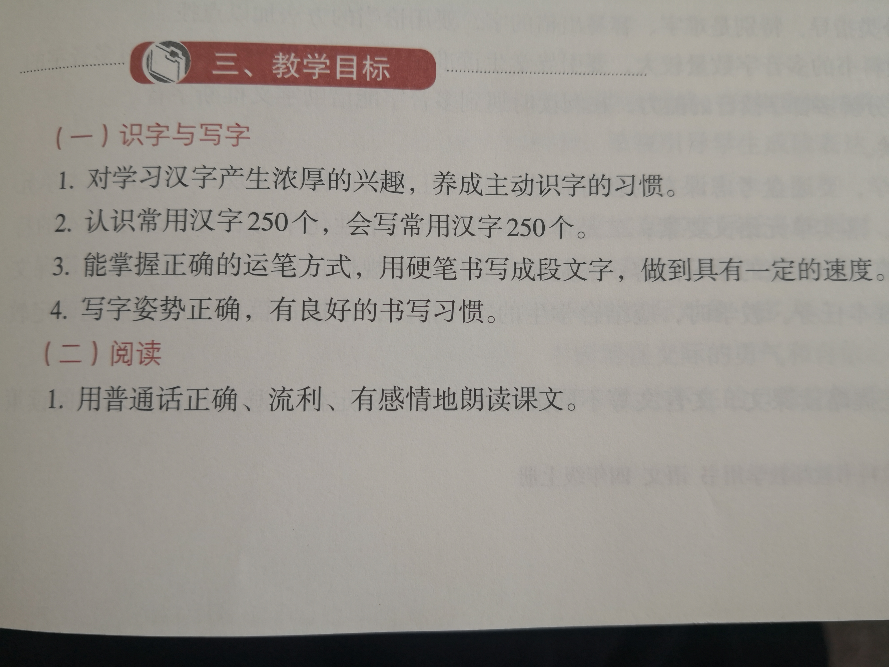
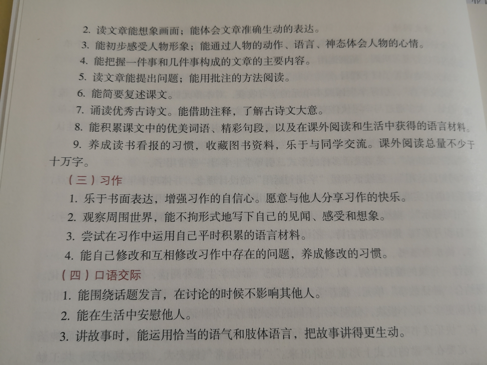

#  语文微信交流

## 2020年9月1日

### 家长寄语

亲爱的大朋友们：下午好！今天是9月1日，我们开学啦！今天的开学典礼上陈老师给大家作了阅读推荐，特别向大家介绍了我们云南本土的儿童文学著名作家——吴然。本学期我们将要学习吴老的课文《走月亮》，语文教材中选录了他的多篇儿童文学作品，后阶段将会学习到。语文学习将是以阅读为主的学习，读好书，交好友，让经典书籍浸润孩子们的人生，陪伴孩子们快乐的成长！最后让我们成为孩子们新学期学习的幸福陪伴者而努力！

### 学生寄语

亲爱的小朋友们：下午好！今天我们开学啦！新学期，新起点，你们做好准备了吗？本学期的学习我们更加以自主管理为主，培养自律和自立。以“十好习惯”为标准，严于律己，真正成为学习的小主人。今天当我走进教室给你们布置第一天的作业，你们拿起笔的那一刻，陈老师提醒你们心里默念“写字儿歌”。还记得陈老师的叮嘱——“提笔就是练字时”吗？你们不仅要注意培养自己良好的书写姿势，还要培养自己良好的书写习惯。“习惯成自然”，这就看你选择什么样的习惯。好习惯会让你们终身受益。**本学期我们将在学习群里开展“作业展示”活动，“每日一诵”和“古诗一首”作业每天由同一名同学进行展示，欢迎你们踊跃报名啊！本学期我们还要增加口头作业，目的一是拓展学习语文的渠道，二是体会语文学习就是在生活中学习。三是学会思考，学会表达，学会交流。四是锻炼口头能力。作业内容及要求：每天阅读“推文”后和爸爸妈妈交流，作业反馈在《作业记录本》“家长留言”中。愿新学期的你们为做最好的自己而加油！**

“作业展示”活动要求：
1.私信报名。
2.私信发展示作业。
3.“古诗一首”的展示需要把抄写在记录本上的内容拍照。
4.“每日一诵”的展示需要发录音。
5.录音要求：
开头：
我是今天的“每日一诵”的诵读者——           ，我诵读的题目是《         》。
结尾：谢谢大家！

### 本日推文

[开学第一课，请这样告诉孩子：新学期为什么要努力学习？](https://mp.weixin.qq.com/s?__biz=MzIzNjQxOTU3Nw==&mid=2247490685&idx=1&sn=2d640bb144b198a5d85c380fa2297cd6&chksm=e8d97cebdfaef5fd82c08bf1292b2320e0015ad48e6dc93f356b1e90f2daf721d351be20cbcb&mpshare=1&scene=1&srcid=0831IizE0g9elleAKLm8iniE&sharer_sharetime=1598945665104&sharer_shareid=bdb36103b3026f46954d60cbeaf956d0&key=590f90317dcde6d7f76cf7d4e8b440b7063600cb4b934fb462060d73921fee09eaf71027afbaeb2220ae59c7c36b1efa2bdb4379d701908fe30b1c49d1b2dc306e4dd552dfc650babd027856b1805b5b4a8a6673bdee59e6bcb5a20cb22b172538e947179f605d6df7e9dca197655962c815dbc71ba693a14c451b5101f0e081&ascene=1&uin=MzU0MzU2OTE1&devicetype=Windows+10+x64&version=62090538&lang=zh_CN&exportkey=AabVPGPsIovdRZVpe4vMo%2BM%3D&pass_ticket=rwAYBiGdG%2B%2BEAEUUzJV%2FuTixx29fuAH84mDfURAJIQF5ntK4KlsxgIbrXaOyZTtH)

### 每日一诵

>  **做最好的自己**  
>
> ​		 如果你无法成为山顶上的一棵苍松，  
>
> 　　就做山谷中的一丛灌木——  
>
> 　　但一定要做溪边最好的一丛小灌木;  
>
> 　　如果不能长成参天大树就好好做一丛灌木，  
>
> 　　如果你成不了灌木，那就做一棵小草，  
>
> 　　让道路因你而更有生气;  
>
> 　　如果你成不了(海洋中的)大梭鱼那就做一条鲈鱼——
>
> 　　但一定要做湖里那条最有活力的鲈鱼;
>
> 　　我们不可能都做船长，必须要有人做船员，
>
> 　　总会有适合我们做的一些事情，
>
> 　　有大事，也有小事，
>
> 　　我们要做的就是眼前的事。
>
> 　　如果你成不了大道那就做一条小径，
>
> 　　如果你成不了太阳那就做一颗星星;
>
> 　　成功还是失败并不取决于你所做事情的大小——
>
> 　　做最好的自己!

　　

### 古诗一首

>  **题西林壁**  
>
>  **宋	杨万里**    
>
> 横看成岭侧成峰，  
> 远近高低各不同。  
> 不识庐山真面目，  
> 只缘身在此山中。

### 语文课程标准

第二学段（3～4年级）

+ （一）识字与写字
  1. 对学习汉字有浓厚的兴趣，养成主动识字的习惯。
  2. **累计认识常用汉字2500个左右，其中1600个左右会写。**
  3. 有初步的独立识字能力。会运用音序检字法和部首检字法查字典、词典。
  4. 能使用硬笔熟练地书写正楷字，做到规范、端正、整洁。用毛笔临摹正楷字帖。
  5. 写字姿势正确，有良好的书写习惯。
+ （二）阅读
  1. 用普通话正确、流利、有感情地朗读课文。
  2. 初步学会默读，做到不出声，不指读。学习略读，粗知文章大意。
  3. 能联系上下文，理解词句的意思，体会课文中关键词句表达情意的作用。能借助字典、词典和生活积累，理解生词的意义。
  4. 能初步把握文章的主要内容，体会文章表达的思想感情。能对课文中不理解的地方提出疑问。
  5. 能复述叙事性作品的大意，初步感受作品中生动的形象和优美的语言，关心作品中人物的命运和喜怒哀乐，与他人交流自己的阅读感受。
  6. 诵读优秀诗文，注意在诵读过程中体验情感，展开想象，领悟诗文大意。
  7. 在理解语句的过程中，体会句号与逗号的不同用法，了解冒号、引号的一般用法。
  8. 积累课文中的优美词语、精彩句段，以及在课外阅读和生活中获得的语言材料。背诵优秀诗文50篇（段）。
  9. 养成读书看报的习惯，收藏图书资料，乐于与同学交流。**课外阅读总量不少于40万字。**
+ （三）习作
  1. 乐于书面表达，增强习作的自信心。愿意与他人分享习作的快乐。
  2. 观察周围世界，能不拘形式地写下自己的见闻、感受和想象，注意把自己觉得新奇有趣或印象最深、最受感动的内容写清楚。
  3. 能用简短的书信、便条进行交流。
  4. 尝试在习作中运用自己平时积累的语言材料，特别是有新鲜感的词句。
  5. 学习修改习作中有明显错误的词句。根据表达的需要，正确使用冒号、引号等标点符号。
  6. 课内习作每学年16次左右。
+ （四）口语交际
  1. 能用普通话交谈。学会认真倾听，能就不理解的地方向人请教，就不同的意见与人商讨。
  2. 听人说话能把握主要内容，并能简要转述。
  3. 能清楚明白地讲述见闻，说出自己的感受和想法。讲述故事力求具体生动。
+ （五）综合性学习
  1. 能提出学习和生活中的问题，有目的地搜集资料，共同讨论。
  2. 结合语文学习，观察大自然，观察社会，用书面或口头方式表达自己的观察所得。
  3. 能在教师的指导下组织有趣味的语文活动，在活动中学习语文，学会合作。
  4. 在家庭生活、学校生活中，尝试运用语文知识和能力解决简单问题。

### 本册教学目标

## 2020年9月2日

### 家长寄语

亲爱的大朋友们：下午好！昨天咱们班级的“开学第一课”主题是自律和劳动。课堂伊始，我给孩子们介绍了朋友圈里的2张照片，一张照片是一间卧室里摆放着整理过的一张床，另一张照片是一个背着书包走在上学路上的小朋友。我对孩子们说：“这两张照片没有文字说明，你会想到什么？”话音刚落，一同学举手说：“这个同学太能干了，能自己整理自己的床上用品，他的妈妈有这样的孩子太骄傲、自豪了。”我告诉他们：“这可是准备上一年级的小朋友。”在我的启发下，另一个孩子说：“我要学习这个小朋友自己的事情自己做。”接着这个话题，我和孩子们分享了这个小朋友的优秀大哥哥的故事。从孩子们专注听课的神情仿佛告诉我——我们明白了要自律，要学会自我管理。接着，我从劳动学科的角度展开了第二个主题——劳动教育的学习。我向孩子们通读了教育部关于劳动教育的相关文件内容，启发孩子们：“我们不仅要学好劳动这门学科，更重要的是从自己，从身边小事做起，养成劳动习惯，树立劳动美德。”些许是昨天的“第一课”奏效了，今早早自习时间，我轻轻走到教室门口，看到同学们整齐地端坐着朗读课文，我忍不住拿起手机录了一段。早自习后紧接着就是第一节课，我让孩子们用掌声表扬自己，并对他们说：“学会自律，能自我管理的孩子总是最优秀的孩子。希望你们坚持啊！”新学期，新起点，新面貌，孩子们开学第一天棒棒滴！今晚你们要好好表扬嘎！

### 学生寄语

亲爱的小朋友们：下午好！今早第一节课我们交流了昨天晚上看的“开学第一课”，你们积极交流了留给你们印象深刻的内容。课堂上，我们积极探讨，“开学第一课”再一次深深地印在了我们的心里。第二节课，我们针对本学期的预习要求逐一作了讲解说明，特别是把一、二年级的预习内容和方法整理起来，再次强调了预习的重要性。紧接着，我以抽读课文的形式了解你们读课文的情况。让陈老师高兴的是，所有被抽到的同学都顺利过关了。我想：这和你们在假期里按照作业要求完成预习是密不可分的。看来，朗读课文是一定要花时间的。只有熟读课文，才能听好课。今天开始布置预习作业了，只要是假期里按照要求完成的只需作检查即可。孩子们，新学期来了，认真学习的孩子真好看啊！加油吧！

### 本日推文

[《开学第一课》给老师家长的8个启示](https://mp.weixin.qq.com/s?__biz=MjM5OTU5MzcyMg==&mid=2653231245&idx=1&sn=fe57e6a16c438150626461022ebc7c68&chksm=bce8ab188b9f220e4a01cbad4e677752e5410fb992db40aa91a772be71fce69cc26077abfa04&mpshare=1&scene=1&srcid=0902yOv2HtT2ONqU1RlJrUEV&sharer_sharetime=1599032081833&sharer_shareid=bdb36103b3026f46954d60cbeaf956d0&key=799ec3b15052ed3c58435141d43c98fe595654cf9a822af1f8c84da251981c2e1e89f350ab171e5e6a178ee3ee239cc9fe8d7699b16ef25e59aaa38cfbdb6298091c14c3b53791f4c5f59aa1a448f38396a3c1ee10d4d830816dd8ad0ed59c7381563f3667b8cab0742a027156f16f1e3d7cc80b08dab3ab027e9fa4ff2cc232&ascene=1&uin=MzU0MzU2OTE1&devicetype=Windows+10+x64&version=62090538&lang=zh_CN&exportkey=Ac2%2Fx%2FMvW3lFPlgY%2FpU%2FyVA%3D&pass_ticket=NJZqNGnOtDVSgLwEmO4%2FsFYrtboK483tk9kF9zeEHtdBzs5GBrl62rgQEVM4yWK6)

[张文宏《开学第一课》带来卫生健康宝典，一起复习](https://mp.weixin.qq.com/s?__biz=MjM5NTA1NjE3NQ==&mid=2649920597&idx=1&sn=aff054da07cadcf903ccfde1b57d0c05&chksm=bef86b15898fe2035ea9c340490f802296144a8ec3db423eae51d74841d236320debcd130a85&mpshare=1&scene=1&srcid=0902iAttYT4EC00Dw8xx3DuO&sharer_sharetime=1599032092439&sharer_shareid=bdb36103b3026f46954d60cbeaf956d0&key=799ec3b15052ed3c29d01d7f17910dd6165dc1dc1d3a308de1723476ef9821cd34aa8cd95fad669886b120097b53d78bb45d12fc502599a5937509402e36b5b9fba0a325c3d790fc0a659dc485184994d967d7312d4b5831d982045007d5be2a8aae52015c9e00148461b00b8c5801352c40c5b592e1e1612937c291c3707ad8&ascene=1&uin=MzU0MzU2OTE1&devicetype=Windows+10+x64&version=62090538&lang=zh_CN&exportkey=AXmZN5%2Fgrh2s%2Fd2iiiv%2FvAg%3D&pass_ticket=NJZqNGnOtDVSgLwEmO4%2FsFYrtboK483tk9kF9zeEHtdBzs5GBrl62rgQEVM4yWK6)

### 每日一诵

>  **妈妈的爱**
>
> 妈妈的爱，  
> 像催你起床的闹钟，  
> 和美味的早餐。  
> 妈妈的爱，  
> 像冬天那温暖的手套，  
> 和温暖的毛衣。  
> 妈妈的爱，  
> 像那一声声亲切的关怀，  
> 和那只为你疲劳的双眼。  
> 妈妈的爱，  
> 是在你伤心的时候，  
> 安慰你，呵护你。  
> 妈妈的爱，  
> 是在你考试考的好的时候，  
> 提醒你，不要骄傲。  
> 妈妈的爱，  
> 是你一辈子无法报答的，  
> 那么，你只有孝顺妈妈，  
> 来报答妈妈对你的养育之恩。

### 古诗一首

>  **夏日绝句**
> 
> **宋  李清照**
>
> 生当作人杰，  
> 死亦为鬼雄。  
> 至今思项羽，  
> 不肯过江东。  

### 阅读推荐

本学期阅读推荐：
1.名家（作品）巴金、安徒生、叶圣陶、法布尔、徐志摩、吴然、屠格涅夫。
2.中国神话故事。

## 2020年9月3日

### 家长寄语

亲爱的大朋友们：下午好！今天我们开始以“思维导图”的方式引导孩子们当堂完成习作有了一点效果，内容是教材P12第一次习作——推荐一个好地方。课堂上引导孩子们从生活中去寻找好地方。好地方就是你喜欢的地方。它是什么地方？在哪里？特别之处是什么？借用教材的例子——推荐一个古镇，从美（景色）、人们以前的生活（风俗）、好吃的（美食）3个方面作介绍。孩子们在第一次完成的“思维导图”基础上进行再次修改，最后围绕“思维导图”进行当堂习作。习作内容是重点部分，文章开头和结尾待到二次习作时再完成。通过巡视看到很多同学完成了一大部分内容，“我手写我心”，笔尖顺着思潮流淌吧！孩子们，加油啊！

### 学生寄语

亲爱的小朋友们：下午好！今天课堂上陈老师小结了第一天的作业情况，让我想抓狂啊！不带作业的，不交作业的，不按要求做的，乱画的……还好，我能管理好情绪，仍然微笑着面对你们。1号本、查字典，这2项作业是假期里以练习书法形式已经完成了的内容，需要你们对照群里的示范进行自查自改，可你们……已经和你们约定好了，明天被表扬的会是谁……？今天当堂习作没有完成的按要求完成，再作修改。你们第一次尝试这样的训练，就像陈老师说的那样：“我们课堂练习就是像在考试，要和时间赛跑嘎！”孩子们，看到你们专心听课的样子，一定要好好表扬的！最后一句：“我的VIP时限从来不过期哦！”加油！

### 本日推文

[今天，一起纪念](https://mp.weixin.qq.com/s?__biz=MjM5NzI3NDg4MA==&mid=2658612863&idx=1&sn=f52a43c47f9eb42bf4dd544cd5dedf40&chksm=bd5fe2108a286b0608c74329d43b9819988795cadbc440bc93fbc622df7a715d0b9b00300728&mpshare=1&scene=1&srcid=09033ujFL44oMagp1w6l5ks6&sharer_sharetime=1599125494947&sharer_shareid=bdb36103b3026f46954d60cbeaf956d0&key=4dcdc0acef2a28ea87218c65d8d8f82daf787fbc727018b822a2c5360003bed4c7866a1c357fcb6865a2ddc264f8c31a9cf3ba241c1d3a26cd2ec208e32eafda0b6da4ca946ccbbfef41ae00c4e96ad2b154fec36200e7d3e6190e2022d2984e2f80e718ab08ffe5ecaaf0b008497977bc872f1264bca9262df030e7b51dcb83&ascene=1&uin=MzU0MzU2OTE1&devicetype=Windows+10+x64&version=62090538&lang=zh_CN&exportkey=AQn256ny76MNnSVzimdiii8%3D&pass_ticket=M%2F6LoYwzTN%2BmYcK0dpIOOHRsYbFWie1ofuGr2v%2B%2BVEXAb1wNucRA7ausJzIX27s1&wx_header=0)

[新增确诊11例，在这3地！](https://mp.weixin.qq.com/s?__biz=MjM5NzI3NDg4MA==&mid=2658612883&idx=1&sn=e6782f6185d88a4fed9ff31923c24d82&chksm=bd5fe2fc8a286bea9a2cde181562b5db6f841acdddd9d7e0c8323005babb763b7ebd759ce693&mpshare=1&scene=1&srcid=0903bY0lmGc3h52wseGA58I6&sharer_sharetime=1599125509327&sharer_shareid=bdb36103b3026f46954d60cbeaf956d0&key=9323edc76735a22f7eb0e5b557635b82d8e407b88004bd54f457f073060872a0419f5241f93e72df9e3fee72e3edc4b2a0021e9aa6a1dfcc6e63b73278a15f42ab8098ca8cf405103962b12cd34b5082bc15b28d7cc39d225ed10c537db04a163154daf4f6925802836e005c14f66ccb27fd87588248687f9d54010d8d497fcc&ascene=1&uin=MzU0MzU2OTE1&devicetype=Windows+10+x64&version=62090538&lang=zh_CN&exportkey=ASBX3yPueOoDCfKVO5TqNAg%3D&pass_ticket=M%2F6LoYwzTN%2BmYcK0dpIOOHRsYbFWie1ofuGr2v%2B%2BVEXAb1wNucRA7ausJzIX27s1&wx_header=0)

### 每日一诵

>  **别了，我们的老乡----巴金**
>
> 提了小小的包，  
> 别了斑斑旧照壁，  
> 家早不是安育的巢。
>
> 春拂草窜绽苞  
> 足迹留徊塞纳畔，
>
> 秋月涟涟濯着征茅   
> 雾中酽酽的思  
> 雨里浓浓乡村曲  
> 电闪蛇一样赋新诗  
> 独自回到陌生，息园的一枝茶花，  
> 沁沁吐着幽幽芬芳。  
> 倦了悄悄别离  
> 不望望就这样走  
> 身后任他云天低垂。  
> 豹嗥为你低唱，  
> 虎啸是天堂的调，  
> 龙摆脱污泥见到光  
> 别了时代巴金  
> 别了巴金的时代，  
> 明天定开启新的晨。

### 古诗一首

>  **三衢道中**
> 
>  **宋    曾几**
>
> 梅子黄时日日晴，  
> 小溪泛尽却山行。  
> 绿阴不减来时路，  
> 添得黄鹂四五声。  

## 2020年9月4日

### 家长寄语

亲爱的大朋友们：下午好！今天对习作进行了第一次评、改，孩子们感到困难的是找“这个地方”的特别之处。这里就引发了我的思考：孩子们玩、乐的地方多了，走过，游过的地方也多了，为什么总是没有多少印象呢？我们很多家庭带领孩子们走出家门，走到大自然，走向社会，游一游，乐一乐，吃一吃，玩一玩，喝一喝，或许已成常态。几天过去了，出门回到家，也就结束了。当问及孩子“到了哪里？”“看到了什么？”“有意思吗？”………不是“不知道”，就是“不好玩”，或者就是“记不得了”。究其原因，我想：根源在于我们的每一次出门是随意性，没有“目的”的。没有“目的”的出门，肯定是没有多少结果的。我一朋友家庭，或许是教师这一特殊的职业，他们的出门是带有“目的”的。比如：去到大观楼公园，他们是去看“大观楼长联”，去学习“长联”的内容，了解“长联”的历史，理解“长联”的意思。回到家后用毛笔去练习书写“长联”，诵读“长联”。他们还去看大观楼公园的荷塘，去观察荷花。结合教材叶圣陶《荷花》一文中描写荷花的几种姿态的语句去观察，去联想，去仿写 ……他们还会引导孩子结合学习的内容，鼓励他“自由发言”。尽管一开始说得不太好，但他们总是充当“忠实听众”，耐心听完，积极地表扬。他们允许孩子“胡言乱语”（不说不文明的，不说不该说的），孩子的口头表达就这样练就成现在出口成章，出口成诗点境界。孩子爱思考，爱问问题，源于爱看书，这样的学习就拓宽了语文学习的渠道。有了“大语文观”的学习，孩子一定是优秀的。**谈到阅读，本学期课外阅读推荐了几个名家名作，广泛阅读，博览群书，是孩子们学好语文的法宝。让我们携手改变：要以孩子为中心，一切的学习方式和方法都是围绕孩子而设计的。**努力，前行！

### 学生寄语

亲爱的小朋友们：下午好！今天的习作需要在评、改要求下完成，“这个地方”的“特别之处”一定用“中心句构段”的方法找出至少3个，每一个内容要用“关键句”引领。记得周一早上带好习作稿纸和“思维导图”。另，从本学期起，我们要加大阅读的训练。从本周起，我们将要完成“阅读记录卡”，其中“我的阅读感言”一定要选择一个内容作为重点，围绕它写具体，写清楚。（围绕一个意思写清楚是本年段的重点）每天的阅读不仅是每天的语文作业，还是我们一生的精神食粮。学好语文的关键就是要阅读。愿你们每天都能享受阅读的快乐！加油吧！

### 本日推文

[今天，如何纪念我们的胜利日](https://view.inews.qq.com/wxn/WXN20200904007040020?refer=nwx&bat_id=1111117232&cur_pos=0&grp_type=region&rg=3&grp_index=1&grp_id=1311117234&rate=0&ft=0&pushid=2020090401&bkt=0&openid=o04IBAGHRL9jpApkIAjDXVBzRKYg&tbkt=A&groupid=1599195944&msgid=0&key=3dc3ffff9db96bb9ec237af64a978b5a2f0e4b091cbd61c681c10247c443463c488ff319c46552fcaa73e14f059375bbb81bfe566f8aeed691ec98aa870117a0d959c09c3ae18200a5985b5a35641c0ea65580f489b9469e85472768de4252e3be22cb35e80be95b05b5fef20917483f3d25fe7bce32a08540970c1adcf7c628&version=62090538)

[五个“绝不答应”，五次热烈掌声！](https://mp.weixin.qq.com/s?__biz=MjM5NzI3NDg4MA==&mid=2658613064&idx=1&sn=c143adafb5671d70f5cffd1d1baf4ddb&chksm=bd5fe3278a286a31408771fea922c7ce8581be9c06a7e066bd52e99a6e826ea064a6bc7bf424&mpshare=1&scene=1&srcid=0904KZbd4bt9iPCMAHUPM702&sharer_sharetime=1599210944786&sharer_shareid=bdb36103b3026f46954d60cbeaf956d0&key=df4daa9b126aa670f3c3e9c358b2f87f4f809e748936972cc07c83e90e54aa7ce91bdf31f86ea0bac23406fda00842b0d757c0a9d28e9ad85f00974801fa2b0c277ef1cfb16c237ebf3f051d6f7be44c1094f7c920cda3da709c8315b80c0642da59876933e089f8817e7e57cdde22020770c4859dc1ad592dbf2d1503e6bbab&ascene=1&uin=MzU0MzU2OTE1&devicetype=Windows+10+x64&version=62090538&lang=zh_CN&exportkey=AWct9wZNPjPGQe91Y93fnCc%3D&pass_ticket=0PK%2B5LWxvkDy5x%2BtEzWXunf4jENXFQNAvdKHgUI2R%2BAhT%2BInJ%2FRzwOlAmmwenCcz&wx_header=0)

附：五个“绝不答应”

> 任何人任何势力企图歪曲中国共产党的历史、丑化中国共产党的性质和宗旨，中国人民都绝不答应！  
>
> 任何人任何势力企图歪曲和改变中国特色社会主义道路、否定和丑化中国人民建设社会主义的伟大成就，中国人民都绝不答应！  
>
> 任何人任何势力企图把中国共产党和中国人民割裂开来、对立起来，中国人民都绝不答应！  
>
> 任何人任何势力企图通过霸凌手段把他们的意志强加给中国、改变中国的前进方向、阻挠中国人民创造自己美好生活的努力，中国人民都绝不答应！  
>
> 任何人任何势力企图破坏中国人民的和平生活和发展权利、破坏中国人民同其他国家人民的交流合作、破坏人类和平与发展的崇高事业，中国人民都绝不答应！  
>

### 每日一诵

>  **月  巴金**
>
> 每次对着长空的一轮皓月，我会想：在这时候某某人也在凭栏望月吗？  
> 圆月犹如一面明镜，高悬在蓝空。我们的面影都该留在镜里吧，这镜里一定有某某人的影子。  
> 寒夜对镜，只觉得冷光扑面。面对凉月，我也有这感觉。  
> 在海上，山间，园内，街上，有时在静夜里一个人立在都市的高高露台上，我望着明月，总感到寒光冷气侵入我的身子。冬夜的深夜，立在小小庭院中望见落了霜的地上的月色，觉得自己衣服上也积了很厚的霜似的。
> 的确，月光冷得很。我知道死了的星球是不会发出热力的。月的光是死的光。但是为什么还有嫦娥奔月的传说呢？难道那个服了不死之药的美女便可以使这已死的星球再生吗？或者她在那一面明镜中看见了什么人的面影吧。

### 古诗一首

>  **示 儿** 
> **宋    陆游 **   
>
> 死去元知万事空，  
> 但悲不见九州同。  
> 王师北定中原日，  
> 家祭无忘告乃翁。     

## 2020年9月7日

### 家长寄语

亲爱的大朋友们：下午好！转眼开学一周的学习结束了，每个周末的主题活动——相约古诗词的作业已经有一年了，从你们留言中反馈给我的信息是：孩子们已经适应了这样的作业方式，你们也已经放手让孩子们独立完成。这就是进步，你们都进步啦！古诗的学习以读为主，仿写作业是根据孩子们的年龄特点而设计的。目前孩子们处在模仿最强的年龄阶段，从读中积累，在仿写中积累，创作自然就是水到渠成的事。你们要求不要太高，只需作一件事——好好欣赏，好好表扬！相信这样的坚持会收到异样的收获。另，本学期起周末作业加大阅读训练，设计了“阅读记录卡”，目的就是培养孩子们阅读的好习惯。其中“我的感言”部分，要求孩子们从读的内容中选取一点作为写的重点。读写结合就是深刻的阅读。只要是把自己思考的写下来就是“感言”。今天展示部分孩子的作业，相互学习，提高最大。坚持！引领！

### 学生寄语

亲爱的小朋友们：下午好！开学一周了，你们端正的学习态度值得表扬啊！但，每天仍有几个同学交作业总是需要不停的催促，提醒。结果不是忘了交，就是没有带，甚至没有做。本学期，我会把每一次欠作业的情况第一时间汇报给你们的爸爸妈妈，请求爸爸妈妈协助你们交作业。作业情况是你们上课效果的真实反应，认真完成作业可以弥补听课的遗憾。请重视！另，因我办公室被安排在你们教室的楼上，从今天起，我课间都会进到教室，欢迎你们随时找我面批改错，或解答你们的疑问。加油啊！

### 本日推文

[新学期，从今天起，为了孩子，请家长每天朗读三遍](https://mp.weixin.qq.com/s?__biz=MzU4OTg1NDA3NQ==&mid=2247546098&idx=2&sn=473e6732a56377d1c7d58f7d64c608d0&chksm=fdc550e6cab2d9f0a98d2f251541b346e98115337cebf897dfd6546ad323dddd6790f8d419ad&mpshare=1&scene=1&srcid=0904EahMK4JkTk5QkPILKOOt&sharer_sharetime=1599465091569&sharer_shareid=bdb36103b3026f46954d60cbeaf956d0&key=df4daa9b126aa6700ffc92c350e6bd93659d1de722b288c571e5871ff2cadc3bc1da1b05b827df43aa342010ba8ba9fa31b31220d373ef692ae3b68dc790acc36a4cf3207743e6f7bab15816f06545bfbb2aa7e73e122662fb182fbe2ea9a9678732d6ef929ce8b00eac61703938fe249e4c9f63c74eaba9d613554880f5f43b&ascene=1&uin=MzU0MzU2OTE1&devicetype=Windows+10+x64&version=62090538&lang=zh_CN&exportkey=Ab%2BBEuE5dPC%2FZluTIXI3hf4%3D&pass_ticket=clHeZVesaTYYYHVXjd%2F%2FtOJT7nlYA1iq895RLw5O4w%2FvXqznsphvoD4tpRIjkYfC&wx_header=0)

[崇尚餐饮节约 拒绝铺张浪费 云南省消费者协会发出倡议](https://mp.weixin.qq.com/s?__biz=MjM5NDg5MzMwMQ==&mid=2671202961&idx=3&sn=c1bd6db17eb593c094ef4e7f0f7346e4&chksm=bc432e0b8b34a71dea3583d35a35bc8135820bf17fa2c4fa7f707876823992dbe5eb2c280d46&mpshare=1&scene=1&srcid=0907FBJV1Awe9fL97Be5c48W&sharer_sharetime=1599465122852&sharer_shareid=bdb36103b3026f46954d60cbeaf956d0&key=126745e5a1fffccfa8c42edfc987d0fca61bacb27b324f06b9326913b2357230142658cfc3dc29de38e0923dc23196e309399ceb1ad950d3a6a82496ab705f915657af37993c8d58eb3638f22cf1b514de4d71ed59800efa497b83127b7de0672e9b10fd2d11826edc177f8db2bf169b48dd7cdf9167c907d374fbb8736cf496&ascene=1&uin=MzU0MzU2OTE1&devicetype=Windows+10+x64&version=62090538&lang=zh_CN&exportkey=AZxwwldI4QZyz%2FPHnqJgBC4%3D&pass_ticket=clHeZVesaTYYYHVXjd%2F%2FtOJT7nlYA1iq895RLw5O4w%2FvXqznsphvoD4tpRIjkYfC&wx_header=0)

### 每日一诵

>  **海上生明月  巴金**
>
> ​        四周都静寂了。太阳也收敛了它最后的光芒。炎热的空气中开始有了凉意。微风掠过了万顷烟波。船像一只大鱼在这汪洋的海上游泳。突然间，一轮红黄色大圆镜似的满月从海上升了起来。这时并没有万丈光芒来护持它。它只是一面明亮的宝镜，而且并没有夺目的光辉。但是青天的一角却被它染成了杏红的颜色。看！天公画出了一幅何等优美的图画！它给人们的印象，要超过所有的人间名作。  
> ​        这面大圆镜愈往上升便愈缩小，红色也愈淡，不久它到了半天，就成了一轮皓月。这时上面有无际的青天，下面有无涯的碧海，我们这小小的孤舟真可以比作沧海的一粟。不消说，悬挂在天空的月轮月月依然，年年如此。而我们这些旅客，在这海上却只是暂时的过客罢了。  
> ​        与晚风、明月为友，这种趣味是不能用文字描写的。可是真正能够做到与晚风、明月为友的，就只有那些以海为家的人！我虽不能以海为家，但做了一个海上的过客，也是幸事。  
> ​        上船以来见过几次海上的明月。最难忘的就是最近的一夜。我们吃过午餐后在舱面散步，忽然看见远远的一盏红灯挂在一个石壁上面。这红灯并不亮。后来船走了许久，这盏石壁上的灯还是在原处。难道船没有走么？但是我们明明看见船在走。后来这个闷葫芦终于给打破了。红灯渐渐地大起来，成了一面圆镜，腰间绕着一根黑带。它不断地向上升，突破了黑云，到了半天。我才知道这是一轮明月，先前被我认为石壁的，乃是层层的黑云。
> ​        

### 古诗一首

>  **秋夜将晓出篱门迎凉有感**
> 
>  **宋   陆游** 
>
> 三万里河东入海，  
> 五千仞岳上摩天。  
> 遗民泪尽胡尘里，  
> 南望王师又一年。

## 2020年9月8日

### 家长寄语

亲爱的大朋友们：下午好！第一单元的语文要素是——边读边想象画面，感受自然之美。今天我们学习了1《观潮》，学习方法是：找句子读——想象画面——谈出感受——读得有情。孩子们边读边想象，透过语言文字，一幅幅画面就会印在孩子们的脑海中。孩子们再把自己的感受表达出来，最后又通过朗读把自己的感受读出来。语言文字有了画面感，孩子们的感受也会更深刻，把课文读得有滋有味也就水到渠成了。这样一个方法从今天起要用到阅读中，坚持这样做会让孩子们的阅读更深刻。另，从几天的作业中看出很多同学在暑假里真正按照要求去完成作业，也有部分同学的不过关。督促完成，提醒上交，检查改错，是几个重要的环节。愿开学综合征快快过去，我们以全新的面貌迎接开学。加油！

### 学生寄语

亲爱的小朋友们：下午好！今天学习了《观潮》一课，从今天起，我们要反复运用今天学习的边读边想象画面的方法去阅读书籍，让一幅幅画面沉淀在我们的脑海里。文字有了画面感，我们对文章的理解会更深刻，最后尝试着把自己的感受读出来，这样的朗读水平会提升更快。几天的作业反馈给陈老师一个信息：你们的书写进步了，真为你们高兴啊！还望坚持认真书写，养成良好的书写习惯。记住：改错和阅读是我们的常规作业啊！加油吧！

### 本日推文

[铭记这一刻！](https://mp.weixin.qq.com/s?__biz=MzAxMjAyODcwMw==&mid=2650894096&idx=1&sn=93abef7a13167c9588d056752e492dae&chksm=804dd160b73a5876becb50a034826426e9495792d21be9f4698de8dc6af668b8d8dfee281679&mpshare=1&scene=1&srcid=0908T5OYqMziqsGMvTbgJqrT&sharer_sharetime=1599551191437&sharer_shareid=bdb36103b3026f46954d60cbeaf956d0&key=799ec3b15052ed3c360be3eb63da55e247e5a080a717d9d4586d09a8281f912068a67356e7a5f3581f8123278a7b333a62a2939349129b323a91f0363904f5155c0ae4d34760a5281603148beb5215a71fde89208221c596340967f4104f83d921df7fdb7a8c73e84ba8d597a467c08fbb80ee63b3da7c9e31b91e305cae7def&ascene=1&uin=MzU0MzU2OTE1&devicetype=Windows+10+x64&version=62090538&lang=zh_CN&exportkey=AbHkR%2FD1Fz%2BX3Dw%2Ba0kBivo%3D&pass_ticket=tieRIK4WlHQjd0IYEJux%2FmozYZhDG2HYOL6gkIvsviM0gr3QG7CR5FzzVPNu8GJA&wx_header=0)

[钱江大潮，现场直击！](https://mp.weixin.qq.com/s?t=pages/video_detail_new&scene=1&vid=wxv_1441170302997807107&__biz=MjM5MTMxMTA4MA==&mid=2651054307&idx=1&sn=d3bcb93caaa5aafb400b631308d49572&vidsn=&key=df4daa9b126aa6703e550e8ac746f75ef2d6dee69239b1d236d8ea159fd69581fbf1b59c5bc04995cc6e8da6d35eb46618168d6837e03946a20d946a9fce9c1ee013805977229f749bb61cb666e71c9c7179cc7cd2eb666b2e72b159996094b982be2a77f5ec030f3e22a999bf8300d4a50d7cf7beb724805bb2d44c8e4cd62e&ascene=1&uin=MzU0MzU2OTE1&devicetype=Windows+10+x64&version=62090538&lang=zh_CN&exportkey=AblOtFTn2D6dbwMvpm6BE7Y%3D&pass_ticket=tieRIK4WlHQjd0IYEJux%2FmozYZhDG2HYOL6gkIvsviM0gr3QG7CR5FzzVPNu8GJA&wx_header=0)

### 每日一诵

>  **星  巴金**
>
> ​       在一本比利时短篇小说集里，我无意间见到这样的句子：  
> 　　“星星，美丽的星星，你们是滚在无边的空间中，我也一样，我了解你们……是，我了解你们……我是一个人……一个能感觉的人……一个痛苦的人……星星，美丽的星星……”我明白这个比利时某车站小雇员的哀诉的心情。好些人都这样地对蓝空的星群讲过话。他们都是人世间的不幸者。星星永远给他们以无上的安慰。  
> ​        在上海一个小小舞台上，我看见了屠格涅夫笔下的德国音乐家老伦蒙。他或者坐在钢琴前面，将最高贵的感情寄托在音乐中，呈献给一个人;或者立在蓝天底下，摇动他那白发飘飘的头，用赞叹的调子说着：“你这美丽的星星，你这纯洁的星星。”望着蓝空里眼瞳似地闪烁着的无数星子，他的眼睛润湿了。  
> 　　我了解这个老音乐家的眼泪。这应该是灌溉灵魂的春雨吧。  
> 　　在我的房间外面，有一段没有被屋瓦遮掩的蓝天。我抬起头可以望见嵌在天幕上的几颗明星。我常常出神地凝视着那些美丽的星星。它们像一个人的眼睛，带着深深的关心望着我，从不厌倦。这些眼睛每一霎动，就像赐予我一次祝福。  
> 　　在我的天空里星星是不会坠落的。想到这，我的眼睛也湿了。
> ​        

### 古诗一首

>  **四时田园杂兴** 
> 
>  **宋  范成大** 
>
> 昼出耘田夜绩麻，  
> 村庄儿女各当家。  
> 童孙未解供耕织，  
> 也傍桑阴学种瓜。

## 2020年9月9日

### 家长寄语

亲爱的大朋友们：下午好！今天我们学习了第2课《走月亮》，开课伊始，我对孩子们说：“你们有被妈妈牵着小手在月光下散步的经历吗？有什么体会呢？”一孩子答道：“我感到很开心，很幸福。”课结束后，我又不经意间听他说：“这节课太有意思啦！”这个孩子在课堂上的学习很积极，看来有过体验的学习是一定会积淀下来的。语文的学习就是生活中的学习。只有体验过的生活，学习才会更有价值。《走月亮》一课是我们云南本土的著名儿童文学作家——吴然爷爷的作品。课文描述了“我”和阿妈在月光下散步，走过了很多地方，感受到无比的愉悦和幸福，同时也体现了浓浓的亲情。今晚《巩固案》中最后一题——仿写第6自然段，要求他们把看到的，听到的，闻到的，想到的，通过画面描述出来。另，请提醒孩子：没有带作业要学会和老师交流，并说明情况。加油啊！

### 学生寄语

亲爱的小朋友们：下午好！第一单元的学习要围绕“边读边想”这一个语文要素进行。你们要通过读课文，想象画面，进一步理解课文内容。昨天学习了《观潮》，要在多读几遍课文的基础上再看学习群里的关于“观潮”的视频，这样就能有效的帮助你们理解课文，同时还能提高朗读水平。另，第1课《巩固案》中有错的地方可以参看群里的示范进行改错，不清楚的明早及时问。加油吧！

### 本日推文

[铭记这一刻！](https://mp.weixin.qq.com/s?__biz=MzAxMjAyODcwMw==&mid=2650894096&idx=1&sn=93abef7a13167c9588d056752e492dae&chksm=804dd160b73a5876becb50a034826426e9495792d21be9f4698de8dc6af668b8d8dfee281679&mpshare=1&scene=1&srcid=0908T5OYqMziqsGMvTbgJqrT&sharer_sharetime=1599551191437&sharer_shareid=bdb36103b3026f46954d60cbeaf956d0&key=799ec3b15052ed3c360be3eb63da55e247e5a080a717d9d4586d09a8281f912068a67356e7a5f3581f8123278a7b333a62a2939349129b323a91f0363904f5155c0ae4d34760a5281603148beb5215a71fde89208221c596340967f4104f83d921df7fdb7a8c73e84ba8d597a467c08fbb80ee63b3da7c9e31b91e305cae7def&ascene=1&uin=MzU0MzU2OTE1&devicetype=Windows+10+x64&version=62090538&lang=zh_CN&exportkey=AbHkR%2FD1Fz%2BX3Dw%2Ba0kBivo%3D&pass_ticket=tieRIK4WlHQjd0IYEJux%2FmozYZhDG2HYOL6gkIvsviM0gr3QG7CR5FzzVPNu8GJA&wx_header=0)

[钱江大潮，现场直击！](https://mp.weixin.qq.com/s?t=pages/video_detail_new&scene=1&vid=wxv_1441170302997807107&__biz=MjM5MTMxMTA4MA==&mid=2651054307&idx=1&sn=d3bcb93caaa5aafb400b631308d49572&vidsn=&key=df4daa9b126aa6703e550e8ac746f75ef2d6dee69239b1d236d8ea159fd69581fbf1b59c5bc04995cc6e8da6d35eb46618168d6837e03946a20d946a9fce9c1ee013805977229f749bb61cb666e71c9c7179cc7cd2eb666b2e72b159996094b982be2a77f5ec030f3e22a999bf8300d4a50d7cf7beb724805bb2d44c8e4cd62e&ascene=1&uin=MzU0MzU2OTE1&devicetype=Windows+10+x64&version=62090538&lang=zh_CN&exportkey=AblOtFTn2D6dbwMvpm6BE7Y%3D&pass_ticket=tieRIK4WlHQjd0IYEJux%2FmozYZhDG2HYOL6gkIvsviM0gr3QG7CR5FzzVPNu8GJA&wx_header=0)

### 每日一诵

>  **火  巴金**
>
> ​        船上只有轻微的鼾声，挂在船篷里的小方灯，突然灭了。我坐起来，推开旁边的小窗，看见一线灰白色的光。我不知道现在是什么时候，船停在什么地方。我似乎还在梦中，那噩梦重重地压住我的头。一片红色在我的眼前。我把头伸到窗外，窗外静静地横着一江淡青色的水，远远地耸起一座一座墨汁绘就似的山影。我呆呆地望着水面。我的头在水中浮现了。起初是个黑影，后来又是一片亮红色掩盖了它。我擦了擦眼睛，我的头黑黑地映在水上。没有亮，似乎一切都睡熟了。天空显得很低。有几颗星特别明亮。水轻轻地在船底下流过去。我伸了一只手进水里，水是相当地凉。我把这周围望了许久。这些时候，眼前的景物仿佛连动也没有动过一下;只有空气逐渐变凉，只有偶尔亮起一股红光，但是等我定睛去捕捉红光时，我却只看到一堆沉睡的山影。  
> 　　我把头伸回舱里，舱内是阴暗的，一阵一阵人的气息扑进鼻孔来。这气味像一只手在搔着我的胸膛。我向窗外吐了一口气，便把小窗关上。忽然我旁边那个朋友大声说起话来：“你看，那样大的火!”我吃惊地看那个朋友，我看不见什么。朋友仍然沉睡着，刚才动过一下，似乎在翻身，这时连一点声音也没有。

#### 文中生字

>  **鼾(hān)	噩(è)	搔(sāo)** 

### 古诗一首
>
>  **四时田园杂兴** 
> 
>  **宋  范成大**
>
> 梅子金黄杏子肥，  
> 麦花雪白菜花稀。  
> 日长篱落无人过，  
> 惟有蜻蜓蛱蝶飞。

## 2020年9月10日

### 家长寄语

亲爱的大朋友们：下午好！首先真挚地感谢你们送来满满的祝福！甘甜如蜜，沁入心脾！第一单元中的课文1《观潮》和课文2《走月亮》的学习是围绕单元导读目标中的“语文要素”——边读边想象而进行的。今天学习了课文3《现代诗二首》，是借助前2课的方法进行巩固学习。读熟课文是基础，抓关键句读，想象画面，再边读边想象画面，这样一个回环，语文要素就落实了。今天作业单中有修改，请关注群里信息。又是一年愉快的节日，祝愿我们跟随节日的脚步在相亲相爱的大家庭里永远开心，幸福！

### 学生寄语

亲爱的小朋友们：下午好！看到桌上铺满的节日贺卡、鲜花、信件，陈老师满心欢喜而幸福！谢谢亲爱的孩子们！有人说：“你下辈子会选择还当教师吗？”我会这样回答：“肯定会，还会选择当教师。因为你们给了我无穷的快乐！”我还会在于漪老师的教导下真正去实践“一辈子当教师，一辈子学做教师。”在如歌的岁月里永远青春！

### 本日推文

[致敬大国良师：人民教师 无上光荣](https://mp.weixin.qq.com/s?t=pages/video_detail_new&scene=1&vid=wxv_1511866575157542914&__biz=MzAxOTE1NzE2Ng==&mid=2651549720&idx=1&sn=a8efb94f4b3b8d26c77a8730aaf1e116&vidsn=&key=df4daa9b126aa67003f39213ab3bead8f27bfd3289f5576c78cee60a2d9dc9a3bfd74e9c0acbe62a338a8e1e281e1030e9f7f8591fc56043ec5a3d8f2da016d6f81fac12fa2927f247c2323ef8fd607d7885e7e51da7f018fd156598929a9aecd2cbf6e0da5c1b595c9ee74b5337c2315933d51f9cd2a1b79a823c83572ca147&ascene=1&uin=MzU0MzU2OTE1&devicetype=Windows+10+x64&version=62090538&lang=zh_CN&exportkey=AUyA3EZAA64bK4hdEFhrGZU%3D&pass_ticket=W7QIm0OnrJsVN3IeL00b9qzBNUmDyCsVUBWR%2FrlVKlPLUIbK1EPDdXaII1ElkQgC&wx_header=0)

[真好听！唱给所有老师的歌！谢谢你，陪我长大！](https://mp.weixin.qq.com/s?t=pages/video_detail_new&scene=1&vid=wxv_1511123591382253568&__biz=MzAxOTE1NzE2Ng==&mid=2651549720&idx=2&sn=7cfcff294b02f0765cc06d97ba4db976&vidsn=&key=4dcdc0acef2a28ea7ccccd28cfa01c2165c87d075d9c9c511f71b3790cbece02febad25e8dfead03279069ac87ef2d16421ba7ec5c16b87f61c306b91bf8f0079ae19cc20a3a270677c88a25ab9a2a9dd796402ec2b41f00f1eb91ebefa4ce18692f63c50bfbfa72665ee199cd4b65aabdb234daadeb3115565d279df1a6f7b3&ascene=1&uin=MzU0MzU2OTE1&devicetype=Windows+10+x64&version=62090538&lang=zh_CN&exportkey=ATzvlrRuES6Q0f4uP0Fz750%3D&pass_ticket=W7QIm0OnrJsVN3IeL00b9qzBNUmDyCsVUBWR%2FrlVKlPLUIbK1EPDdXaII1ElkQgC&wx_header=0)

### 每日一诵

>  **老师，您最美**
>
> ​        世界上有一种最美的职业，她叫做——教师。亲爱的老师，您的无私奉献以最美的愿景呈现，您所有的付出，最终化作了每一个学生对知识的得偿所愿。四季更迭，如诗静好，微风不燥，如歌低徊，山河流岚，风景阅遍。又是一年教师节，**今天我想对您说——老师，您最美。**  
>
> ​		一生中，您用最平凡的姿态尽职尽责教书育人。星月相随，默默耕耘，恰似一支燃烧的蜡烛，摇曳着红红的火焰，燃烧自己，照亮别人，却无怨无悔，您像一个辛劳的农人，使一块块土地结出累累硕果。**把今日的辛劳，换成明日的自豪，把自己的每一份耕耘，变成学子们成长路上一步步坚实的脚印。**  
>
> ​		您懂得阳光可以照亮一切。无论前行的路上遇到什么困难，您都会带领我们不断调整，不断积蓄新的力量，从黑暗的夜路上把我们带出困境。每当早上起来，开始迎接崭新的一天，总会有一种温暖的呼唤，让您不辜负自己的使命，敢于冲破重重困难，去做那个把灿烂的光明照射进人类灵魂的人。  
>
> ​		在您的世界，学生是您深深浅浅生命的印痕。而您所做的一切，就是为您的学生输送知识营养，滋养我们如花的青春，精心塑造我们创造无限未来的纯洁心灵。我们延续着您的思想，传承着您的信念，完成着您的教诲及赋予的使命。**我们在您的呵护下茁壮成长，枝繁叶茂，日复一日，年复一年，最终长成了一道道靓丽的风景。 ** 
>
> ​		您老了，或许已喊不出我们大多数人的姓名。但您知道，那一张张曾经稚气的脸庞，都已成为了美好的未来，而您甘心做我们人生路上的引路人。命定的缘份让您与我们相伴走上一程，再目送我们的背影渐行渐远。您虽然已淡化了自己曾经崇高的身份，却依然是最值得我们一生信赖，永生难忘的人。  
>
> ​		甘为人梯，您一生都在为我们努力奉献。您一点一滴的付出，换来我们的颗粒饱满；你为人师表的高度，成为我们前行路上的明灯。让我们能翱翔于天地之间，自由如风，任意驰骋。  
>
> ​		**今天，我们把天下学子的共同心愿化为一份深情的问候——亲爱的老师，祝您教师节快乐！祝愿您身体安康，幸福一生！！！**
>

#### 文中生字

> **岚（lán）	曵（yè）	辜（gū）	痕（hén）	塑（sù)		诲（huì）	赋（fù）	茁（zhuó） 	靓（liàng）**
> **稚（zhì）	缘（yuán）	骋（chěng）**

### 古诗一首

>  **小池** 
> 
>  **宋	杨万里** 
>
> 泉眼无声惜细流，  
> 树阴照水爱晴柔。  
> 小荷才露尖尖角，  
> 早有蜻蜓立上头。

## 2020年9月11日

### 家长寄语

亲爱的大朋友们：晚上好！今天身体不适下班后就睡了，现在才发信息，见谅啊！孩子们开学近2周了，大部分孩子课堂学习专心，作业完成得认真，面批改错也很积极，学习状态不错，要好好表扬啊！班上有几个孩子总是在作业方面出问题，因“防疫”期间放学后不允许孩子滞留在校，陈老师也没有办法去帮助他们，只有辛苦你们再“盯盯”啦！特别是改错要及时，不清楚的要及时弄明白。语文的学习是个积累的过程，一字一词，一句一段，点点滴滴都是在积累。只要每天认真去学，有积极向上的态度，尽力而为就行。加油吧！

### 学生寄语

亲爱的小朋友们：晚上好！陈老师和你们讲过：吾日三省吾身，你们要学会自我反思，要利用周末时间学会整理整理自己的学习，比如：学习态度怎样？学习效率如何？学习效果是好是坏！自己在哪些方面进步了？还存在哪些不足之处？下个星期的目标是什么？准备怎样去达成目标？从昨天起，我们的语文作业记录形式不光是陈老师训练你们的听记了，还邀请优秀同学参与抄写作业的活动。下个星期有打算参与这样的活动吗？好好表现，机会都是平等的。只要努力，你总会占有一席之地。加油呀！

### 本日推文

[西南联大：弦歌不辍 薪火相传](https://mp.weixin.qq.com/s?__biz=MzUzMDk4NDQ2Mg==&mid=2247580911&idx=1&sn=86114ae756a3c929039ea7cfd5415cbf&chksm=fa4a878ecd3d0e98a30a81d31807979f19a2e4884c48962fd7cbe288162270af5d698c13c74d&mpshare=1&scene=1&srcid=09110hrenn9RkH7oU2cw3SU4&sharer_sharetime=1599831094113&sharer_shareid=bdb36103b3026f46954d60cbeaf956d0&key=9323edc76735a22f6ebea7952a7a007298de17cfc3f6d19c9371d13c81ac3b0b90150f602b34dada27b6f9a26d16417b014083aed165ddb45a25611fe607e62aa65c3aa7a6d5c98d0900e7b8f35f8ae6f9a7355574b02b9da12ccefe6e3e54ae9404ea1e1fedfe21b4bb7ee5bd1d0f09d7bae4ee6219265d9ff139d0915ffddc&ascene=1&uin=MzU0MzU2OTE1&devicetype=Windows+10+x64&version=62090538&lang=zh_CN&exportkey=Ac%2Fry0ZwNhDCm4Vwj0IL4WI%3D&pass_ticket=W7QIm0OnrJsVN3IeL00b9qzBNUmDyCsVUBWR%2FrlVKlPLUIbK1EPDdXaII1ElkQgC&wx_header=0)

[吕玉刚：加强家庭教育，是落实立德树人根本任务的重要基础](https://mp.weixin.qq.com/s?__biz=MzAxOTE1NzE2Ng==&mid=2651549814&idx=1&sn=7fc2abbef30352fca039823d0c5c1983&chksm=803489b7b74300a18971a62a5b99b6446a1a4c7d837c14b5f2261e4ffad24a00fc46e737c561&mpshare=1&scene=1&srcid=0911NthXwUmhyK769V7hqC6x&sharer_sharetime=1599831106074&sharer_shareid=bdb36103b3026f46954d60cbeaf956d0&key=6326e8d9dbd5a89fa4541176ea4bfbaef66b4a220a368f5a5737d4ad152c892ab583bf8a5a5f3317a9a2ca0f7011152737e4c77085a2c718a62308ce589d238d0242ef188c073c5bf21494ce987218941e8433afb2b72a52f56f8b9dd065b6b989d569bfa970c6daef9d2e2f369aebe81c6da52e743fe830d1920003c8ceddee&ascene=1&uin=MzU0MzU2OTE1&devicetype=Windows+10+x64&version=62090538&lang=zh_CN&exportkey=AZmEukY6Pnq8lzb%2F5pleFgE%3D&pass_ticket=W7QIm0OnrJsVN3IeL00b9qzBNUmDyCsVUBWR%2FrlVKlPLUIbK1EPDdXaII1ElkQgC&wx_header=0)

### 每日一诵

>  **《火》  巴金（节选）**
>
> 　　舱内是阴暗世界，没有亮，没有火。但是为什么朋友也嚷着“看火”呢?难道他也做了和我同样的梦?我想叫醒他问个明白，我把他的膀子推一下。他只哼一声却翻身向另一面睡了。睡在他旁边的友人不住地发出鼾声，鼾声不高，不急，仿佛睡得很好。  
> 　　我觉得眼睛不舒服，眼皮似乎变重了，老是睁着眼也有点吃力，便向舱板倒下，打算阖眼睡去。我刚闭上眼睛，忽然听见那个朋友嚷出一个字“火”!我又吃一惊，屏住气息再往下听。他的嘴却又闭紧了。  
> 　　我动着放在枕上的头向舱内各处细看，我的眼睛渐惭地和黑暗熟习了。我看出了几个影子，也分辨出铺盖和线毯的颜色。船尾悬挂的篮子在半空中随着船身微微晃动，仿佛一个穿白衣的人在那里窥探。舱里闷得很。鼾声渐渐地增高，被船篷罩住，冲不出去。好像全堆在舱里，把整个舱都塞满了，它们带着难闻的气味向着我压下，压得我透不过气来。我无法闭眼，也不能使自己的心安静。我要挣扎。我开始翻动身子，我不住地向左右翻身。没有用。我感到更难堪的窒息。  
> 　　于是耳边又响起那个同样的声音“火”!我的眼前又亮起一片红光。那个朋友睡得沉沉的，并没有张嘴。这是我自己的声音。梦里的火光还在追逼我。我受不了。我马上推开被，逃到舱外去。  
> 　　舱外睡着一个伙计，他似乎落在安静的睡眠中，我的脚声并不曾踏破他的梦。船浮在平静的水面上，水青白地发着微光，四周都是淡墨色的山，像屏风一般护着这一江水和两三只睡着的木船。  
> 　　我靠了舱门站着。江水碰着船底，一直在低声私语。一阵一阵的风迎面吹过，船篷也轻轻地叫起来。我觉得呼吸畅快一点。但是跟着鼾声从舱里又送出来一个“火”字。  
> 　　我打了一个冷噤，这又是我自己的声音，我自己梦中的“火”!

#### 文中生字

> **阖（hé）眼 		窥（kuī）探	难堪（kān）	窒（zhì）息	畅（chàng)快**

### 古诗一首

>  **晓出净慈寺送林子方**   
>
>  **宋	杨万里**    
>
> 毕竟西湖六月中，  
> 风光不与四时同。   
> 接天莲叶无穷碧，   
> 映日荷花别样红。 

## 2020年9月14日

### 家长寄语

亲爱的大朋友们：下午好！从今天起，我兼任的劳动学科岗位作了调整，不再任劳动学科教学了，被安排到少年宫校点兼任阅读教学。也就是早上在人民路校区，下午在少年宫校点。孩子们要找陈老师只能抓紧早上的时间了，不然等我回到人民路校区孩子们也放学了。难免会有一些通知、要求等内容不能面对孩子们说，只能借助群进行传递。麻烦你们关注陈老师的留言。谢谢！另外，今天布置了完成17课一类生字书写和查字典作业，是延续暑假作业内容安排的，明早不交 ，上交时间待通知。虽然时空变了点，但我们的合作依然不变。加油啊！

### 学生寄语

亲爱的小朋友们：下午好！今天课堂上以第三课为依托重点练习了边读边想象画面的方法，通俗的讲就是“读书时要放电影”。陈老师作了第一课《观潮》、第二课《走月亮》和第三课《现代诗二首》的朗读示范，你们要学着陈老师的方法加强练习朗读。一边读，一边放电影。当你朗读的时候没有画面感就要立即停下，调整自己，静下心，慢慢地练习。坚持努力，你们一定可以当优秀的“小小朗读者”。加油呀！另外，从今天起，陈老师下午在少年宫校点上课，回到本部这边你们已经放学了，你们需要改错的可以把作业交到我办公桌上，或有事要交流的可以写留言等纸条放在办公桌上。最后还需要你们关注群里信息。虽然下午的时间我无法走进教室见到你们，但陈老师时刻关注着你们。加油啊！

### 本日推文

[云南新增境外输入病例2例，均为缅甸籍，从瑞丽入境！](https://mp.weixin.qq.com/s?__biz=MzA3NzA5NDMxNw==&mid=2652464380&idx=3&sn=4aaf26e30bed4413e0db951ea94f2b90&chksm=84ba883eb3cd0128334eafa83a3fa7cba6989a044f6eacbd91853d7136e241e78f8ee7395e41&mpshare=1&scene=1&srcid=09146DADtVIEpCBEs1HCAvAp&sharer_sharetime=1600071575432&sharer_shareid=bdb36103b3026f46954d60cbeaf956d0&key=126745e5a1fffccf517da6accd9d6826a5ed3eb8cc010ea688d483a8fd38bdd7b6cb6065f5db71ba58c82a5b92764b31b4a33fa0323ccb93572cf50d60358fdec5064fc4e373b5cfb6251669052b43ffb256a7b35499faad76950246a41832ebb08c146717f2a2468f28c6d1b1c5385333b72671032541568b3f71b010a1509d&ascene=1&uin=MzU0MzU2OTE1&devicetype=Windows+10+x64&version=62090538&lang=zh_CN&exportkey=AQ1n9EISEumZgEP6lR1mt4w%3D&pass_ticket=pDLYXevL%2BEqHFqZyZU65RMH0YggLBgQvpcofMF%2B1P%2BT2LbxLc0WTX9sgETY4C70e&wx_header=0)

[优秀的孩子，都是家长陪出来的](https://mp.weixin.qq.com/s?__biz=MzI5MzU5NjcyMQ==&mid=2247515966&idx=1&sn=8973ab3461b0365413772738e7d14864&chksm=ec6d4460db1acd76d362f69b2364c48c58d7f9f4dc7713433d76fa5684fbf3bc61bd14e36ce8&mpshare=1&scene=1&srcid=09123TrrVbdidYDQ4TZUCDNd&sharer_sharetime=1600071599905&sharer_shareid=bdb36103b3026f46954d60cbeaf956d0&key=126745e5a1fffccf866b9623bab5013cfe7039895d369ad958e1edd10b41b6c755ccdfc1b610807a2929f51e759dc73a444af6e25fc84edc17ff3f0c0bf931bc336c170b95e0ead9da485a97414af840b1d2244244b8fca3243615d03e1cba703e9947adacd3b20d627c95c0efe36fa4bc76804b2b74acb7a061c35b8442f64c&ascene=1&uin=MzU0MzU2OTE1&devicetype=Windows+10+x64&version=62090538&lang=zh_CN&exportkey=Aeuy%2FF3%2FBqIgUxjRV%2BeS5DU%3D&pass_ticket=pDLYXevL%2BEqHFqZyZU65RMH0YggLBgQvpcofMF%2B1P%2BT2LbxLc0WTX9sgETY4C70e&wx_header=0)

### 每日一诵

>  **《火》  巴金（节选）**  
> 　
> 　    四年了，它追逼我四年了!  
> 　    四年前上海沦陷的那一天，我曾经隔着河望过对岸的火景，我像在看燃烧的罗马城。房屋成了灰烬，生命遭受摧残，土地遭着蹂躏。在我的眼前沸腾着一片火海，我从没有见过这样大的火，火烧毁了一切：生命，心血，财富和希望。但这和我并不是漠不相关的。燃烧着的土地是我居住的地方;受难的人们是我的同胞，我的弟兄;被摧毁的是我的希望，我的理想。这一个民族的理想正受着熬煎。我望着漫天的红光，我觉得有一把刀割着我的心，我想起一位西方哲人的名言：“这样的几分钟会激起十年的憎恨，一生的复仇。”我咬紧牙齿在心里发誓：我们有一天一定要昂着头回到这个地方来。我们要在火场上辟出美丽的花园。我离开河岸时，一面在吞眼泪，我仿佛看见了火中新生的凤凰。  
> 　　四年了。今晚在从阳朔回来的木船上我又做了那可怕的火的梦，在平静的江上重见了四年前上海的火景。四年来我没有一个时候忘记过那样的一天，也没有一个时候不想到昂头回来的日子。难道胜利的日子逼近了么?或者是我的热情开始消退，需要烈火来帮助它燃烧?朋友睡梦里念出的“火”字对我是一个警告，还是一个预言?……  
> 　　我惶恐地回头看舱内，朋友们都在酣睡中，没有人给我一个答复。我刚把头掉转，忽然瞥见一个亮影子从我的头上飞过，向着前面那座马鞍似的山头飞走了。这正是火中的凤凰：  
> 　　我的眼光追随着我脑中的幻影。我想着，我想到我们的苦难中的土地和人民，我不觉含着眼泪笑了。在这一瞬间似乎全个江，全个天空，和那无数的山头都亮起来了。  

#### 文中生字

> **蹂躏(róu lìn) 	熬(áo)煎	憎(zēng)恨 	惶(huáng)恐 	酣(hān)睡	 马鞍(ān)**

### 古诗一首

> **春   日**  
> **宋   朱熹**  
>
> 胜日寻芳泗水滨，  
> 无边光景一时新。  
> 等闲识得东风面，  
> 万紫千红总是春。  

## 2020年9月15日

### 家长寄语

亲爱的大朋友们：下午好！今天作业没有对接好，实在抱歉，见谅啊！今天孩子们进行了一天的军训，没有在教室上课。课外阅读和改错作业是每天的常规作业，作业中的个别题需要统一讲评后再改错。**明天起，孩子们可以整理第一单元的预习作业（共4课），按顺序整理，用小夹子夹住左上角，本周四上交。**

### 学生寄语

亲爱的小朋友们：下午好！今天我从少年宫校点回到教室后，发现有一堆批改过的作业单又放在了书柜里没有发下去。你们知道：陈老师习惯性的会在课间和放学时去教室查看作业的发放情况，因为从昨天起陈老师从少年宫回到教室就见不到你们了。没有领到作业单，做不了作业，改不了错。我们明早再来商量怎么办？另，每天选派优秀同学负责抄作业和“听写小老师”报名活动正在进行中，望你们积极参与哦！

### 本日推文

[“一箭九星”！现场视频来了](https://mp.weixin.qq.com/s?__biz=MjM5NzI3NDg4MA==&mid=2658615567&idx=1&sn=84628e42409ff9a86dcb465239557b27&chksm=bd5f95608a281c76d24a3f17032206b23d6a8cae3b607aa34c61d73da7d044ddbb95acbe4036&mpshare=1&scene=24&srcid=09154z2HQEqsCiu7CmQAxhQ2&sharer_sharetime=1600141067199&sharer_shareid=bdb36103b3026f46954d60cbeaf956d0&ascene=1&devicetype=Windows+10+x64&version=62090538&nettype=WIFI&abtest_cookie=AAACAA%3D%3D&lang=zh_CN&exportkey=AbjTwMb47zl%2FgrQmxCJYTlk%3D&pass_ticket=pDLYXevL%2BEqHFqZyZU65RMH0YggLBgQvpcofMF%2B1P%2BT2LbxLc0WTX9sgETY4C70e&wx_header=0&key=df4daa9b126aa67054d0ac086f1cff9f4065e9f683e624cfd082273c4b0a889dc40cc45515ab2494e416d6efb6e8ff1474c25ff77d546a2241791b32fbf9492b22f7e970e4b8813c7f7b1a8bad8b27f5543884e45f6a9e62640df47d8a1db1adcaf61f7018d6d549ffd47af25bc96c85debb06e40ef5b4898c90b442cfb79428&uin=MzU0MzU2OTE1)

[偷渡者入境后确诊，瑞丽全城居家隔离，云南边境进入战时状态！](https://mp.weixin.qq.com/s?__biz=MjM5NzI3NDg4MA==&mid=2658615519&idx=1&sn=59b2044ddbd22601a0ae2350d277975f&chksm=bd5f94b08a281da60bd97d5b1773da1d5d79a929412c1a9e905766934fbda2d7e984241ca184&mpshare=1&scene=1&srcid=0915E1M2wwqASehp00qtRBiP&sharer_sharetime=1600160546898&sharer_shareid=bdb36103b3026f46954d60cbeaf956d0&key=50d5fce57b117a933923f0a2bdbfdbcf461c91b8b4f47a8936c04b78b120f17f6293eccdb44eb57871dc13e5b2a934392f16ad78ceb211a16e795fc2379dbb5d356ba041c20c2c22db184d6c3fa5f1f09d4094dc8afca726f44cfa2fd9f7af80ae765f10160ff4190d6c3a904f2464c2837bdc4b1946b6c21721a25708049944&ascene=1&uin=MzU0MzU2OTE1&devicetype=Windows+10+x64&version=62090538&lang=zh_CN&exportkey=AbApw%2Fp%2FcXYf7oqIQvXVdZ0%3D&pass_ticket=pDLYXevL%2BEqHFqZyZU65RMH0YggLBgQvpcofMF%2B1P%2BT2LbxLc0WTX9sgETY4C70e&wx_header=0)

### 每日一诵

>  **《秋语》 徐志摩**  
> 　
> 　    秋雨在一流清冷的秋水池，一棵憔悴的秋柳里，一条怯懦的秋枝上，一片将黄未黄的秋叶上，听亲亲切切喁喁唼唼，私语三秋的情思情事，轻轻将他拂落在秋水秋波的秋晕里，一涡半转，跟着秋流去。  

#### 文中生字

> **憔悴(qiáo cuì)	怯懦(qiè nuò)	喁(yú)	唼(shà)	涡(wō)**

### 古诗一首

> **观书有感**  
>
> **宋   朱熹**  
>
> 半亩方塘一鉴开，  
> 天光云影共徘徊。  
> 问渠哪得清如许？  
> 为有源头活水来 。

## 2020年9月16日

### 家长寄语

亲爱的大朋友们：下午好！今天我们学习完了第一单元的四篇课文，孩子们要落实本单元的语文要素——边读边想象画面，感受自然之美。方法一：按照陈老师范读的方法，自由练习读这四篇课文，一边读一边想象画面。（脑海里要有“放电影”的感觉）方法二：自由选择课外读物，巩固“边读边想象画面”的方法自由练读。方法三：尝试运用“画场景”自由练笔。（百字作文）开学进度稍慢一点，目的是巩固课堂常规，狠抓学习习惯。第二单元起学习进度会稍快一点，关键是把预习作业做到位——按照预习案中的每一项内容认真完成。另，请查看1号本第一单元一、二课的一类字完成改错的情况（这是假期作业）。加油啊！

### 学生寄语

亲爱的小朋友们：下午好！今天花了一些时间进行作业中难题的改错指导，请认真完成改错，记得明早上交第一单元预习案。另，第一单元的课文学习结束了，每天要按照陈老师范读的方法去练习朗读这四篇课文。去找感觉，脑海里有“放电影”了吗？一遍没有感觉， 就读第二遍，第三遍……坚持这样的练习，你们不仅提高了朗读水平，加强了语感，还积累了习作的素材。加油吧！

### 本日推文

[连续三天上了《新闻联播》！云南的小康生活有滋有味](https://mp.weixin.qq.com/s?__biz=MzUzMDk4NDQ2Mg==&mid=2247582455&idx=1&sn=4cb6338378ee8ff5868202b10bd00018&chksm=fa4ab996cd3d308013ebfbc350f2a730d932422e82f00500161b231b57924d7b06f095ca9ed8&mpshare=1&scene=24&srcid=091685UqD5FuFGCZWtMQVUSB&sharer_sharetime=1600236163024&sharer_shareid=bdb36103b3026f46954d60cbeaf956d0&key=6d84c5fc3ea908faeb0adeb4d333a772a3d0ac70887073994cc9440e04c0106edf8daae7a61e7a91d370ec48071833a6412394c4446a064525588bed0df00abb07ed80305f3f63a54d2adbe8fddbef02283c22a68d8633ecb03876a4eb3503945c6181c855b52fcaa1b7ea4c70e997568b76e72540c5cc5524153f87f6a9132d&ascene=1&uin=MzU0MzU2OTE1&devicetype=Windows+10+x64&version=62090538&lang=zh_CN&exportkey=AREIWxePe6gd386Xt1%2BK2ag%3D&pass_ticket=Jsjkh92pwwusvO1Gg8%2BL1fbo7fMFwvcAeYKwmbYVqk2MWKVvdqqWSU0a%2B2EXKsNh&wx_header=0)

[体育课，要不要进高考？](https://mp.weixin.qq.com/s?__biz=MjM5NzI3NDg4MA==&mid=2658615731&idx=1&sn=4ac35821d8efde88b03868815cca5b45&chksm=bd5f95dc8a281cca3968eb417fa19450ed670432652a57650c7106a55cc7c77a92bcaa431423&mpshare=1&scene=24&srcid=0916gt0hsTocWxmBYqcPdaE7&sharer_sharetime=1600236259246&sharer_shareid=bdb36103b3026f46954d60cbeaf956d0&key=a022c3ed02eaca06059779a9050bc08a25059200a52d61141af7928f279d0cdeb832ac86926c43cfc289740496c2af8d9885c6c61a5aaa7ffe48cd82903ae1e7525008d6b9b2ea188a859bd22e9c9b93b70c050892d5db11b91b6b6637bfc55790813f62cd31b690a2359ba0ce5614a0549e643afe68c4e09772d63c7bad2442&ascene=1&uin=MzU0MzU2OTE1&devicetype=Windows+10+x64&version=62090538&lang=zh_CN&exportkey=AREc3flavYPp%2B6PnRtx8yjI%3D&pass_ticket=Jsjkh92pwwusvO1Gg8%2BL1fbo7fMFwvcAeYKwmbYVqk2MWKVvdqqWSU0a%2B2EXKsNh&wx_header=0)

### 每日一诵

>  **《繁星》冰心**  
> 　
> 　　一   
> 　　繁星闪烁着——  
> 　　深蓝的天空  
> 　　何曾听得见他们对语  
> 　　沉默中  
> 　　微光里  
> 　　它们深深的互相颂赞了  
>
> 　　二  
> 　　童年呵!  
> 　　是梦中的真  
> 　　是真中的梦  
> 　　是回忆时含泪的微笑  
>
> 　　三  
> 　　万顷的颤动——  
> 　　深黑的岛边   
> 　　月儿上来了  
> 　　生之源  
> 　　死之所!  
>
> 　　四  
> 　　小弟弟呵!  
> 　　我灵魂中三颗光明喜乐的星  
> 　　温柔的  
> 　　无可言说的  
> 　　灵魂深处的孩子呵!  

#### 文中生字

> **颂(sòng)	颤(chàn)**

### 古诗一首

> **题临安邸**  
>
> **宋   林升**  
>
> 山外青山楼外楼，  
> 西湖歌舞几时休？  
> 暖风熏得游人醉，  
> 直把杭州作汴州。  

## 2020年9月17日

### 家长寄语

亲爱的大朋友们：下午好！今天完成了练习一的学习，学习重点围绕本单元语文要素进行——边读边想象画面。一个词，一句话，一个段落，一篇文章，我们要养成边读边想象的习惯，去想象文字背后的画面。从今天起，我们要努力培养孩子们一边阅读一边想象的好习惯。今天还对昨天的仿写改错进行了指导，抓住仿写特点：以时间为线索，变换地点，描绘画面，表达感受。注意看群里的展示。加油啊！

### 学生寄语

亲爱的小朋友们：下午好！今天我们对第一单元的课文围绕本单元的语文要素进行了回顾，接着学习了练习一的内容。课堂上我们反复训练围绕一个词，或一个句子，或一个段落，或一篇文章，我们进行了边读边想象画面的“放电影”。课堂上有很多同学积极参与，“放了好多场电影”。表扬表扬自己嘎！坚持，加油啊！

### 本日推文

[顾明远：教育要树立“健康第一”的理念 | 观点](https://mp.weixin.qq.com/s?__biz=MzAxOTE1NzE2Ng==&mid=2651550099&idx=1&sn=ca8696155af7e328d836631027771c7b&chksm=80348852b7430144c11473afc7bd9d987f5472c5dc5d21d9ac5e2213062c1dcf9e90121b973f&mpshare=1&scene=1&srcid=0917Ky8hvsqJutf16wQ8ZYFb&sharer_sharetime=1600330923272&sharer_shareid=bdb36103b3026f46954d60cbeaf956d0&key=df4daa9b126aa6702de0835dbd7af62dce575f64111f65a509a71a4112e2dd22eae745bcee1150968dc4d900f0754e2ae8dd813f01b3364db2f2f5773193f84b13c0c220eaac9549ad35ed6ef282bf74492c55d15be27ddd69117380b11a1408d9032f0ec3f8f9fd381ac7d179fae06f9380fa49d1a55992c311e23582544844&ascene=1&uin=MzU0MzU2OTE1&devicetype=Windows+10+x64&version=62090538&lang=zh_CN&exportkey=AbMfv2Ya8Ks3P%2FR5c2LkjKw%3D&pass_ticket=pe6irqzXJL%2Br8X3nVTDaxmoqpiX%2B%2F%2BhfuDfY3xPu%2F9uacSF0tYAl94HtYyxkSk7r&wx_header=0)

[习近平：今天我到这里来，也是受教育](https://mp.weixin.qq.com/s?__biz=MjM5NzI3NDg4MA==&mid=2658616060&idx=1&sn=84bc9fc7b5fa29cc95aa524ab89f1465&chksm=bd5f96938a281f85d8464737f4712f1ba631d7da1069de5a4ca8a97cc934f495ebe8233a0e48&mpshare=1&scene=1&srcid=0917H5gjVRJdeEfQayiHGKcy&sharer_sharetime=1600330941103&sharer_shareid=bdb36103b3026f46954d60cbeaf956d0&key=df4daa9b126aa6702e464beb0128c40f8a7bef1b6d5495949fe114bbd17c2e6f2271173a3725f392feb5ba550e4fbb78480881de45819d56d38a689fca1f851b3739bfb93a4ab8cd0caa498760c2b378b7fa54f040a91eb9fcf7ff60698e9a0c3e680eef5e06630a522cf217e3a26c6fa317fc1bb469245bed058de40f06981a&ascene=1&uin=MzU0MzU2OTE1&devicetype=Windows+10+x64&version=62090538&lang=zh_CN&exportkey=AbUryBhBGj3APjAIks57Ki0%3D&pass_ticket=pe6irqzXJL%2Br8X3nVTDaxmoqpiX%2B%2F%2BhfuDfY3xPu%2F9uacSF0tYAl94HtYyxkSk7r&wx_header=0)

### 每日一诵

>  **《繁星》冰心**  
>
> 五  
>    
> 黑暗  
>    
> 怎样幽深的描画呢   
> 心灵的深深处  
> 宇宙的深深处  
> 灿烂光中的休息处  
>
> 六  
>
> 镜子  
>
> 对面照着  
> 反而觉得不自然  
> 不如翻转过去好  
>
> 七
>
> 醒着的  
> 只有孤愤的人罢!  
> 听声声算命的锣儿  
> 敲破世人的命运
>
> 八
>
> 残花缀在繁枝上  
> 鸟儿飞去了  
> 撒得落红满地——  
> 生命也是这般的一瞥么

### 文中生字

> **缀(zhuì)	瞥(piē)**

### 古诗一首

> **游园不值**    
>
> **宋     叶绍翁**    
>
> 应怜屐齿印苍苔，  
> 小扣柴扉久不开。  
> 春色满园关不住，  
> 一枝红杏出墙来。  

## 2020年9月18日

### 家长寄语

亲爱的大朋友们：下午好！下周我们进入第二单元的学习，学习重点是——阅读时尝试从不同角度去思考，提出自己的问题。这个内容在三年级上学期我们的预习案最后一题“质疑”中就有所体现，设计目的就是引导孩子们从不同角度提出自己的疑问，且是有价值的问题。一年的训练内容正好和第二单元的学习内容不谋而合，请提醒孩子们把第5课预习案收好，课堂上要用。另，**第一单元的内容学习完了，需要做整理复习，包括作业单的整理，知识点的整理。具体方法：1.把每一篇课文读正确， 读熟练。2.把每一课的一类词、二类词和积累词，写正确，写规范。3.读书上笔记，并作思考、记忆。4.背诵指定篇目内容，做到正确，流利。5.把“练习一”中勾画的词语读熟，写正确，写规范。6.查看改错**，不清楚的及时请教，或“微”我。加油啊！

### 学生寄语

亲爱的小朋友们：下午好！到今天为止陈老师去少年宫校点给二年级同学上阅读课已经一周了，当我上完课回到办公室令我欣慰的是很多同学把自己需要批改错的作业放在了办公桌上。我细数了一下，还是有一部分孩子不愿意和陈老师交流，更不愿意来办公室找陈老师改错。我想了想原因不外乎一是胆小不敢，二是因为贪玩不改错，三是改错不愿意付出耐心，四是没有改错习惯，五是家长不“盯”，陈老师也没有时间管，也就放任自己……或许还有其它原因。但无论什么原因，陈老师要说的是，积极“盯”陈老师的，他（她）永远是走在最前面的，也一定是最优秀的。你们知道，二年级5个班的同学第一次上陈老师的阅读课是那么专心、认真。阅读课的第一课主题是课堂常规，我让他们用“接龙”游戏作自我介绍。每个同学介绍完了，陈老师都要说：“顶呱呱，陈老师喜欢你啊！”他们个个表现好！你们知道，我对他们说了275遍这样的话，虽然自己感觉很累，但心里明白：因为在他们第一次上陈老师的课就能够得到陈老师的夸奖，那一定是最开心的，相信他们下周的学习会很积极的。遗憾陈老师没有那么多时间面对你们，遗憾有同学不够“积极”。愿你们下周表现更好嘎！

### 本日推文

[勿忘！勿忘！](https://mp.weixin.qq.com/s?__biz=MjM5NzI3NDg4MA==&mid=2658616189&idx=1&sn=72d030c0ca28537c27f6f69e643b7562&chksm=bd5f97128a281e046c0fb26e9cd3af06ba4a4034b08c124d9daabeb5728983e50e392703d53c&mpshare=1&scene=1&srcid=0918TY6Ia566eSiEsJ1p43Vg&sharer_sharetime=1600416310968&sharer_shareid=bdb36103b3026f46954d60cbeaf956d0&key=799ec3b15052ed3c4c9c4773a9a31cf68932da8c4f857a08e72cb10e5e91bddb280cc1d5bc850a9f4ab62449099c644997cf87ae1532490eef2d4cb3c7f89b9f3e52b3ccf961cc6ac6cbaaf394ae3b2e6d763adad431f338aed13ef444d4be9dadabddba58477ecb3ca0ff73939a3a862c5c12e6f4706a1dba252640cee6ce1a&ascene=1&uin=MzU0MzU2OTE1&devicetype=Windows+10+x64&version=62090538&lang=zh_CN&exportkey=AfvN4FsPIdDBMyvtaJcHmgY%3D&pass_ticket=dtcakI9aNfI1M5F2mOpEO%2FEI%2BvLLBaZBuBZDCwJsMr7d%2BtxcExhUQslkYayhQ2vu&wx_header=0)

[让孩子知道，学习是一种责任](https://mp.weixin.qq.com/s?__biz=MzU4NjMyNzI4NA==&mid=2247500079&idx=1&sn=c644f55bb8fe2c2cc9cd87dc808d2e97&chksm=fdfe74b4ca89fda204911e3f4256952b24ca5b494c23ce330bc78486b1d1b1c920e8015b0779&mpshare=1&scene=1&srcid=091742Z45W0IO8JChZr533Bc&sharer_sharetime=1600416341532&sharer_shareid=bdb36103b3026f46954d60cbeaf956d0&key=df4daa9b126aa670f4cf04b3c184d44f4694bc92d4d4098f72409c5a0e97d9c17f3d40bd5588e49f26b2a60eba849b5f51c58d41b20bcc84043fc26f9476e18542bbf895b3d863b83eae9136a336e71bdb98d835841443dd4f991df82a42e783fa699f6af940f7d16368ffdc5bbef3bd81b51d1e60f0d0bc52b185cfad21e656&ascene=1&uin=MzU0MzU2OTE1&devicetype=Windows+10+x64&version=62090538&lang=zh_CN&exportkey=ASVZn6CrsndKi85LzhC7b6s%3D&pass_ticket=dtcakI9aNfI1M5F2mOpEO%2FEI%2BvLLBaZBuBZDCwJsMr7d%2BtxcExhUQslkYayhQ2vu&wx_header=0)

### 每日一诵

>  **《繁星》冰心**  
>
>
> 九
>
> 梦儿是最瞒不过的呵!  
> 清清楚楚的  
> 诚诚实实的  
> 告诉了  
> 你自己灵魂里的密意和隐忧  
>
> 十  
>
> 嫩绿的芽儿  
> 和青年说  
> "生长你自己!"  
> 淡白的花儿  
>
> 和青年说  
> "孝敬你自己!"  
> 深红的果儿  
> 和青年说  
> "牺牲你自己!"  
>
> 十一  
>
> 无限的神秘  
> 那边寻他  
> 微笑之后  
> 言语之前  
> 即是无限的神秘了  
>
> 十二  
>
> 人类呵!  
> 相爱罢  
> 我们都是长行的游客  
> 甸著统一的归宿

### 文中生字

> **甸(diàn)**

### 古诗一首

> **乡村四月**    
> **宋   翁卷**      
>
> 绿遍山原白满川，  
> 子规声里雨如烟。  
> 乡村四月闲人少，  
> 才了蚕桑又插田。    

## 2020年9月21日

### 家长寄语

亲爱的大朋友们：下午好！今早开课伊始，我对周六早上的“课堂展示”作了小结。表扬孩子们积极参与，同时也对古诗词的朗读提出了一些建议。九月份我们即将完成第一阶段的古诗词学习任务，10月份进入第二阶段的学习。从每天“古诗一首”的作业情况，再到群里的“作业展示”，都充分地体现了孩子们真正地和古诗词交上“好朋友”了。每周一早上最美好的时光就是阅读孩子们完成的“仿写古诗”作业，和“家长留言” ，一副副画面在脑海中浮现，一句句或“点评”，或“欣赏”，或“提醒”，都带给我无尽的思考。谢谢孩子们，谢谢你们！古诗词的学习永远在路上！

### 学生寄语

亲爱的小朋友们：下午好！九月份即将结束，我们的古诗词学习的第一阶段任务也将告一段落了。让陈老师欣喜的是你们每天认真完成的抄写作业，还有周末完成的“仿诗作业”。或是习惯了，你们“按部就班”；或是有点点喜爱，你们“顺理成章”；或是有所提升了，你们“文思泉涌”……无论怎样，我看到了你们一开始的为难情绪，无所适从……到现在的一篇篇“杰作” ，真为你们骄傲啊！感谢古诗词的学习，让我们彼此有了的“傲娇”，衷心地祝福你们在古诗词学习的道路上享受学习的快乐！也祈愿我们快乐的学习一直在路上啊！

### 本日推文

[重磅！中国新设3个自贸区](https://mp.weixin.qq.com/s?__biz=MjM5NzI3NDg4MA==&mid=2658616953&idx=1&sn=a36fb2fb4789d3bfc077a1d38c0dc2d5&chksm=bd5f92168a281b0060eaff9d13de63273343ca3d5aa51f34ffa921a69a61fb129a7fd84f0d29&mpshare=1&scene=1&srcid=0921cXS3JBOx5922uPVHgub5&sharer_sharetime=1600679100094&sharer_shareid=bdb36103b3026f46954d60cbeaf956d0&key=799ec3b15052ed3c3a34f493b66b4e63a4a54614af545813567158d66036e0335f865202514a2d6ed9db9168a9a067b2ed8d3ae8be35ad8b017999bdfd476a1c145188510004637666899c1db352e1ee82b7f3547844d873ac3e14f1f3acee3f1773561a2db8f083b15dee3cb04959980da967a5cbaff9673d480ab4ca40378e&ascene=1&uin=MzU0MzU2OTE1&devicetype=Windows+10+x64&version=62090538&lang=zh_CN&exportkey=Ad0q3kHD2p%2FZ9ODLCPQbc9U%3D&pass_ticket=N%2BKjGxEiobq%2BL5AzqwfFp9PB7PymOs3UqA65gYJ6VWkDvZ6R0TQS1wg7Xrf7odod&wx_header=0)

[李玫瑾：孩子12岁以后，真正厉害的父母都懂得“示弱”](https://mp.weixin.qq.com/s?__biz=MzUzOTgxMTkxMg==&mid=2247514160&idx=4&sn=2842330ce7eefd77964b933ee249960f&chksm=fac03117cdb7b801dc0d28aae2e3ffb45f72f8c85e027a454c543fe551999d412d0482a373d5&mpshare=1&scene=1&srcid=0921qwY1aEsVZ1Notk7Wck3g&sharer_sharetime=1600679115372&sharer_shareid=bdb36103b3026f46954d60cbeaf956d0&key=74c1d550118a3d287438174d6b7ee182364b77dd5b12a63c5f4606ebec0576e87fbe0310d4bb46c30e6bf93c7422e1fe90f9d5657374b50e34599a69a6919d7ce7b55ba3a9f8a5a5d0617067215c97791f7ee79fdf386e91e4effbe6f7dda4ed69a8abb7a5db005270634bfbdb3cf6cd1158bf7391808b09ce505175c289f0e0&ascene=1&uin=MzU0MzU2OTE1&devicetype=Windows+10+x64&version=62090538&lang=zh_CN&exportkey=AaPfXIkaf2niWWQypMWlvFY%3D&pass_ticket=N%2BKjGxEiobq%2BL5AzqwfFp9PB7PymOs3UqA65gYJ6VWkDvZ6R0TQS1wg7Xrf7odod&wx_header=0)

### 每日一诵

>  **《繁星》冰心**  
>
> 十三
>
> 一角的城墙  
> 蔚蓝的天  
> 极目的苍茫无际——  
> 即此便是天上一人间  
>
> 十四
>
> 我们都是自然的婴儿  
> 卧在宇宙的摇篮里  
>
> 十五
>
> 小孩子!  
> 你可以进我的园  
> 你不要摘我的花——  
> 看玫瑰的刺儿  
> 刺伤了你的手  
>
> 十六
>
> 青年人呵!  
> 为着后来的回忆  
> 小心着意的描你现在的图画

### 文中生字

> **蔚(wèi)**

### 古诗一首

> **墨    梅**    
> **元    王冕**        
>
> 我家洗砚池头树，  
> 朵朵花开淡墨痕。  
> 不要人夸好颜色，  
> 只留清气满乾坤。

## 2020年9月22日

### 家长寄语

亲爱的大朋友们：下午好！今天我们进入“提问策略”单元的学习，第5课《一个豆荚里的五粒豌豆》的学习任务是——读完课文会提出问题。课堂上引导孩子们完成对课文整体内容的把握，接着以四人小组合作的学习方式讨论从本课中提出的问题。从课堂上孩子们学习的情况看，前期预习课文到位的同学一定跟得上老师的节奏。遗憾有同学连课文都读不通，更何况听懂课文。上周提醒同学们带第5课的《预习案》，今天课堂上就用上了。还是遗憾有同学没有带，也就没有交。请你们提醒孩子们按陈老师要求完成每一项任务。谢谢啊！

### 学生寄语

亲爱的小朋友们：下午好！今天学习了第5课的内容，学习任务还有一半明早继续完成！记得带第五课预习案嘎！从近段时间看你们的改错问题，实在不尽人意。我也在反思：语文改错确实是比较琐碎，一个标点或一个字不过关就会影响着整份作业单不能过关。但这是必须的。有优秀同学的改错做法值得你们学习：他们一定是拿到作业单就及时地完成改错，第一时间就找陈老师面批。或是在家里认真完成改错后，第二天找陈老师面批完成的。遗憾有一小部分孩子连开学第一天的错误都不改，也不管。再加上从上周起，我基本上下午放学后回到本部这边只能批改主动放在办公桌上的改错作业。我为此也在想办法。加油啊！

### 本日推文

[今日秋分](https://mp.weixin.qq.com/s?__biz=MzAxOTE1NzE2Ng==&mid=2651550582&idx=2&sn=fa4902bd43b6c53b8a1d149061f046ba&chksm=80348ab7b74303a1868badcfebe57ef43d7aa52771be8d94d2006e6269655b018e6b0f73a016&mpshare=1&scene=1&srcid=0922x6sOhIKO8sXbOP4wCLGE&sharer_sharetime=1600765182954&sharer_shareid=bdb36103b3026f46954d60cbeaf956d0&key=590f90317dcde6d7c222687af3e5f44a49d94f3ea656f57426ee7d6fe5cae7185566f90ff93b15312d0094735b1dba8f3e9e38f150bc467b144c2e77c6d23066dd0b2f0c0f5be146f427cd89dc33313fee5cbf7f9dc2acacea5259365e112477ac57b839aa71efac5c9070b1d7b5b704e84b6e7eb8160b5ab39ea52be3315cc6&ascene=1&uin=MzU0MzU2OTE1&devicetype=Windows+10+x64&version=62090538&lang=zh_CN&exportkey=AdGaO6dNYSzlTD1c%2B%2BK12rw%3D&pass_ticket=%2Ba6jKDfCqvjTq3rPcMVcvsXQSWHETCg9xNi9ioQyUaPKkv0UQpAJlB%2Fm8WzgyHr9&wx_header=0)

[不要轻易认为青春期的孩子是“坏孩子”！](https://mp.weixin.qq.com/s?__biz=MzAxOTE1NzE2Ng==&mid=2651550582&idx=1&sn=5d407cb215d40d110e14acf5355d3056&chksm=80348ab7b74303a14a0952b4a8d40168cecbd3dd04f13eead9c9ffebd74d0f2aab79f680454d&mpshare=1&scene=1&srcid=0922GQhxySEzeMI8wJd4MAOt&sharer_sharetime=1600765204050&sharer_shareid=bdb36103b3026f46954d60cbeaf956d0&key=a022c3ed02eaca06392c1d0ff861c58896bfcf7ccf9cb84e3b2ac71d6ac620a1a3bd5f382964afec6516b20ef17c27e086ca3119a21bbc1af721953323bbaa60a713853f824799714b2a5987374a4757625125b6d1ded6d77c5d128028e91ebc8f5b9fc38ba7fca535663e166e70004d8740cae7a3eb79a70f5baaab9fe12a88&ascene=1&uin=MzU0MzU2OTE1&devicetype=Windows+10+x64&version=62090538&lang=zh_CN&exportkey=AWDXZyG8PStoUmQFbMtM%2FLQ%3D&pass_ticket=%2Ba6jKDfCqvjTq3rPcMVcvsXQSWHETCg9xNi9ioQyUaPKkv0UQpAJlB%2Fm8WzgyHr9&wx_header=0)

### 每日一诵

>  **《繁星》冰心**  
>
> 一七
>
> 我的朋友!  
> 为什么说我"默默"呢  
> 世间原有些作为  
> 超乎语言文字以外  
>
> 一八
>
> 文学家呵!  
> 善意的撒下你的种子去  
> 随时随地要发现你的果实  
>
> 一九
>
> 我的心  
> 孤舟似的  
> 穿过了起伏不定的时间的海  
>
> 二〇
>
> 幸福的花枝  
> 在命运的神的手里  
> 寻觅着要付与完全的人  

### 古诗一首

> **石灰吟**    
> **明    于谦**        
>
> 千锤万凿出深山，  
> 烈火焚烧若等闲。  
> 粉骨碎身浑不怕，  
> 要留清白在人间。

## 2020年9月23日

### 家长寄语

亲爱的大朋友们：下午好！今天学习了第6课《夜间飞行的秘密》，主要训练从不同角度提问中的“针对全文提问”的具体方法：1.从课文写法上来提问。2.从课文中得到的启示，联系生活经验来提问。需要你们引导孩子们在课外阅读中强化巩固练习。另，我每天批改作业作登记时，总有孩子缺交作业，究其原因是：要么没有做，要么做错作业本，要么做了忘记收……我想：我们得想办法解决这些看似小的问题。方法：1.对照《作业记录本》逐一核实完成情况。2.作业分学科放。3.作业合并学科放。4.和文具盒放在一起。任何好习惯不是一朝一夕养成的，总是按照标准日复一日，月复一月，每天坚持，每天监督，逐步培养成。最后提醒：请查看1号本上的1《观潮》2《走月亮》5《一个豆荚里的五粒豆》改错情况。加油吧！

### 学生寄语

亲爱的小朋友们：下午好！表扬你们今天学习的积极性很高啊！请按照今天课堂上学习提问的方法在课外阅读中去练习，坚持阅读，反复巩固，相信你们的阅读会有更深的思考力。另，你们中有同学总在作业上出问题，请一定反思自己，针对自己的实际情况采取相应的措施，努力克服不足，争取有进步嘎！“作业展示”和“听写小老师”活动报名正在进行中，望你们积极参与。加油吧！

### 本日推文

[人民日报列出优秀父母的9条标准！有几条你没做到？](https://mp.weixin.qq.com/s?__biz=MzAxOTYyMDQ5Mg==&mid=2650936517&idx=3&sn=4bec06462214c6a1a025a2e57595e91b&chksm=80328326b7450a307edc0e86ce1c1541cff9f21da5991dd189fe0b2430cfec93e6ec84eba701&mpshare=1&scene=1&srcid=0922WqbvzKALfWcB3yJ68SOS&sharer_sharetime=1600849276599&sharer_shareid=bdb36103b3026f46954d60cbeaf956d0&key=cf75bbfba147d8f0d62bdf124594ad9c4ee0f73f33e223a245ae6db726bcdc0f17ef56673b89c55326f388909a4e16402dfbc68ee2b91f8683ffb4a13d8f6e743e6e210386598f34e7b07af72758dfff3d99ac9c8ed617f1ac5b3d61c15f1b57dc2375460b5b46d538bcf4b130fc76434d89af0713aac7f0d11ee30b839b1047&ascene=1&uin=MzU0MzU2OTE1&devicetype=Windows+10+x64&version=62090538&lang=zh_CN&exportkey=AUXLbP4Qh0zytoeF65q4%2B1U%3D&pass_ticket=%2Ba6jKDfCqvjTq3rPcMVcvsXQSWHETCg9xNi9ioQyUaPKkv0UQpAJlB%2Fm8WzgyHr9&wx_header=0)

[14岁男生跳楼身亡真相曝光：夺走孩子命的，不是妈妈那两巴掌](https://mp.weixin.qq.com/s?__biz=MjM5MDc0NTY2OA==&mid=2651520016&idx=1&sn=92425b99ee711729f65a605dab024189&chksm=bdbe493b8ac9c02dde0b6b0df1c0d8c76ab4358abe8183e84d360d8a748b43396ee9c1555bc3&mpshare=1&scene=1&srcid=0921FLZVSUKfXaY1YzditroK&sharer_sharetime=1600849293229&sharer_shareid=bdb36103b3026f46954d60cbeaf956d0&key=799ec3b15052ed3c65d3d1ae1afabae5a732b310308775069ea051ce059378593d29f29ae70378fd43406cbfb299c870c5d8330580798322d9fdcc1aad65cbecdb7b1a684e5d5778eba273332f4708038097ffb017def59eb05781e5f49f50c0a584db063275556b659aadb8c5d9c03b09406c5fbca768fb012676559ef908e0&ascene=1&uin=MzU0MzU2OTE1&devicetype=Windows+10+x64&version=62090538&lang=zh_CN&exportkey=AekeJYLwK9u9ndnjBiFjwvE%3D&pass_ticket=%2Ba6jKDfCqvjTq3rPcMVcvsXQSWHETCg9xNi9ioQyUaPKkv0UQpAJlB%2Fm8WzgyHr9&wx_header=0)

### 每日一诵

>  **《繁星》冰心**  
>
> 二十
>
> 幸福的花枝  
> 在命运的神的手里  
> 寻觅着要付与完全的人  
>
> 二十一
>
> 窗外的琴弦拨动了  
> 我的心呵!  
> 怎只深深的绕在余音里  
> 是无限的树声  
> 是无限的月明  
>
> 二十二
>
> 生离——  
> 是朦胧的月日  
> 死别——  
> 是憔悴的落花  
>
> 二十三
>
> 心灵的灯  
> 在寂静中光明  
> 在热闹中熄灭  
>
> 二十四
>
> 向日葵对那些未见过白莲的人  
> 承认他们是最好的朋友  
> 白莲出水了  
> 向日葵低下头了  
> 她亭亭的傲骨  
> 分别了自己  
>
> 二十五
>
> 死呵!  
> 起来颂扬他  
> 是沉默的终归  
> 是永远的安息  
>
> 二十六
>
> 高峻的山巅  
> 深阔的海上——  
> 是冰冷的心  
> 是热烈的泪  
> 可怜微小的人呵!  
>
> 二十七
>
> 诗人  
> 是世界幻想上最大的快乐  
> 也是事实中最深的失望  

### 文中生字

> **朦胧(méng lóng)	憔悴(qiáo cuì)	巅(diān)**

### 

### 古诗一首

> **竹    石**    
> **清   郑燮**     
>
> 咬定青山不放松，  
> 立根原在破岩中。  
> 千磨万击还坚劲，  
> 任尔东西南北风。

## 2020年9月24日

### 家长寄语

亲爱的大朋友们：下午好！今天学习了第7课《呼风唤雨的世纪》，学习重点是会提有价值的问题。孩子们在阅读中会伴随着一些问题产生。问题可以针对课文中的部分内容提问，还可以针对课文全文内容提问。其中，针对全文提问可以从课文写法上提问，也可以从课文中得到的启示，联系生活经验提出。问题提出后要学会筛选出有价值的问题。有些问题不影响对课文内容的理解，这样的问题就没有多少价值；有的问题可以帮助理解课文的内容，或能引发深入思考，这样的问题就有价值。从今天起，孩子们要在课外阅读中巩固练习。学会提问，尝试自己解决；学会提出有价值的问题，学会与老师或同伴讨论解决。最重要的是要在《预习》案中的“质疑”内容中体现出来，提出有价值的问题，带着问题听课，这将是提升学习能力的一种很有效的方法。加油啊！

### 学生寄语

亲爱的小朋友们：下午好！今天我们学习完了第二单元的前3篇课文，学习重点是——学会提出有价值的问题。这个单元的最后一课第8课是篇略读课文，你们要在学习方法上再次巩固，用学到的方法去完成这篇课文的预习作业。（本周日完成）你们从今天起，还要在课外阅读中尝试练习提出有价值的问题。这是一种很重要的能力，望你们自觉锻炼啊！另，请整理作业单，加强改错，不懂及时解决。加油吧！

### 本日推文

[让孩子们跑起来](https://mp.weixin.qq.com/s?__biz=MjM5NTA1NjE3NQ==&mid=2649924803&idx=1&sn=ec81866d41f286ab678eaf0f06ef98d0&chksm=bef85b83898fd2954d4565226cdfaa7327423eeca38cefc52336488c3f68a87bd02dc2d7d7ea&mpshare=1&scene=1&srcid=0924RgCvkPuneRvJmdUJsKp9&sharer_sharetime=1600938236830&sharer_shareid=bdb36103b3026f46954d60cbeaf956d0&key=4dcdc0acef2a28ea5bb2b9a4f45d2dd8d3fc70ee2a9f700d2d874639d15568850afb584483eaf9c13c17db660e4e364740cb01649dee4d223363c4f5c12dbf4b622b3c7d4afc79923f7f3ebcb199e2c3491e8e2e063e2b2b57601d56bf8e60b023f761c0e2423f61c6a099d6daca9c1dbc277cf1a66e70efb3c32b750020dd83&ascene=1&uin=MzU0MzU2OTE1&devicetype=Windows+10+x64&version=62090538&lang=zh_CN&exportkey=AZlUFh57Ma3uL2J7CjtXs5c%3D&pass_ticket=%2Ba6jKDfCqvjTq3rPcMVcvsXQSWHETCg9xNi9ioQyUaPKkv0UQpAJlB%2Fm8WzgyHr9&wx_header=0)

[不要轻易认为青春期的孩子是“坏孩子”！](https://mp.weixin.qq.com/s?__biz=MzAxOTE1NzE2Ng==&mid=2651550582&idx=1&sn=5d407cb215d40d110e14acf5355d3056&chksm=80348ab7b74303a14a0952b4a8d40168cecbd3dd04f13eead9c9ffebd74d0f2aab79f680454d&mpshare=1&scene=1&srcid=09240OZZvqllaQDtCNMClhiY&sharer_sharetime=1600938274670&sharer_shareid=bdb36103b3026f46954d60cbeaf956d0&key=a022c3ed02eaca06667d57ad7d8e59b1d95a1b7297b77961ea2d6f146ae09987f70c1f743d7bb21b3b37fe052b32ea9d915906bf6beacaafe22d25bba3c3ef6aa0ab9a3c8fe0abfa00b2cb83ecf3a48198541a5f1eea08dfef0c27d5d8197acb7c8508374851148cbe01ede4757411bef198faf118076a6cb40db3b134b876ba&ascene=1&uin=MzU0MzU2OTE1&devicetype=Windows+10+x64&version=62090538&lang=zh_CN&exportkey=AXpZhOD%2BCv2M6elPSc43rgY%3D&pass_ticket=%2Ba6jKDfCqvjTq3rPcMVcvsXQSWHETCg9xNi9ioQyUaPKkv0UQpAJlB%2Fm8WzgyHr9&wx_header=0)

### 每日一诵

>  **《繁星》冰心**  
>
> 二八
>
> 故乡的海波呵!  
> 你那飞溅的浪花  
> 从前怎样一滴一滴的敲我的盘石  
> 现在也怎样一滴一滴的敲我的心弦  
>
> 二九
>
> 我的朋友  
> 对不住你  
> 我所能付与的慰安  
> 只是严冷的微笑  
>    
> 三十
>
> 光阴难道就这般的过去么  
> 除却缥渺的思想之外  
> 一事无成!  
>
> 三一
>
> 家是最不情的——  
> 人们的泪珠  
> 便是他的收成  
>
> 三二
>
> 玫瑰花的剌  
> 是攀摘的人的嗔恨  
> 是她自己的慰乐  
>
> 三三
>
> 母亲呵!  
> 撇开你的忧愁  
> 容我沉酣在你的怀里  
> 只有你是我灵魂的安顿  
>
> 三四
>
> 创造新陆地的  
> 不是那滚滚的波浪  
> 却是他底下细小的泥沙  
>
> 三五
>
> 万千的天使  
> 要起来歌颂小孩子  
> 小孩子!  
> 他细小的身躯里  
> 含着伟大的灵魂  

### 文中生字

> **缥渺(piāo miǎo)	嗔(chēn)	酣(hān)**

### 

### 古诗一首

> **所   见**    
> **清   袁枚**     
>
> 牧童骑黄牛，  
> 歌声振林樾。  
> 意欲捕鸣蝉，  
> 忽然闭口立。

## 2020年9月25日

### 家长寄语

亲爱的大朋友们：下午好！今天课堂上学习了两篇习作范文，目的是让孩子们学习点评文章。具体方法是：1.结合习作内容梳理出习作要求。2.结合习作要求作习作前思考——“画竹子”，即我们训练了一年的“三段式”提纲。3.结合“三段式”提纲，梳理出具体方法。4.围绕习作要求给习作取题目。其中最重要的是“三段式”提纲，即文章结构。文章开头内容和结尾内容做到首尾呼应，文章中间部分内容紧扣习作要求——有顺序，理由充分。要写出充分的理由，就需要围绕中心句写出特点。接着就让孩子们再次修改自己的习作。本周天我们还要继续进行修改，请提醒孩子们带4号本。加油啊！

### 学生寄语

亲爱的小朋友们：下午好！今天课堂上带领孩子们学习了文章的点评方法，你们很认真地按照方法完成自己习作的修改。提醒周天上课带4号本继续完成修改嘎！另，第二单元的课文学习即将结束了，你们要充分地读熟每一篇课文，认真完成字词抄写作业。对改错有困难的同学一定要学会积极主动找陈老师面批改错。学习之余别忘了坚持每天的课外阅读，加油吧！

### 本日推文

[如何让孩子爱上阅读，这几点父母都做到了吗？](https://mp.weixin.qq.com/s?__biz=MzUxNDcyNTY4Mg==&mid=2247492831&idx=2&sn=f6e7ba664232f3fca18c2a0aefee0a4e&chksm=f9432682ce34af94fba3c118d3a2de8e3dfa1fed229236bb13c2a2d2ee6e73aa29225a345561&mpshare=1&scene=1&srcid=0925ICQK5GuIcf9JzD2LRCy5&sharer_sharetime=1601024550089&sharer_shareid=bdb36103b3026f46954d60cbeaf956d0&key=799ec3b15052ed3c128d7cb2abf1ecd31097b9a51267980e505680321d4ef4b783d40ebdb214df5cb9336a65eb567a2131083cc9f2c245c6b6e396c3ee171274e656a36bf1a60e407d0c6df1a246a51769ac9f0d7705d3c18039f986a34c59e5ffc84bfa2048aa4e8b66d5f91bdd742823b4aa900b5b5e934d4ae08e697cb8a3&ascene=1&uin=MzU0MzU2OTE1&devicetype=Windows+10+x64&version=62090538&lang=zh_CN&exportkey=AWCewJGPRtqIu5ho8dFYQgQ%3D&pass_ticket=QFZ1%2FLl7SNHkpV4q0nty%2F7gpOyA7yXitn1aZiNZ2NHzNyhyvgCK4B8hi0vmhtjmV&wx_header=0)

[“云南普法 每日一典”百集短视频上线！带你轻松学法](https://mp.weixin.qq.com/s?__biz=MzUzMDk4NDQ2Mg==&mid=2247585871&idx=3&sn=7d4276398a8a7d93360e41610877af2e&chksm=fa4aab2ecd3d2238de24555a5f4ab26b4317422c823b37c03a1868abc53c1e35867f9982a3f7&mpshare=1&scene=24&srcid=0925lkhYgWCe2H9DBy9vZf3P&sharer_sharetime=1601012915484&sharer_shareid=bdb36103b3026f46954d60cbeaf956d0&ascene=1&devicetype=Windows+10+x64&version=62090538&nettype=WIFI&abtest_cookie=AAACAA%3D%3D&lang=zh_CN&exportkey=ARJgGNkn%2FgaWWjivvbmxuWk%3D&pass_ticket=QFZ1%2FLl7SNHkpV4q0nty%2F7gpOyA7yXitn1aZiNZ2NHzNyhyvgCK4B8hi0vmhtjmV&wx_header=0&key=590f90317dcde6d7a9a99d0b52f98f1b60efbedb90a871c6c0350db004af06f228e21c29c5f902ab5572fbf8cf12d83545b357c206401d8d2ccb768888f329971f0a8eac171c40cdda5d64c1ece2c749cbdc4221c0ef6c182db99a91c8633f929d34eadc269e1624997bf4ac50113d705d79032b2928b338f5c01f79805c2a98&uin=MzU0MzU2OTE1)

### 每日一诵

>  **《繁星》冰心**  
>
> 三十六
>
> 阳光穿进石隙里  
> 和极小的刺果说  
> "借我的力量伸出头来罢  
> 解放了你幽囚的自己!"  
> 树干儿穿出来了  
> 坚固的盘石  
> 裂成两半了
>
> 三十七
>
> 艺术家呵!  
> 体和世人  
> 难道终久的隔着一重光明之雾  
>
> 三十八
>
> 井栏上  
> 听潺潺山下的河流——  
> 料峭的天风  
> 吹着头发  
> 天边——地上  
> 一回头又添了几颗光明  
> 是星儿  
> 还是灯儿
>
> 三十九
>
> 梦初醒处  
> 山下几叠的云衾里  
> 瞥见了光明的她  
> 朝阳呵!  
> 临别的你  
> 已是堪怜  
> 怎似如今重见!
>
> 四十
>
> 我的朋友!  
> 你不要轻信我  
> 贻你以无限的烦恼  
> 我只是受思潮驱使的弱者阿!  
>
> 四十—
>
> 夜已深了  
> 我的心门要开着——  
> 一个浮踪的旅客  
> 思想的神  
> 在不意中要临到了  
>
> 四十二
>
> 云彩在天空中  
> 人在地面上  
> 思想被事实禁锢住  
> 便是一切苦痛的根源  
>
> 四十三
>
> 真理  
> 在婴儿的沉默中  
> 不在聪明人的辩论里  

### 文中生字

> **潺潺(chán chán)	衾(qīn)	禁锢(jìn gù)**

### 

### 古诗一首

> **村居**    
> **清   高鼎**     
>
> 草长莺飞二月天，  
> 拂堤杨柳醉春烟。  
> 儿童散学归来早，  
> 忙趁东风放纸鸢。
>
> 

## 2020年9月27日

### 家长寄语

亲爱的大朋友们：下午好！今天重点讲讲作业记录。我们对听、记作业记录训练了一年，方法是：陈老师口述，孩子们作记录。要求：1.记录完整。（包括日期、星期几。）2.记录正确。3.认真书写。从本学期起，为了激发孩子们听课认真，发言积极，我每天会选择一个优秀同学按照我布置的作业抄在黑板上，要求第一时间抄作业，同桌互查、签字。有特殊情况的同学会安排班委一对一的进行二次核查。这样的训练快有一个月了，就目前的情况，今晚要求你们按照“范本”对您孩子的完成情况作评价和反思。作业记录是这样一个过程：观察——模仿——练习。习惯培养从抄作业开始。加油啊！

### 学生寄语

亲爱的小朋友们：下午好！9月份的学习快结束了，今天针对抄作业一事作小结。你们知道：从三年级上学期我们第一天布置作业起，陈老师和你们说过，抄作业是自己的事情，陈老师没有发作业在群里的习惯，也不会让你们的爸爸妈妈帮忙抄作业。自己管理自己是现在最重要的事，也是必须的。我们的作业布置采取听记的方式，练习了一年了，你们棒棒滴！从本学期起，每天会选择一个优秀同学作代表帮助陈老师抄作业。我回顾了近段时间你们抄作业的情况，你们需要在态度上，方法上进行改进。观察——模仿——练习，是你们每天学习的一个过程，你们要端正态度，认真完成。这是一个学习的过程，同时也是对待一件事的态度。认真做事，从今天起，我们努力前行啊！

### 本日推文

[有一种精神叫女排！](https://mp.weixin.qq.com/s?__biz=MjM5NzI3NDg4MA==&mid=2658618371&idx=3&sn=5e36dcd22ab35790879fa1f8a8afacf5&chksm=bd5f986c8a28117afbb93dd73becce6a15b9f3333118242033647e3bb3d530405bf42aa76ba8&mpshare=1&scene=1&srcid=0927q5tg7AuSNtt26yNsGIUl&sharer_sharetime=1601197248879&sharer_shareid=bdb36103b3026f46954d60cbeaf956d0&key=a022c3ed02eaca0673f2ca4ee2b666a9ad360835b29a78aa572114b471c86c07fc84c8963cc4f72c83f2a447065cec002d53f9cabdecf8e169bfd5cdcf322066e2494538d58b4d4433d9aa3b37ef2b6d1eac5cd197f7cdfc82b6ace2ab7084b1fae3600444df19184b1cefeaf6c7772607fafebb28634a93dbd102bb6c86bf9e&ascene=1&uin=MzU0MzU2OTE1&devicetype=Windows+10+x64&version=62090538&lang=zh_CN&exportkey=AavoYOnw7XPxA3NvRkYuaDQ%3D&pass_ticket=QFZ1%2FLl7SNHkpV4q0nty%2F7gpOyA7yXitn1aZiNZ2NHzNyhyvgCK4B8hi0vmhtjmV&wx_header=0)

[最高礼遇！](https://mp.weixin.qq.com/s?__biz=MjM5NzI3NDg4MA==&mid=2658618706&idx=1&sn=8aabea6d6a360c8b7140eebe80ef7bdd&chksm=bd5f993d8a28102bb9d2b1be1f1f1d316136ac4340ee06bde2cae6af02a9efadb45c7135fb87&mpshare=1&scene=24&srcid=0927ogIj10Ef2LnXM8n3sWVB&sharer_sharetime=1601190654999&sharer_shareid=bdb36103b3026f46954d60cbeaf956d0&ascene=1&devicetype=Windows+10+x64&version=62090538&nettype=WIFI&abtest_cookie=AAACAA%3D%3D&lang=zh_CN&exportkey=AWhd9dI5vKXAAWju2ONZWC0%3D&pass_ticket=QFZ1%2FLl7SNHkpV4q0nty%2F7gpOyA7yXitn1aZiNZ2NHzNyhyvgCK4B8hi0vmhtjmV&wx_header=0&key=799ec3b15052ed3ccd92b3c5c530d063868489ee31271b64ddb4c7281a1d26cdcc02a3597af161ef55b2fb314b44a99e1fdf601b528f6cb7392ca540ba790bd9b5768f2350e2e13f4535fa17939b8c9162f141a03e6e13bfdcf405424192d4ef451675e83597128d9affa7268f31bd9b6e07048952c8c72496c68c5ee5353c87&uin=MzU0MzU2OTE1)

### 每日一诵

>  **《繁星》冰心**  
>
> 四四
> 自然呵!  
> 请你容我只问一句话  
> 一句郑重的话  
> 我不曾错解了你么  
>    
> 四五
>
> 言论的花儿  
> 开的愈大  
> 行为的果子  
> 结得愈小
>
> 四六
>
> 做饭上的蜡烛  
> 依旧照着罢!  
> 反复的调儿  
> 弹再一阕罢!  
> 等候着  
> 远别的弟弟  
> 从夜色里要到门前了  
>
> 四七
>
> 儿时的朋友  
> 海波呵  
> 山影呵  
> 灿烂的晚霞呵  
> 悲壮的喇叭呵  
> 我们如今是疏远了么  
>
> 四八
> 	 
> 弱小的草呵!  
> 骄傲些罢  
> 只有你普遍的装点了世界  
>
> 四九
>
> 零碎的诗句  
> 是学海中的一点浪花罢  
> 然而他们是光明闪烁的  
> 繁星般嵌在心灵的天空里  
>
> 五十
>
> 不恒的情绪  
> 要迎接他么  
> 他能涌出意外的思潮  
> 要创造神奇的文字  
>
> 五一
>
> 常人的批评和断定  
> 好像一群瞎子  
> 在云外推测着月明  

### 文中生字

> **阕(què)**

### 古诗一首

> **己亥杂诗**    
> **清    龚自珍**     
>
> 九州生气恃风雷，  
> 万马齐喑究可哀。  
> 我劝天公重抖擞，  
> 不拘一格降人才。

### 文中生字

> **喑(yīn)**

## 2020年9月28日

### 家长寄语

亲爱的大朋友们：下午好！今早早自习时间和孩子们“介绍”了一个熟悉的同学，与其说“介绍”，其实是夸奖。我这样和孩子们说：“第一个夸奖：是因为这个孩子没有爸爸妈妈的陪伴能够自我管理，自主完成作业，自主进行复习。第二个夸奖：是因为答应陈老师10点睡觉就说到做到，并且一直在坚持。第三个夸奖，是因为改掉了睡前玩的习惯。”陈老师还建议大家以他为榜样，好好表现，争做优秀的自己。在这里我们夸奖孩子的变化与进步，其实更应该夸奖孩子的爸爸妈妈。是他们发现孩子的问题积极和老师沟通与交流，是他们紧密配合老师的结果。我们都清楚地明白：孩子身上任何一点改变与进步都离不开学校、家庭和孩子自己的努力。只要我们用心去培养孩子，“优秀孩子，那是别人家的。”就不会是神话，而是现实。加油吧！

### 学生寄语

亲爱的小朋友们：下午好！我们今天第一次隆重地“介绍”了一个优秀的同学，以后还会找时间找机会介绍更多优秀的同学，相信你们会积极努力，争做优秀的自己。昨天和你们讲了抄作业一事，从今天批改情况看得出你们的变化。但还是有一部分同学似乎没有改变。陈老师会静静地、耐心地等待你们的改变，相信你们会进步的。你们说，是吧？一天进步一小点，坚持不懈，你们就会进步一大步。加油啊！

### 本日推文

[15个表扬孩子和10个惩罚孩子的科学方法，转给家长！](https://mp.weixin.qq.com/s?__biz=MzA3MDUxNzkzNw==&mid=2247521112&idx=2&sn=cf45cf71422e9310eadcdb7aa2ca375f&chksm=9f394686a84ecf901c074996de2bd0d43f646a80c95f7c51aac31e7cfca0e436bf8c396c6eff&mpshare=1&scene=1&srcid=0922KruHwY0y3qBUEmqw2IwS&sharer_sharetime=1601283707977&sharer_shareid=bdb36103b3026f46954d60cbeaf956d0&key=a022c3ed02eaca06aae7e5e1b2091bf3a898c7cb13073cf557ee8937959b4c14be4c82651f1c6974259c9da59dea2f2fc75bd2af50ec53894b339fb5fc8011ffea9787f264f451187296999e3d387a5abe554f5b1580b2bee0b92d99c298e85d93099702b9008bec4a8f2b46993047e5de01a87042d609b46be446776713679c&ascene=1&uin=MzU0MzU2OTE1&devicetype=Windows+10+x64&version=62090538&lang=zh_CN&exportkey=AeTb7oCppJbfWE1OqGfAEYY%3D&pass_ticket=K0iwkHHDjV5fU%2B1LEmNZi7swPqfBMze46%2FcqWv%2Fmga3SKUHQ5MTYCmPlmWAvswMs&wx_header=0)

[从新石器时代延续到明清！云南这一遗址发现了什么](https://mp.weixin.qq.com/s?__biz=MzUzMDk4NDQ2Mg==&mid=2247586396&idx=2&sn=3bd78e79639e9722d908596594ac7728&chksm=fa4aa93dcd3d202bf947d03fdb8d32b0de2c985f5959678e745538417d7d52b3015eebf530df&mpshare=1&scene=1&srcid=0927eSRqF06UbKHcaFuUQUfN&sharer_sharetime=1601283718254&sharer_shareid=bdb36103b3026f46954d60cbeaf956d0&key=df4daa9b126aa670774ad12ddace9d8fea89fa0bbf067b60f1a0e08b90a800b256f23ff036ab8a6d80475fab4629884dc190241351c2c2e8a1e242f9f25e1cf4d570ab0a9c73908fbd014534fae818a958a0e8c51227293bc4de9abfcffdd1a33530599f8c081b6c664341acc4f58740ded853f8eb83c3ab7d05989475fce048&ascene=1&uin=MzU0MzU2OTE1&devicetype=Windows+10+x64&version=62090538&lang=zh_CN&exportkey=AeGfR8TApJBtBX5WI8zph%2B8%3D&pass_ticket=K0iwkHHDjV5fU%2B1LEmNZi7swPqfBMze46%2FcqWv%2Fmga3SKUHQ5MTYCmPlmWAvswMs&wx_header=0)

### 每日一诵

>  **《繁星》冰心**  
>
> 五二
>
> 轨道旁的花儿和石子!  
> 只这一秒的时间里  
> 我和你  
> 是无限之生中的偶遇  
> 也是无限之生中的永别  
> 再来时  
> 万千同类中  
> 何处更寻你  
>
> 五三
>
> 我的心呵!  
> 警醒着  
> 不要卷在虚无的旋涡里!  
>
> 五四
>
> 我的朋友!    
> 起来罢  
> 晨光来了  
> 要洗你的隔夜的灵魂  
>
> 五五
>
> 成功的花  
> 人们只惊慕她现时的明艳!  
> 然而当初她的芽儿  
> 浸透了奋斗的泪泉  
> 洒遍了牺牲的血雨  
>
> 五六
>
> 夜中的雨  
> 丝丝的织就了诗人的情绪  
>
> 五七
>
> 冷静的心  
> 在任何环境里  
> 都能建立了更深徽的世界  
>
> 五八
>
> 不要羡慕小孩子  
> 他们的知识都在后头呢  
> 烦闷也已经隐隐的来了  
>
> 五九
>
> 谁信一个小"心"的呜咽  
> 颤动了世界  
> 然而他是灵魂海中的一滴

### 文中生字

> **徽(huī))**

### 古诗一首

> **出塞**    
> **唐    王昌龄**     
>
> 秦时明月汉时关，  
> 万里长征人未还。  
> 但使龙城飞将在，  
> 不教胡马渡阴山。

## 2020年9月29日

### 家长寄语

亲爱的大朋友们：晚上好！今天因为持续开会中耽误了大家，抱歉啊！今晚有习作修改任务，近一半的同学在课堂上就完成了修改（第二次修改）。这样指导孩子们修改：一题目：或是借用习作主题《推荐一个好地方》，或是以地名为题。二结构：“三段式”1.开头：点出推荐的好地方是什么地方，在哪里。抓关键词“推荐”和“好地方”。2.中间：（1）抓特别之处写。（至少写3处）（2）每个特别之处作为一个自然段。（3）用中心句构段。（关键句放在首段：总—分）（4）有顺序。（有标志词等）（5）理由充分。（运用修辞手法等）3.结尾：点题。（首尾呼应）三标点符号运用正确，语句通顺。四书写认真。五卷面整洁。后续还会进行第三次修改。加油啊！

### 学生寄语

亲爱的小朋友们：晚上好！抱歉啦！今天耽误你们啦！今晚的习作修改按照课堂上讲过的评改要求完成就行，如你有困难一定要请教陈老师嘎！你们知道：每天积极围着陈老师改错，或问问题的同学一定是你们学习的榜样。他们学习劲头足，学习认真，这就是优秀的表现。今天开课前，陈老师又表扬了几个优秀的同学。只要你们能看到同学优秀的地方，就说明你们进步啦！快快动起来，用你们的慧眼学习他人之长，补己之短吧！加油！

### 本日推文

[励志！305斤小伙500天减128斤考上国防科大](https://mp.weixin.qq.com/s?__biz=MjM5NzI3NDg4MA==&mid=2658619319&idx=1&sn=f217012e8e0ba9e5d7043ac6607a98fc&chksm=bd5f9bd88a2812ce04b8410b90f5fa5a3fac2b6e0402e5c20f7ac1ee37ecee358d9e50350e65&mpshare=1&scene=1&srcid=0929oKGtdgLliYbtv2Yk2tGu&sharer_sharetime=1601376487652&sharer_shareid=bdb36103b3026f46954d60cbeaf956d0&key=74c1d550118a3d2822b9781ff5a84eedc61bb778fee487f1fff29d9c6d1fd3788cc001cbc4f95ea615a292934a263668fcad8913098e02add5d38121cbe4606acca12eb41ba7feab64de8f97fd302e9e0f33a5b2452e1eee96a8f4101b663cb54a2caed486ed536dd207cb1288c11d60c7c69b29e9e2b956841040e3fa3ddef7&ascene=1&uin=MzU0MzU2OTE1&devicetype=Windows+10+x64&version=62090538&lang=zh_CN&exportkey=ActL%2FEjCvNPK0RZ%2Bg368iw4%3D&pass_ticket=K0iwkHHDjV5fU%2B1LEmNZi7swPqfBMze46%2FcqWv%2Fmga3SKUHQ5MTYCmPlmWAvswMs&wx_header=0)

[有了孩子≠成为“爸爸”！](https://mp.weixin.qq.com/s?__biz=MzUxNDcyNTY4Mg==&mid=2247492942&idx=3&sn=f4aa7b6689d5c9c2c232c5006a391e78&chksm=f9432713ce34ae05a8e05945a15952040771d9bccf0c2a64ff6b7900c2bce69cf3170062bd1c&mpshare=1&scene=1&srcid=0929NFwaPuwMdn03SdhTJJaT&sharer_sharetime=1601376514448&sharer_shareid=bdb36103b3026f46954d60cbeaf956d0&key=a022c3ed02eaca064af257491b6c56696c2e51150281002dd1a7e334241b2d666b448c739d9087351df93142163f5897dc7c6fcd5d0661bf86812fa738ea466ae99c48d4d1fa933f3a9ff34f3937d3da5cabb501c115548fa1708cd186e21351cd932b10b4d01adcd46bf62789118de4dd40fa594f69b5dbc09741b38eb6c386&ascene=1&uin=MzU0MzU2OTE1&devicetype=Windows+10+x64&version=62090538&lang=zh_CN&exportkey=AeV86uuIw%2BXzMgn0loIr9n0%3D&pass_ticket=K0iwkHHDjV5fU%2B1LEmNZi7swPqfBMze46%2FcqWv%2Fmga3SKUHQ5MTYCmPlmWAvswMs&wx_header=0)

### 每日一诵

>  **《繁星》冰心**  
>
> 六〇
>
> 轻云淡月的影里  
> 风吹树梢——  
> 你要在那时创造你的人格  
>
> 六一
>
> 风呵!  
> 不要吹灭我手中的蜡烛  
> 我的家远在这黑暗长途的尽处  
>
> 六二
>
> 最沉默的一刹那顷  
> 是提笔之后  
> 下笔之前
>
> 六三
> 指点我罢  
> 我的朋友!  
> 我是横海的燕子  
> 要寻觅隔水的窝巢
>
> 六四
>
> 聪明人!  
> 要提防的是  
> 忧郁时的文字  
> 愉快时的言语  
>
> 六五
>
> 造物者呵!  
> 谁能追踪你的笔意呢  
> 百千万幅图画  
> 每晚窗外的落日  
>
> 六六
>
> 深林里的黄昏  
> 是第一次么  
> 又好似是几时经历过  
>
> 六七  
>
> 渔娃!  
> 可知道人羡慕你  
> 终身的生涯  
> 是在万顷柔波之上  

### 古诗一首

> **凉州词**    
> **唐     王翰**     
>
> 葡萄美酒夜光杯，  
> 欲饮琵琶马上催。  
> 醉卧沙场君莫笑，  
> 古来征战几人回？  

## 2020年9月30日

### 家长寄语

亲爱的大朋友们：下午好！开学一个月的学习结束了，表扬孩子们认真学习了一个月啊！提醒孩子们作“9月份评价”嘎！（在《作业记录本》里）随后陈老师也会以微信方式给每个孩子作反馈。放假期间的作业以读书和复习为主。每天坚持至少半个小时的课外阅读是必须的。复习内容包括1.把每一篇课文读正确、流利。2.牢记每一课的字词。（参照群里“范本”做好听写复习。）3.背熟指定背诵内容。4.认真做好每一次作业的改错。顺祝大家双节愉快！

### 学生寄语

亲爱的小朋友们：下午好！首先表扬你们越来越会听课了啊！只有你们做到专心听课，方能提高学习效率！我们一起努力，高效、扎实的上好每一节课嘎！放假期间不要忘记课外阅读，每天坚持课外阅读是你们学好语文的基础和关键。坚持阅读，会让你们更优秀啊！另外，今天下发了《古诗词资料》，请放在家里保管好，收假后我们进入古诗词的第二轮学习。顺祝放假愉快！

### 本日推文

[缅怀先烈 跟着总书记一起感受天地英雄气](https://mp.weixin.qq.com/s?__biz=MzAxMjAyODcwMw==&mid=2650896585&idx=1&sn=2be42f961d76332121516495fd97e7cb&chksm=804dc6b9b73a4faf32fd021cfac108435b8ea77edaa49690813317ed692d7cb726ddb75ef84f&mpshare=1&scene=1&srcid=09300IEv1hxZKVztRiOqjsdg&sharer_sharetime=1601457904759&sharer_shareid=bdb36103b3026f46954d60cbeaf956d0&key=9323edc76735a22f560ca1bf945458be8a6f273352352285bdc1a7c6f3b9255091d1620748a2b3a81372e520e73961314cd8378b5d3c98d8f2dc15fe9163053d7fb541bce750fc3d3cd3ed96b4889d2654e6820532b664ddf2539b2cde9f74506e871c28567f0469794f791c7e89a82fc590e902ab07c2ce2bb5dc3b4588a851&ascene=1&uin=MzU0MzU2OTE1&devicetype=Windows+10+x64&version=62090538&lang=zh_CN&exportkey=AeT1dz5ucmG60MuaQE9MP3I%3D&pass_ticket=K0iwkHHDjV5fU%2B1LEmNZi7swPqfBMze46%2FcqWv%2Fmga3SKUHQ5MTYCmPlmWAvswMs&wx_header=0)

[孩子的表现都写在他的作业本和书本里](https://mp.weixin.qq.com/s?__biz=MzUxNDcyNTY4Mg==&mid=2247492942&idx=1&sn=e76f63c6fad87afff776594daaaf7c4f&chksm=f9432713ce34ae057cf1445232573e2b3bbfc54890e8e48ae41effefe3036f3fecf3cd8a2d67&mpshare=1&scene=1&srcid=0929DRPsJ3UA2q2ATyCDuTgD&sharer_sharetime=1601457918110&sharer_shareid=bdb36103b3026f46954d60cbeaf956d0&key=590f90317dcde6d72db0d93903e24c4fc179acdcbb7a161fe706692b953b11a958d2e283df06b37c1b89e1bbe5894e192ed5bb2567b7b71136529a4d656e59d171c878d55fb52bf14a861c313f82c9010fc8df7d4bccffaa17f2ce356664906a8e43edfe86fb84f0f0eba5ce2db26901c7ec5e85aa1534c4d8773fe91089a5fa&ascene=1&uin=MzU0MzU2OTE1&devicetype=Windows+10+x64&version=62090538&lang=zh_CN&exportkey=AS2suBE10cZeTbb2iM98how%3D&pass_ticket=K0iwkHHDjV5fU%2B1LEmNZi7swPqfBMze46%2FcqWv%2Fmga3SKUHQ5MTYCmPlmWAvswMs&wx_header=0)

### 每日一诵

>  **中秋节——但愿人长久，与君共良辰**  
>
> 金风送桂香，玉露丹枫凉，又是一年中秋时。 
>
> 中秋节起源于上古时代，又叫八月节，月亮节，团圆节等，人们在这天欢聚一堂，赏月，吃月饼，饮桂花酒，寄情明月，思乡念人，祈盼丰收和圆满，是我国弥足珍贵的文化遗产。 
>
> 这从远古走来的中秋，带来斑斓的色调，带来月饼的香甜，带来家国两团圆，也带来了醉人的诗篇。
>
> “平分秋色一轮满，长伴云衢千里明。”山水染秋意，明月照笙歌，多少欢声笑语，多少杯觥交错，全家围坐，月在杯中，爱在心底，所念人在身旁，共度人间好时光。 
>
> “昨风一吹无人会，今夜清光似往年。”那迎面吹来的风可从故乡来，那缓缓升起的月可似故乡明，那奔波的人可有灯火可亲，那远方的人可踏上归程，但愿人长久，与君共良辰。 
>
> 不管身在旅途还是回归家园，中秋佳节的到来，总是给我们添了欢喜也添了思念。岁月匆匆而过，学会珍惜当下，学会感恩拥有，光阴荏苒，真情不减，心若靠近，天涯不远。
>
> 每一个中秋，都有思念在蔓延，每一个家园，都有烟火的温暖，每一个望月人，都有深情的挂牵。 
>
> 每一处故乡，都有亲切的名字，每一次离别，都有更好的遇见，每一次团聚，都有那祝福万千。 
>
> 愿此生此夜长好，愿明月明年共看。愿岁月温柔以待，美好相伴，愿山河从此无恙，国泰民安。
>
> 看月桂婆娑，听风露点点，中秋时分，可有秋思绵绵，静落你的窗前？ 
>
> 清光千里同，离合总关情，中秋月照着归人影，也是这人世间别样的风景。 
>
> 又是一年圆月升，心上归人慢慢行，一步一步，一程一程，有爱不怕相思远，有情终会有相逢。

### 文中生字

> **祈(qí )	斑斓(bān lán)	杯觥交错(bēi chou jiāo cuò)	荏苒(rěn rǎn)	婆娑(pó suō)**

### 古诗一首

> **夏日绝句**    
> **宋    李清照**     
>
> 生当作人杰，  
> 死亦为鬼雄。  
> 至今思项羽，  
> 不肯过江东  

## 2020年10月09日

### 家长寄语

亲爱的大朋友们：下午好！从今天起，我们进入10月份的学习了。也从今天起，古诗词学习进入到第二阶段。（第一阶段的学习要求是：1.读正确。2.读流利。）第二阶段的学习要求是：**1.把古诗抄写正确。2.了解诗人及古诗的创作背景。3.读古诗中的故事。4.讲古诗中的故事。**每周末进行一次讲故事竞赛。期待孩子们积极参与，让我们的语文学习“诗情画意”些，加油啊！

### 学生寄语

亲爱的小朋友们：下午好！从今天起，《作业记录本》上的古诗完成抄写后需要自检自查，及时改错。从10月份起的古诗学习，你们要勤查资料，了解诗人及古诗的创作背景。还要找相关故事读一读，把读到的故事讲给爸爸妈妈听一听。每个周末开展讲故事比赛，（录音）需要5个同学参与。快快行动起来，踊跃报名参与嘎！提醒：今天的“词语竞赛卷”改错，不仅要把错误改在2号本上，（以词为单位改一遍就行），还要改在卷子上。（改在侧边）加油吧！

### 本日推文

[教育家陶行知：家长每天6个“一分钟”，成为孩子最好的导师](https://mp.weixin.qq.com/s?__biz=MzA5NTIyODgzOQ==&mid=2650210412&idx=2&sn=9612b5b908bbec4a5347d96098612a24&chksm=884126a4bf36afb27da8d0ba350df0ee6bbab50e7e130bf53f78e30a6093ef76f178156766d5&mpshare=1&scene=1&srcid=1006zBE0CSyeOhLtusiokBE7&sharer_sharetime=1602234354036&sharer_shareid=bdb36103b3026f46954d60cbeaf956d0&key=590f90317dcde6d79904254f583198ff538c465f0220d8142a896fe251b114419cde8602ea12cc988bcccbd0ae451d129dfc29118649f848b61d01982bed9398cc1c8d39c4feb14097338e04933cdf7c1618c156d7263870903f640d5be7c69223a4d3c96c03044258c8689e069fd8fcd5b09bf25b60b39c5edacf30ce7fea49&ascene=1&uin=MzU0MzU2OTE1&devicetype=Windows+10+x64&version=62090538&lang=zh_CN&exportkey=Ac%2FiljMWLtTRDCzG74f1FQs%3D&pass_ticket=xtO0PIGNKCCt4aD8zpd8kWjLrwAlRNZe2oXx4APPTg%2FPf1xFeGcl2i7KT3ARh41r&wx_header=0)

[红嘴鸥要回来了，是否带有病毒？来听听专家解读](https://mp.weixin.qq.com/s?__biz=MjM5MjYwMjQwMA==&mid=2654347544&idx=5&sn=56a3f4daacb9c416abe895c8c7fa4efd&chksm=bd6141578a16c84187aab238f4466653a3ca4d4d8d37ed68584b0acb2089137411ab616e74b4&mpshare=1&scene=1&srcid=10093J0XZiZOcXq7DNCVFgxP&sharer_sharetime=1602234373008&sharer_shareid=bdb36103b3026f46954d60cbeaf956d0&key=df4daa9b126aa670d1282e850eb931f596375750b0e57f80011a219a69501fcc526b8643767fdc5e9c59e6ef69f577a9e6b12fa082909ec30e5c1e9a58cc92c11c8097acbc9594ec404ac12c338d20c856c616c6aedbbc7b9e4a8f4337b3f068008dde28e1ce184bc5b887df1666c488bb9bcc4c296751ef6c4bebf7b5064c23&ascene=1&uin=MzU0MzU2OTE1&devicetype=Windows+10+x64&version=62090538&lang=zh_CN&exportkey=AefNwGQZ8hoCVrWHNqDeYys%3D&pass_ticket=xtO0PIGNKCCt4aD8zpd8kWjLrwAlRNZe2oXx4APPTg%2FPf1xFeGcl2i7KT3ARh41r&wx_header=0)

### 每日一诵

> 第1课 《观潮》

### 古诗一首

> **江南**    
> **汉乐府**     
> 
> 江南可采莲，莲叶何田田。  
> 鱼戏莲叶间。  
> 鱼戏莲叶东，鱼戏莲叶西，鱼戏莲叶南，鱼戏莲叶北。

## 2020年10月10日

### 家长寄语

亲爱的大朋友们：下午好！昨天进入古诗学习的第二阶段，要求是：1.写正确。2.读故事。3.讲故事，从《作业记录本》上看到了部分孩子的反馈情况。对古诗抄写作了批改，请提醒孩子们注意改错。本学期孩子们在学习作品的同时去了解作者，除了读一读，还要学会提取作者的关键信息，适当记一记。孩子们在通过查资料了解古诗作者的时候也用这样的方法进行巩固练习。加油啊！

### 学生寄语

亲爱的小朋友们：下午好！你们从开学到今天已经学习了一个月，凡是涉及了解课文的作者的时候，我们通常用读一读的方法进行，之后学习提取作者的关键信息，比如：作者的“雅号”、风格、代表作等。你们除了粗略地读一读，还要学着适当记一记。古诗词的学习也用这样的方法巩固练习嘎！提醒：认真书写，加强改错！

### 本日推文

[人民日报记者追忆十年前采访杨善洲：此心常绿一善洲](https://mp.weixin.qq.com/s?__biz=MzUzMDk4NDQ2Mg==&mid=2247590194&idx=2&sn=a3b56a5ce81d1fb8afe4cc487c948be4&chksm=fa4a5a53cd3dd345fc6bdeba79f9860acfcf79c34dd409840654c7867ac8c6edc81a59e5d2fa&mpshare=1&scene=1&srcid=1010109YXkQNT1WGtQA8I9Ou&sharer_sharetime=1602320658349&sharer_shareid=bdb36103b3026f46954d60cbeaf956d0&key=74c1d550118a3d28ba69c577819a98bead0bb558f0c9901d3b17fecded4717beabb3e398b9bea012a148b397e6a5347468bd6c120f3577e4c6a6532e21db1ed923af2f9a14c56e29560fef480705654298fc213abe8f733d708abef8bf330791acb60f001678dbdfe5fd1d3208c00489583cd1bd828326b1a29a81acf4c32ad5&ascene=1&uin=MzU0MzU2OTE1&devicetype=Windows+10+x64&version=62090538&lang=zh_CN&exportkey=AScoTDLd%2BVrGqBZ4Pt3ZY38%3D&pass_ticket=4UHWeFE2J%2BPSl%2FMW2WCth6asyCQxj0Khxz2vw6t8bKIJeCcEs31PJxs2XJLEyN7n&wx_header=0)

[孩子和家长如何顺利度过“学段衔接”的焦虑期，老师您有什么建议？| 每周一问](https://mp.weixin.qq.com/s?__biz=MzAxOTE1NzE2Ng==&mid=2651551399&idx=1&sn=383382f283577c767f5d36d331fa01d3&chksm=80348f66b74306707d2c37949fd30401bb552abca2817bb800180cfb151321b225457554bb71&mpshare=1&scene=1&srcid=1010diROxpTiKEb6ANXdXD7D&sharer_sharetime=1602320709604&sharer_shareid=bdb36103b3026f46954d60cbeaf956d0&key=126745e5a1fffccf64c461b5ad8d089c2e9fba133fd7cf54ae708fd37e2af8915afd6e1886df4130f85956edea779307fea7578875ef4e85032f89ac3a2ad0ed6a40c56de4bb44bef2bdef082557e959f22ac2d5fbab0e9f36aa8f3ad4d7a678bcf0d33acb578c73c9c54c52e5f75be5238f3171364533fda017b79c22eccf46&ascene=1&uin=MzU0MzU2OTE1&devicetype=Windows+10+x64&version=62090538&lang=zh_CN&exportkey=AVazcglu51F2XFEpMyOydDA%3D&pass_ticket=4UHWeFE2J%2BPSl%2FMW2WCth6asyCQxj0Khxz2vw6t8bKIJeCcEs31PJxs2XJLEyN7n&wx_header=0)

### 每日一诵

> 第2课 《走月亮》

### 古诗一首

> **长歌行**    
> **汉乐府**     
>
> 青青园中葵，朝露待日晞。
>
> 阳春布德泽，万物生光辉。
>
> 常恐秋节至，焜黄华叶衰。
>
> 百川东到海，何时复西归?
>
> 少壮不努力，老大徒伤悲！

## 2020年10月12日

### 家长寄语

亲爱的大朋友们：下午好！从今天起，“读古诗   讲故事”活动正式拉开序幕，目前已有孩子踊跃报名参与。这个星期的内容是1～5首古诗，以录音形式完成，时间3～5分钟，一首古诗录音一次，（注意录音开头和结尾）上交时间是本周五晚上10点前。另，请认真查看1号本的改错。感谢孩子们学习的路上一直有你们陪伴啊！

### 学生寄语

亲爱的小朋友们：下午好！今早我们对第二次习作进行了第二次修改指导，每一个同学都认真而努力，为你们点赞啊！记得不要把作业放在家里嘎！另外，今天“读古诗   讲故事”活动正式开始了，你们要通过自主学习，以“录音形式”完成讲故事作业。我们会在今后的活动中评选“故事大王”，希望你们积极报名，勇敢地锻炼自己。相信坚持做下去，你们会更优秀啊！

### 本日推文

[成功发射！](https://mp.weixin.qq.com/s?__biz=MjM5NzI3NDg4MA==&mid=2658622296&idx=2&sn=3c05ce87421d2cfc2091d75597970cc6&chksm=bd5f8f378a28062122b5fd0897bd3745b004f55d512f3a48564a903d9f23d3e143c07c98f215&mpshare=1&scene=1&srcid=1012YkM5u0utvA3JcWMcd1kQ&sharer_sharetime=1602493393341&sharer_shareid=bdb36103b3026f46954d60cbeaf956d0&key=9323edc76735a22f6aefeca15d25f7b1e78082b7d3893ffb3d42d19b3ca61b906839b63bd5df405017874319a0620f1ef3f223f88d5242aefba878f0ad8cf0cb363e73d8bed092079339198eb7638026a4331feada50f4f2008d37c0e4d9abd066d6fed6878e37cf4cb0e3dff703ea65c4b0098d241e172a56f59d30c88ad4bf&ascene=1&uin=MzU0MzU2OTE1&devicetype=Windows+10+x64&version=62090538&lang=zh_CN&exportkey=AbOFzvHgIMdzJLYiAqUUZKE%3D&pass_ticket=9S676B84D3ZziFi1Qzf8mBBq0eMNykVp1kxra%2BiY%2F%2F9qiqdJBaV3%2BMliKhgpvRx%2B&wx_header=0)

[关于小学生的作业，父母必须知道这4点](https://mp.weixin.qq.com/s?__biz=MzIzMjQzOTQ4MQ==&mid=2247503355&idx=3&sn=620a86ea61d9293c84951b65221e0ddd&chksm=e896662ddfe1ef3b01a544bbacacfd8541a6c6cb4256c6626b7e16df3095ce010745e6ad2d63&mpshare=1&scene=1&srcid=1012tHpeDzRj0GFTVkzV9XIu&sharer_sharetime=1602493412594&sharer_shareid=bdb36103b3026f46954d60cbeaf956d0&key=799ec3b15052ed3c4f136c621a2e69e92e01d23fdaf9f7696b1aca1a25d625f1f85124ed0cd823654f56b6489855ed7ba0bd8ba73bc845e5148b22c172b0f1f83f5564b45cd3c252ec408283557099c1b2b490ff5f36b5b76e9dd4fb4de6366b34cfc4f64f00f05b8c0459ce2ee32c747bf6cb1c6940a9f8e5eea1a03d70e0f5&ascene=1&uin=MzU0MzU2OTE1&devicetype=Windows+10+x64&version=62090538&lang=zh_CN&exportkey=AY%2BhSVmpYcJATVQXRxC6mVY%3D&pass_ticket=9S676B84D3ZziFi1Qzf8mBBq0eMNykVp1kxra%2BiY%2F%2F9qiqdJBaV3%2BMliKhgpvRx%2B&wx_header=0)

### 每日一诵

> 第3课 《现代诗二首》

### 古诗一首

> **敕勒歌**    
> **北朝民歌**     
>
> 
>
> 敕勒川，阴山下，
>
> 天似穹庐，
>
> 笼盖四野，
>
> 天苍苍，野茫茫，
>
> 风吹草低见牛羊。

## 2020年10月13日

### 家长寄语

亲爱的大朋友们：下午好！今天学习了10《爬山虎的脚》，从今天起，孩子们要学习写观察日记，方法是：1.细致观察。2.连续观察。具体内容是运用多种感官：看一看，听一听，闻一闻，摸一摸，想一想。观察日记的形式：1.图文结合。2.做表格。（根据观察对象二选一）建议：种豆芽、养蚕或养小金鱼。从今天起思考完成《巩固案》中的第四题，（完成在背面）因为需要连续观察作记录，所以这道题目在期末复习时上交。语文学习与生活紧密联系，学习语文，就是在生活中学习。细致观察，连续观察，为习作储备素材，真正地学以致用。加油！

### 学生寄语

亲爱的小朋友们：下午好！今天课堂上学习《爬山虎的脚》，重点学习了怎样写观察日记，从今天起你们开始思考，准备观察什么，选取什么样的观察形式，思考后就做计划，学习叶圣陶老先生那样细致而连续地观察。观察生活中的一景一物，一人一事，其实就是在学习语文。语文学习生活化是很重要的内容和形式。只有爱观察，会观察，才能激起你们思维的火花，才能为你们的习作堆砌砖石瓦料，你们的习作才会有活水源。加油吧！

### 本日推文

[我们教给孩子的究竟是幸福课，还是成功学？](https://mp.weixin.qq.com/s?__biz=MzAxOTE1NzE2Ng==&mid=2651551351&idx=1&sn=e4e691ea7e771a1ffebc2dabcdc14168&chksm=80348fb6b74306a0acac810e2d03585381326891492fd27235f71dded22ce931bce58085a716&mpshare=1&scene=1&srcid=1013wbaOWeYjVvUkIINdQJ0m&sharer_sharetime=1602634849428&sharer_shareid=b1907b4b630f2079173b91632a432ec0&key=6d84c5fc3ea908faf67fef521db66ef55011bcaa7f9b82c0eb0f661166e0d30acab58d43377582819ae7c8de5dfda5d4dd2f2d3746cd603b0fa61d8525b2324df8beb946c7913efe12e21f3ad52e6b0070a8a5afa3313d1ccd2507f85fdb5b752c0ac5ee132a0cbd3b1e5bee24fdd45363d230dd3e96303644d71bb84809d21e&ascene=1&uin=MzU0MzU2OTE1&devicetype=Windows+10+x64&version=62090538&lang=zh_CN&exportkey=ASVgvsICPAFre9iK3smovq4%3D&pass_ticket=cAwQ8T1%2FcbcuUH4GVVXN%2FWHNtWtFk4h5u9OlWeX19NUq%2BX2cFn5Lp5auR23KPRJ5&wx_header=0)

[孩子最喜欢父母的行为中，“信任”排在首位！你相信自己的孩子吗？](https://mp.weixin.qq.com/s?__biz=MzAxOTE1NzE2Ng==&mid=2651551429&idx=1&sn=3622559a1cc289484cb6dd1bbe95902c&chksm=80348f04b74306126a42ac43c73537bc2bb3864b57b2ed24bd668631065e3a8655ba9701fd0a&mpshare=1&scene=1&srcid=1011ohoKD7uMvJLpMQX1WZUs&sharer_sharetime=1602634857239&sharer_shareid=b1907b4b630f2079173b91632a432ec0&key=4dcdc0acef2a28ea926976bcafd87ebb6d7eaa312c846f3a903a68f0b7675bb26106e6764ffa287700ee5e06542d17fcde2332db5efc2ec62b17f703987567e0fe1cfa393101ab7bc35aa039b0eb6e1eeeae857a7d3ad0c38f776ed1175d42e33686fc693572849d0a0e120af145cd4a928d6b606ddb1cf31e8724531fc37ffd&ascene=1&uin=MzU0MzU2OTE1&devicetype=Windows+10+x64&version=62090538&lang=zh_CN&exportkey=AeRlQcXQRgY1Qe7UdnkQgiY%3D&pass_ticket=cAwQ8T1%2FcbcuUH4GVVXN%2FWHNtWtFk4h5u9OlWeX19NUq%2BX2cFn5Lp5auR23KPRJ5&wx_header=0)

### 每日一诵

> 第4课 《繁星》

### 古诗一首

> **咏鹅**    
> **唐	骆宾王**     
>
> 
>
> 鹅，鹅，鹅，
>
> 曲项向天歌。
>
> 白毛浮绿水，
>
> 红掌拨清波。

## 2020年10月15日

### 家长寄语

亲爱的大朋友们：下午好！今早班上有10个孩子参加运动会比赛项目，我利用这个时间段和剩余的孩子们交流了自主管理——抄作业和改错的方法。我现场作了一个统计，结果是：在教室的38人中只有2人没有因为作业问题被陈老师私信提醒。作业问题是：忘带作业、忘交作业、忘记改错。我对孩子们说：“你们来帮陈老师支支招，怎样治愈我心里这块总是治愈不好的伤疤？”孩子们纷纷说：“在课堂上批评，或把名字写在黑板上，或把名字发在群里……”我对他们说：“这些方法陈老师从来没有用过，但也不想用。你们还有其它办法吗？”紧接着，我对改错作业再次作了强调，要学会用“回头看”的办法改错，具体方法就是：在完成当天作业之前要翻到头一天的作业看一看有需要改错的作业吗？当天的改错作业必须当天完成。第二天找陈老师面批改错的只能是“疑难错题”。因为孩子们在学校学习的节奏很快，真的是“没有时间”。请从今天起，坚持每天查看作业，并督促完成改错作业嘎！加油啊！

### 学生寄语

亲爱的小朋友们：下午好！今早我们聊天的内容要牢牢记在心上嘎！改错作业是每天的常规作业，必须做到当天作业错题当天完成改错。改错的时候一定要先想：错在哪里？正确的答案是什么？又怎样改？经过这样一个思考过程，相信你们的改错大多数情况下是一次“过关”。偶有“疑难错题”也是正常的。不会改怎么办？一定要记得第二天找陈老师解决。从今天起，快快行动起来，认认真真完成改错作业嘎！

### 本日推文

[一块橡皮，就能看出孩子上课不认真？老师建议在这里](https://mp.weixin.qq.com/s?__biz=MzAxOTE1NzE2Ng==&mid=2651551710&idx=2&sn=0bdd0162216625c68d8bcebacbc8f6ae&chksm=80348e1fb7430709c0890c4d2fa9bc9dcb3f5cbe2a87b83a2865e6ccac0017dfbee0b71c0c34&mpshare=1&scene=1&srcid=1015ke3bdpAnZ3KDDSWozVaQ&sharer_sharetime=1602752495712&sharer_shareid=bdb36103b3026f46954d60cbeaf956d0&key=a022c3ed02eaca06dafefc1b0fea25875934699959f2ae728e4610ff5ce3bd89c7657db4e44aebc51e6e9b57af68c08cc1ade7c1ec5dc0167eb83a3578fc8e5556f14ef944916fef60aef7905d50417bc643273854dce59141005dae8c9310f8d51b48f44c6aaf9ae8408a8d3f93ca32da7a034c82c4b5af92575240168333a7&ascene=1&uin=MzU0MzU2OTE1&devicetype=Windows+10+x64&version=6300002f&lang=zh_CN&exportkey=AXKvQUMmUv%2FhOk727inuvT4%3D&pass_ticket=tMt5B1Vvci8lJLhn7QVA08LLxn38pEQ1cxkzEyi5TAwZJ8fQ%2F6RPhDrSIYGf2Nj8&wx_header=0)

[作业神器，你的孩子入坑了吗？](https://mp.weixin.qq.com/s?__biz=MzUxNDcyNTY4Mg==&mid=2247493522&idx=1&sn=833a4239a98da523024d85fb3e4cce1c&chksm=f94325cfce34acd9f87c8872eb73aa7f2ec05423eec9c66f022b265cf9719a111e7d44a4338e&mpshare=1&scene=1&srcid=1015S04TPfsEZmjklQeMy2sU&sharer_sharetime=1602752522247&sharer_shareid=bdb36103b3026f46954d60cbeaf956d0&key=74c1d550118a3d28035a760aca5a192fd1b4b0f1fac55c3166b3196c2064249b7343b52160eaea0b2b433399b78e3e2f59918f8ec19a21381bbd683d86bff2ea3d65881848682f5a65ba328e79722a37ed7257cf8c1773d6207a4b640de9f88d6885fe00835997476e45b90bed7dd84ac7b0f76ea2136af0b96de2acbb6f429e&ascene=1&uin=MzU0MzU2OTE1&devicetype=Windows+10+x64&version=6300002f&lang=zh_CN&exportkey=AXDnYtDqXhEbLpFtWu4RAlY%3D&pass_ticket=tMt5B1Vvci8lJLhn7QVA08LLxn38pEQ1cxkzEyi5TAwZJ8fQ%2F6RPhDrSIYGf2Nj8&wx_header=0)

### 每日一诵

> 第6课 《夜间飞行的秘密》

### 古诗一首

> **咏柳**    
> **唐	贺知章**     
>
> 
>
> 碧玉妆成一树高，
>
> 万条垂下绿丝绦。
>
> 不知细叶谁裁出，
>
> 二月春风似剪刀。 

## 2020年10月16日

### 家长寄语

亲爱的大朋友们：晚上好！抱歉现在才发留言。今早对“书法练习一”进行了评价指导。“书法练习一”的学习重点是：注意行款整齐，把字写在格子的中心，注意字间距均匀。标点符号也算字，也要注意标点符号的占位。之前教给孩子们的“压线”写也是一种写法。这两种方法平时都可以交替练习。只要孩子们把“书写要求”和“书写姿势”牢记于心，就一定能把字写好。书写认真是一种良好的书写习惯，更是一种书写态度。“提笔就是练字时”，相信在你们的积极配合下，孩子们一定能写出一手漂亮的字。加油！

### 学生寄语

亲爱的小朋友们：晚上好！这个周末的“书法练习二”作业要按照今早的评价方法再作改进练习啊！能写一手漂亮的字是语文基本功，也是语文学科的核心素养。只要有正确的方法，端正书写的态度，相信你们都能成为“小小书法家”。另，记得每周一次的《阅读记录卡》作业要在周一早上交嘎！现在很多同学把阅读课外书当作每天的家庭作业，已经养成了良好的阅读习惯。他们有计划，有目标地去汲取阅读的精神养料，从课外书中看到另一个更广阔的精彩的世界。加油吧！阅读的世界里有诗和远方正在等待着你们啊！

### 本日推文

[青岛通报，源头查清！](https://mp.weixin.qq.com/s?__biz=MjM5NzI3NDg4MA==&mid=2658623512&idx=1&sn=b8db5c0c2e8ac24048b005f0a05332c7&chksm=bd5fb4778a283d61536970111fcdace431e403c8c568b2b7141bf9f85aaf8bc35a23ac5df878&mpshare=1&scene=1&srcid=1016ylG4VSq5AkFjIsPwerBj&sharer_sharetime=1602850051140&sharer_shareid=bdb36103b3026f46954d60cbeaf956d0&key=799ec3b15052ed3c0579f737088da2bf17da2abb97b370866b8a6c613e6bcf47778f1236d784f5d99cabd817c2c5cba55218076f64dc9182f328a2968ab3b884787c57f5a39b03bc9a0ccf85bad238c75920c3e3dbdcdde713729c193ba0d6b2e68cacf12bdaf0c47d5049bd4ae88ea66fdac7c1ba2152036ad27a671825942e&ascene=1&uin=MzU0MzU2OTE1&devicetype=Windows+10+x64&version=6300002f&lang=zh_CN&exportkey=AQW7qAxijOpU0Uc4P2XMZnQ%3D&pass_ticket=tMt5B1Vvci8lJLhn7QVA08LLxn38pEQ1cxkzEyi5TAwZJ8fQ%2F6RPhDrSIYGf2Nj8&wx_header=0)

[这3张家庭教育表，值得所有父母收藏！](https://mp.weixin.qq.com/s?__biz=MzA4MTQ3MjczMA==&mid=2655367641&idx=1&sn=d40faea48d7e00bdcd251b64735640bd&chksm=84256c6cb352e57aac0955bcf1dc7b74d8df4660f5c12cbad1090c08a24344f093d5b106a2ee&mpshare=1&scene=1&srcid=1015N9yjOvOoNnUhXHeA8RTW&sharer_sharetime=1602850068759&sharer_shareid=bdb36103b3026f46954d60cbeaf956d0&key=4dcdc0acef2a28ea360081e9fd84d82ebb3d3d54be6f165e8d5b533abd3a67ae3c8efabf9a4bd55ecaa3f1312e5412a8759ff11cee3eb388f7b1a4f09e848620adfda208d9333a37fe608de14a57a1c9b8bea4d275ca3f98a4511bde18c98ae9ec2809bf89cfe4a28e8f8ef3793007a56955b39d01aa5705cf754a8820cc2738&ascene=1&uin=MzU0MzU2OTE1&devicetype=Windows+10+x64&version=6300002f&lang=zh_CN&exportkey=AXE5wLv%2FRl%2BIqQAOi2u7W08%3D&pass_ticket=tMt5B1Vvci8lJLhn7QVA08LLxn38pEQ1cxkzEyi5TAwZJ8fQ%2F6RPhDrSIYGf2Nj8&wx_header=0)

### 每日一诵

> 第7课 《呼风唤雨的世纪》

### 古诗一首

> **回乡偶书**    
> **唐	贺知章**     
>
> 
>
> 少小离家老大回，
>
> 乡音无改鬓毛衰。
>
> 儿童相见不相识，
>
> 笑问客从何处来。 

## 2020年10月19日

### 家长寄语

亲爱的大朋友们：下午好！今早对阅读课外书又作了强调，坚持，用心，一份付出就会有一份收获。另，第一节课我们进行第二单元词语竞赛，还是坚持“无人监考”制度。但，今天有一个激励。凡是考试时能够做到“自律”的同学今天就可以免一项作业。等下课铃声响了我走进教室进行统计的时候，全班孩子都做到了“自律”，所以今天只有一项作业。你们一定要好好表扬嘎！好习惯从细节做起，加油啊！

### 学生寄语

亲爱的小朋友们：下午好！你们今早的表现很棒哦！其实做个“自律”的孩子并不难，难的是挑战自己。把自己这个“敌人”打败了，也就成功了。学习是件愉快的事，你们这样想，也就会从内心有这样的感受。不信，你们试试嘎！另，记得今天“回头看”——改错。今天下发了2号本和练习三，一定查看并坚持改错嘎！

### 本日推文

[云南，大步向前！](https://mp.weixin.qq.com/s?__biz=MzUzMDk4NDQ2Mg==&mid=2247592771&idx=1&sn=14afeb97345ed071711fe1c20d9da39d&chksm=fa4a5022cd3dd9340c201063a5dc002f80255db15d506537c070019ed71cf65c9aa716c5d299&mpshare=1&scene=1&srcid=1019T9qnpe0sJVVVAckWg29m&sharer_sharetime=1603098157621&sharer_shareid=bdb36103b3026f46954d60cbeaf956d0&key=4dcdc0acef2a28ea55d08679e9bb5d49785895181a87823e4365371ccda7761816c41a67e63c137257258ae7fb81f81757386e7ecb643e59d24c3face2ae80b45c86a7d8d4bb11c58749297f261f24ab9caf3d31ab94a77a549270d0b5afd735ad4c6f0ad321b33c3b4e693cfa90b7ca1b054b84f78476c217bf8b47ce765d80&ascene=1&uin=MzU0MzU2OTE1&devicetype=Windows+10+x64&version=6300002f&lang=zh_CN&exportkey=ATSo6ZeIgjxjQ%2B%2FCcALMc5w%3D&pass_ticket=tMt5B1Vvci8lJLhn7QVA08LLxn38pEQ1cxkzEyi5TAwZJ8fQ%2F6RPhDrSIYGf2Nj8&wx_header=0)

[多个疫情结论来了！钟南山发声…](https://mp.weixin.qq.com/s?__biz=MjM5NzI3NDg4MA==&mid=2658624234&idx=1&sn=e32d7a523faabe392986ef2d168f1fdb&chksm=bd5fb6858a283f93e553eca510ad53c6a3db67d741809e7ae380b66c3d13f0aa81b1a7aa13ac&mpshare=1&scene=1&srcid=1019Ho5rlT20Y4w0tJtKQjX8&sharer_sharetime=1603098199530&sharer_shareid=bdb36103b3026f46954d60cbeaf956d0&key=590f90317dcde6d768bbe212c999a4466c9e977e270b2e104e7ca56a5d4051a57a05c51555ab94a98e34c8a67230bd11ed6e330044ad3dbffe8f47a24f780d6531346624deb49f05469953de8b6b468867e68ea0cc17283c0d8272d346fdf0acfab6ea8430282e57f1c7d30358b9fca62be3b5cfa130d36b15e81fce61f6103d&ascene=1&uin=MzU0MzU2OTE1&devicetype=Windows+10+x64&version=6300002f&lang=zh_CN&exportkey=ATEZHH7pSNldLHf9Enypke8%3D&pass_ticket=tMt5B1Vvci8lJLhn7QVA08LLxn38pEQ1cxkzEyi5TAwZJ8fQ%2F6RPhDrSIYGf2Nj8&wx_header=0)

### 每日一诵

> 第8课 《蝴蝶的家》

### 古诗一首

> **凉州词**    
> **唐	王之涣**     
>
> 
>
> 黄河远上白云间，
>
> 一片孤城万仞山。
>
> 羌笛何须怨杨柳，
>
> 春风不度玉门关。

## 2020年10月20日

### 家长寄语

亲爱的大朋友们：下午好！今早和孩子们交流了“回头看”——改错问题，我给他们布置了一个游戏，从今天开始玩起来。游戏名称是“和错别字交好朋友”，玩法是：1.把写过的错别字集中起来管理好。2.多和错别字“说说话”。（多见面，弄清楚错在哪里。）3.多和错别字交“好朋友”。（多见面，多“拉手”，写正确。）暑假里安排“小小书法家活动”，其目的就是要求孩子们练习书写一类生字。每一课都有同学的“范本”，要求对照范本作自检自查，并及时改错。到目前为止，我们从孩子们的1号本上看到了取得的一点成绩，同时也反映出了一些问题。问题1.您督促紧的，孩子完成的质量高一点。2.您要求严格些的，孩子完成的质量最高。3.您只是嘴上说要求，不查看作业的，孩子完成的质量就差一些。4.您从来不要求的，孩子完成的质量最差。孩子书写质量的关键除了掌握书写方法及要求，更重要的是书写态度。只有端正了态度，书写质量才能提升。所以，孩子的学习质量是由您的态度决定的。班上确实有非常自律的孩子，但只是个别。要靠孩子都自律，只有培养起好的学习习惯。小学六年是习惯养成的阶段，我们唯一要做的一件事就是培养孩子们的良好的学习习惯。加油啊！

### 学生寄语

亲爱的小朋友们：下午好！今早一上课就特别表扬了积极找陈老师改错的同学和进步大的同学。接着和你们交流了“管理错别字”。我们最大的敌人是我们自己，我们要努力打败自己。书写质量是提升成绩的关键。只有认真书写，才能克服“一堆错别字”。“先入为主”这个道理你们要明白。一开始没有先观察就写的，绝大部分会写错。一旦写错了就特别难改过来。一旦写错了的，你不及时改正，你的错字就会“堆成山”。这一点都不夸张。因为我们的识字高峰由地段逐步向高段递减，认识的字越多，错字就会越多。所以，加强改错是最紧要的一件大事。记得把1号本上的错认真改一改嘎！加油啊！

### 本日推文

[中方1名士兵在中印边境地区迷路走失，西部战区回应](https://mp.weixin.qq.com/s?__biz=MjM5NzI3NDg4MA==&mid=2658624467&idx=1&sn=ec597a91d11b1ef7319d93e24ffc64fe&chksm=bd5fb7bc8a283eaaaa1ba63ffc3e2911e9124f22ed7aceb55a2401974f47884af9b875ab6612&mpshare=1&scene=1&srcid=1020Oz83Nc26NR7lpmoq3v55&sharer_sharetime=1603184627237&sharer_shareid=bdb36103b3026f46954d60cbeaf956d0&key=a022c3ed02eaca065a0d7fcd91d445725903410cc729ef5698f807e67956980b38039e10007f4d220a9a164f29b00ab61a30fffe21094996e804406b0bbea37cd6a891a224b77d27e6a2715db87e98c88b06fbbb7309585a5ffd0fb2d3ec59674e3baac8068237d367b67a7c36e19cd5af05a51743c479e49d9d5c5804cb5704&ascene=1&uin=MzU0MzU2OTE1&devicetype=Windows+10+x64&version=6300002f&lang=zh_CN&exportkey=AdnMuX%2BT2TviUb0R51%2F2sJc%3D&pass_ticket=tMt5B1Vvci8lJLhn7QVA08LLxn38pEQ1cxkzEyi5TAwZJ8fQ%2F6RPhDrSIYGf2Nj8&wx_header=0)

[云南中考体育与语数外分数齐平，教育部点名表扬！将全国推广云南经验 ！](https://mp.weixin.qq.com/s?__biz=MzA3NzA5NDMxNw==&mid=2652470864&idx=1&sn=dc45a2fd12146baf258ec57965e9e3bb&chksm=84ba9292b3cd1b847c36814cb8f458acaccf20af82cc25bfb94b1be049cfb59578f8b0c6ec81&mpshare=1&scene=1&srcid=1020stb2PJRY5qQ8gfWzdP0J&sharer_sharetime=1603184647429&sharer_shareid=bdb36103b3026f46954d60cbeaf956d0&key=a022c3ed02eaca065ff57b0d6373a2b76a3fe45e4331657fcee63c177e766ca47450d266599a53ba37a76b34349a87dcc0551c4c5ef21fe75185c1c170bfa3401a724eb2de80696ca40a3f7fad3a0b49a7fd23bc7d11aee7f03b9c0759658948e35ca80d7e73f0ad84d872c67ee633fe76f2bfcab525adfc1a116689f29d56c5&ascene=1&uin=MzU0MzU2OTE1&devicetype=Windows+10+x64&version=6300002f&lang=zh_CN&exportkey=ATf2zQS6UQ%2FDg%2Fb66adYtoI%3D&pass_ticket=tMt5B1Vvci8lJLhn7QVA08LLxn38pEQ1cxkzEyi5TAwZJ8fQ%2F6RPhDrSIYGf2Nj8&wx_header=0)

### 每日一诵

> 第9课 《古诗三首》

### 古诗一首

> **登鹳雀楼**    
> **唐	王之涣**     
>
> 
>
> 白日依山尽，
>
> 黄河入海流。
>
> 欲穷千里目，
>
> 更上一层楼。

## 2020年10月21日

### 家长寄语

亲爱的大朋友们：下午好！近段时间反复强调作业改错问题，今早通过《作业记录本》上的反馈，看到了你们的重视，同时也看到了你们的行动。谢谢谢谢！家校配合一定能够帮助孩子们养成改错的好习惯，再接再厉，努力坚持啊！另，第四单元的学习快要结束了，也就意味着我们的学习任务完成了一半，陈老师准备对第一～四单元内容作一次测试，请督促孩子们有计划地复习。加油！

### 学生寄语

亲爱的小朋友们：下午好！昨天陈老师反复强调改错问题，你们中的大部分同学进步很大。今早第一节课就表扬了改错最认真的两个孩子，他们是你们学习的榜样啊！会学习榜样，你们就进步了。转眼我们的学习任务就快过半了，你们要有计划地复习，做好迎接检测的准备啊！加油吧！

### 本日推文

[小学低年级段学习习惯误区，千万别踩！](https://mp.weixin.qq.com/s?__biz=MzUxNDcyNTY4Mg==&mid=2247493699&idx=3&sn=60336c091fb123ece9c13e16bf7068ae&chksm=f9432a1ece34a308f61e9e675ae6e76ed9df20ab08219bc75d8bbe882e5dd1b5bfb9071d197b&mpshare=1&scene=1&srcid=1021LACriLjMZybH2nW3GF4O&sharer_sharetime=1603271021880&sharer_shareid=bdb36103b3026f46954d60cbeaf956d0&key=590f90317dcde6d7de67583a1dafe35d89301494d7882d55ad37d3e05cd2895932746b51e662d58570f84ef53292f0b65d76df1799a5917e365597a9fe043a4726a0b2abf5f2704857ab1ec1f513c454fe236c2aed6fc2b67246e915236f46f85531dd5ffc8e5e79100c9104b97b7d24b89fb4e9ff4fdbabb1fa364437b55b77&ascene=1&uin=MzU0MzU2OTE1&devicetype=Windows+10+x64&version=6300002f&lang=zh_CN&exportkey=ATeByAHOkXIoRMtgCdxnUl0%3D&pass_ticket=tMt5B1Vvci8lJLhn7QVA08LLxn38pEQ1cxkzEyi5TAwZJ8fQ%2F6RPhDrSIYGf2Nj8&wx_header=0)

[卫健委紧急提示，这类食品慎吃！老师家长要引以为戒 | 提醒](https://mp.weixin.qq.com/s?__biz=MzAxOTE1NzE2Ng==&mid=2651552213&idx=2&sn=a8b26ee6d4ce377126b776d4ebb015ca&chksm=80348014b74309020634f9df51eccfba2b29a4562a66b1491158de0aac7296438af5d9aa60e0&mpshare=1&scene=1&srcid=1021mdosZNSzEsbPFQFfmtyz&sharer_sharetime=1603271033592&sharer_shareid=bdb36103b3026f46954d60cbeaf956d0&key=126745e5a1fffccf30447033e4cb6137e3fe666c270188c5227b24bb4ada57c2374ed11809ef07af24ad79a42d22b15471ee7943a0854939db54c4c2d8bff616b20f3b85d5c899d1378a0bbac73b052ddc8b6fffbddf70affb1772a00d25dd6a27b8008361d596357dae15d13e9266f147f90cec97809fed04da0c913ca8f963&ascene=1&uin=MzU0MzU2OTE1&devicetype=Windows+10+x64&version=6300002f&lang=zh_CN&exportkey=AYkD8uTW%2BLuS3hINDx4hIE0%3D&pass_ticket=tMt5B1Vvci8lJLhn7QVA08LLxn38pEQ1cxkzEyi5TAwZJ8fQ%2F6RPhDrSIYGf2Nj8&wx_header=0)

### 每日一诵

> 第10课 《爬山虎的脚》

### 古诗一首

> **春晓**    
> **唐	孟浩然**     
>
> 
>
> 春眠不觉晓，
>
> 处处闻啼鸟。
>
> 夜来风雨声，
>
> 花落知多少。

## 2020年10月22日

### 家长寄语

亲爱的大朋友们：下午好！这个星期因为活动频繁，我们没有完成计划任务，下周尽力改进，见谅啊！今天布置了14课和17课的预习作业，其中用1号本书写一类生字和查字典内容是暑假已经完成了的，只需自检自查再改错。孩子们的改错有些进步了，感谢你们的引导与陪伴。加油啊！

### 学生寄语

亲爱的小朋友们：下午好！今天布置了预习作业，其中1号本和查字典内容需要你们认真检查，及时改错，逐渐养成改“前错”的好习惯。另，每天作业展示活动进行了一个阶段，现转入第二阶段。让了我们每个孩子都能够积极参与到活动中，陈老师会私信你们的爸爸妈妈，告知任务要求。同时，也希望你们认真对待。比如：作业抄写完整、正确，书写认真 。古诗抄写后做好自检自查，再及时改错。加油啊！

### 本日推文

[我们也插播一条：东风-17！](https://mp.weixin.qq.com/s?__biz=MjM5NzI3NDg4MA==&mid=2658624995&idx=1&sn=8dce7a94a3b005979ae0c3524af1fdf4&chksm=bd5fb18c8a28389a312d7ca471cb103baf654d8e3a480e6c82c8c7bd669c666562be33254cf8&mpshare=1&scene=1&srcid=1022ADa0nngIz8rSIPuINkcR&sharer_sharetime=1603357437795&sharer_shareid=bdb36103b3026f46954d60cbeaf956d0&key=74c1d550118a3d28b3db9655274bff26d4a14b0248ec64f29a54cad4b0f1779fe4ea625cd175ad1f73922aa6f9a6371871f46fca66a8307e54e46e0431cc1beaead1884b054d8ce58cbfc26a285e3a59a88841655c92ccf1ad010d9c8cc2be8894fdddf1494e94cb6ead13e4a476f7409f9abf8ad935ea542445d9e38da8545b&ascene=1&uin=MzU0MzU2OTE1&devicetype=Windows+10+x64&version=6300002f&lang=zh_CN&exportkey=AZ7J3gQTyyweiJEHwGzSqcE%3D&pass_ticket=tMt5B1Vvci8lJLhn7QVA08LLxn38pEQ1cxkzEyi5TAwZJ8fQ%2F6RPhDrSIYGf2Nj8&wx_header=0)

[中共中央、国务院、中央军委颁发“中国人民志愿军抗美援朝出国作战70周年”纪念章](https://mp.weixin.qq.com/s?__biz=MzAxMjAyODcwMw==&mid=2650898488&idx=1&sn=13cf7b4c99fd5f2426d33012e5607de4&chksm=804d3e48b73ab75e93573a91bcb2a4833db0e384b38f0f0eb05d69e462a3910b42dd87eb2775&mpshare=1&scene=1&srcid=1022BK3C8zV37QkcB0f4mTcC&sharer_sharetime=1603357919149&sharer_shareid=bdb36103b3026f46954d60cbeaf956d0&key=a022c3ed02eaca06aac95faf2a35b0bdc7d544a8f7e6788dbb179850f2dc28186b9fbd5827dcec4c4a522b5cd426bae8334457758065d1bfafe9ddd9167732463cceb1653c53250efd0fc12808c36402c11ef7ae8535c3968b799620038a4d7520cc977494eb971e79a20953ac86cccc14ce58e3e9c66ba89cc91e9f41bee490&ascene=1&uin=MzU0MzU2OTE1&devicetype=Windows+10+x64&version=6300002f&lang=zh_CN&exportkey=AZAkxji%2Fc45zj%2B56NmY%2Bvko%3D&pass_ticket=tMt5B1Vvci8lJLhn7QVA08LLxn38pEQ1cxkzEyi5TAwZJ8fQ%2F6RPhDrSIYGf2Nj8&wx_header=0)

### 每日一诵

> 第12课 《盘古开天地》

### 古诗一首

> **凉州词**    
> **唐	王翰**     
>
> 
>
> 葡萄美酒夜光杯 ，
>
> 欲饮琵琶马上催。
>
> 醉卧沙场君莫笑，
>
> 古来征战几人回。

## 2020年10月23日

### 家长寄语

亲爱的大朋友们：晚上好！今天有事被耽搁了，抱歉啊！从你们的留言反馈中，我看到很多孩子们已经开始作复习计划，也有孩子开始了有计划地复习。复习内容及方法是：1.一类字词：读、写正确，并理解词意。2.二类字词：读、写正确。3.多音字：查字典整理字音，并能“据义定音”。4.同音字：收集整理，归类识记。5.形近字：收集整理，辨析识记。6.课文：读得正确、流利、有感情。6.指定背诵内容：读熟，背正确。7.园地：读熟、记忆。8.看作业，“找问题”。9.笔记：读、想、记。10.错字整理：读、写正确，强化记忆。有疑问欢迎随时“微我”嘎！加油啊！

### 学生寄语

亲爱的小朋友们：晚上好！陈老师知道好多小朋友开始重视语文学习的“日积月累”了，说明你们知道学习语文的方法了，真为你们高兴啊！语文学习就是一点点，一天天积累起来的。做好每天的“积累”，就是在为期末复习做准备。你们急需要做的一件事就是：收集整理错字音。把它们整理好，每天认真复习，相信错字音会离你们越来越远。试试看啊！另，认真完成作业也是一种“积累”。在“认真作业”的基础加快速度也就提高了学习效率。只有平时有扎实的训练，考试才能得心应手。孩子们，加油吧！

### 本日推文

[现场实录）习近平：在纪念中国人民志愿军抗美援朝出国作战70周年大会上的讲话](https://mp.weixin.qq.com/s?__biz=MzAxOTE1NzE2Ng==&mid=2651552348&idx=1&sn=6940d2ebae403a2cb028718ded4eb51b&chksm=8034839db7430a8b446a5f5f6da55224a491d355f2299a034e09dc5e6a18af812a55bc08a09c&mpshare=1&scene=1&srcid=10235BYUMIGjz426UMopOTTs&sharer_sharetime=1603457058055&sharer_shareid=bdb36103b3026f46954d60cbeaf956d0&key=a022c3ed02eaca06555e88e0380e0c428e3fd5c7815a4380854979147b014db48d29ab8ba8dfd3aaadc8acf37a20992e79fdaccb8cb482f2c3df05ec5edab652372f86eeb1e0d329ea37e0b171d35478d77bb7eae713bb745d73f2b7a446661c12cb7d8d4dc211a8b2b14ad0d09362a1a038e18f3dced2e354904973c16ca6da&ascene=1&uin=MzU0MzU2OTE1&devicetype=Windows+10+x64&version=6300002f&lang=zh_CN&exportkey=AWPY4f2kXNRpnqdtkm7DkLM%3D&pass_ticket=oYwkBZw64ZBSACqaLoSp9cu7lW6Wy0yANm8QqpluyyB6ZTPkM%2FTWWk%2F8AlIuOajA&wx_header=0)

[抗美援朝中的云南印记](https://mp.weixin.qq.com/s?__biz=MzAxMjAyODcwMw==&mid=2650898615&idx=1&sn=43e17db3cc0a84ea18c97bf53d67e0f9&chksm=804d3ec7b73ab7d18825ad6130138275c9237fcfb26f5c4787f89224bff8495e1499ad4d24f0&mpshare=1&scene=1&srcid=1023wqvmwBhctUW6gMII327N&sharer_sharetime=1603457072571&sharer_shareid=bdb36103b3026f46954d60cbeaf956d0&key=799ec3b15052ed3cb4c47106bb3a2c3e4c8e0cf37ddfc6e1786b7e3d10c4dd92ce835cf935b9296d3c99a25f6c333dd0ce7f36ac5ac10f2f4313e0d17583dace28d4c04a6d61ab2d86ff56b265d636f3ac98be2e30b60099615fa1d89814e6e82bdece01627380ac335577dc3ee9a3ed9f59f098ae10f4fda1f8b56ce218527b&ascene=1&uin=MzU0MzU2OTE1&devicetype=Windows+10+x64&version=6300002f&lang=zh_CN&exportkey=AZMEfvT0ZEb8K0K2Bjf2zAU%3D&pass_ticket=oYwkBZw64ZBSACqaLoSp9cu7lW6Wy0yANm8QqpluyyB6ZTPkM%2FTWWk%2F8AlIuOajA&wx_header=0)

### 每日一诵

> 自选内容

### 古诗一首

> **出塞**    
> **唐	王昌龄**     
>
> 
>
> 秦时明月汉时关，
>
> 万里长征人未还。
>
> 但使龙城飞将在，
>
> 不教胡马度阴山

## 2020年10月26日

### 家长寄语

亲爱的大朋友们：晚上好！今天带领孩子们上了一节公开课，一直在反思总结，抱歉现在才发留言。因为孩子们表现很棒，今天作业就减免了一项。另，今天发下的《词语竞赛卷》大部分孩子的书写质量有了提升，你们要好好表扬嘎！本次竞赛内容难度大，需要孩子们认真改错。完成好的同学都有一个共同特点：熟读课文，用心识记字词，及时改错。麻烦您查看了解情况！加油啊！

### 学生寄语

亲爱的小朋友们：晚上好！首先表扬你们今天课堂上的表现很棒哦！学习语文就是要面对困难，像今天课文里描述的那样：勇于挑战自我，一定能够勇攀高峰。今天陈老师的教授课题的选课就是具有挑战性的，没有完成好的方面会促进陈老师不断反思总结。第一次尝试，就一定会带给陈老师更意外的收获，这就是进步。陈老师和你们一样也是要不断学习，不断提高的。加油啊！我们一同学习，一同进步嘎！

### 本日推文

[云南新增境外航空输入无症状感染者1例，为马尔代夫输入](https://mp.weixin.qq.com/s?__biz=MzA3NzA5NDMxNw==&mid=2652472202&idx=5&sn=3dfdac21386245d982c7d5e9e9eb396e&chksm=84ba6f48b3cde65ec34fdcb26cd8369af2b9c1d5c178381dfa259a49986d1e79fa3570c280fd&mpshare=1&scene=1&srcid=1026dXDkfpitUIiD1xKgbVAC&sharer_sharetime=1603706350942&sharer_shareid=bdb36103b3026f46954d60cbeaf956d0&key=126745e5a1fffccf3614c58716be6f5905916b03094cce22ffa2b7a6063d0513ed55165ea28befe610a5c8e5e6cb3106b38ab5b93918e2f7cfece232c02de2633045084c91d86644e4897b3589c361808fe96a1b3af785e4b84938fd61efdfc74f056cbc733920562141b07008db7bde7d24c96a945ef4a9c3b8069f7dec3868&ascene=1&uin=MzU0MzU2OTE1&devicetype=Windows+10+x64&version=6300002f&lang=zh_CN&exportkey=AXQZCh7zp5bsB1vVchZrrU0%3D&pass_ticket=oYwkBZw64ZBSACqaLoSp9cu7lW6Wy0yANm8QqpluyyB6ZTPkM%2FTWWk%2F8AlIuOajA&wx_header=0)

[中方宣布制裁！](https://mp.weixin.qq.com/s?__biz=MjM5NzI3NDg4MA==&mid=2658626329&idx=1&sn=8d893de3aab4547481d6be8420dae718&chksm=bd5fbf768a28366041a529a1dcd2163876320b036d60dc19aab718ef57d66af1fa032f1a7fc0&mpshare=1&scene=1&srcid=1026hjtyPvJ9jzEfNPMSdGAC&sharer_sharetime=1603706430985&sharer_shareid=bdb36103b3026f46954d60cbeaf956d0&key=4dcdc0acef2a28eae7b6ec4cd6a8022c1a17463f81375d239e9d310959885640bcfb47815ee02f7f4a8a67e83e40652527939d7d00674c605d2e03c086b05e0c5192a34d220a2efe8a11df27f8594377ce35a4e89e4ac43ef6852c87c1a30bfb41f0b26e9e3c06178023250ee83cf5945a35ca986a639b357a939096f950b1a1&ascene=1&uin=MzU0MzU2OTE1&devicetype=Windows+10+x64&version=6300002f&lang=zh_CN&exportkey=AXuZ1Boks5goFrO2FUmyKd8%3D&pass_ticket=oYwkBZw64ZBSACqaLoSp9cu7lW6Wy0yANm8QqpluyyB6ZTPkM%2FTWWk%2F8AlIuOajA&wx_header=0)

### 每日一诵

> 自选内容

### 古诗一首

> **芙蓉楼送辛渐**    
> **唐	王昌龄**     
>
> 
>
> 寒雨连江夜入吴，  
>
> 平明送客楚山孤。  
>
> 洛阳亲友如相问，
>
> 一片冰心在玉壶。

## 2020年10月27日

### 家长寄语

亲爱的大朋友们：下午好！近段时间孩子们活动多，很辛苦！你们一定多陪伴啊！关于改错，你们要引导孩子按照“改错方法及步骤”认真落实，多提醒，多督促，多检查。不清楚的第一时间沟通交流嘎。今天作业需要写“颁奖词”，你们要引导孩子上网查资料，自主学习方法，鼓励孩子自主完成。另，请提醒孩子们明早带“词语竞赛卷（二）”嘎！加油啊！

### 学生寄语

亲爱的小朋友们：下午好！学校活动多，你们很辛苦，陈老师是知道的，也能够体谅你们学习状态欠佳。其实，你们要记住：无论你们周围有多少干扰因素，认真学习一定是最重要的事。再者你们无论参加什么活动，只要尽力完成就是最棒的！人处在复杂环境中最锻炼自己。加强锻炼，学会“闹中取静”，你们会越来越强大啊！

### 本日推文

[“认真检查啊”光喊是没用的！教会孩子检查试卷，至少还能加10分！](https://mp.weixin.qq.com/s?__biz=MzI5MzU5NjcyMQ==&mid=2247523928&idx=1&sn=f45489f2933f7765ce89581772eaf861&chksm=ec6d6506db1aec1036d0834b4f8090ccb71a3d58896ddd6e4b4dfc813f70acf9b92e9f882d28&mpshare=1&scene=1&srcid=1026pSQNkGZ69bV7mWLc0IdV&sharer_sharetime=1603791640622&sharer_shareid=bdb36103b3026f46954d60cbeaf956d0&key=4dcdc0acef2a28ea20cb101477479564c55ca1cfea070209d0edf59b7de9cc8be17c4a3ae6eb22177e5c71d9ec1b0643e43db89e2a912e468238dd8a1e5fa104d5bb60cc90486ed4b391d88098ce0c30111e15639a6105f3c22f92ff13230065a0e82ecd747e207537ad268c2dcf126944c4cf9aed3dd3d548a704e758945981&ascene=1&uin=MzU0MzU2OTE1&devicetype=Windows+10+x64&version=6300002f&lang=zh_CN&exportkey=AbxmGuPaQhiuFJY5Kk8G0Gk%3D&pass_ticket=8L2%2FrCy1NfMTNa7n63YaZvEXShQZZI%2BqfXXIGOWJyiicUMG87aYGyuz6aCWQ4mcR&wx_header=0)

[心理专家陈默：中国孩子已经变了，老师和家长却还没跟上](https://mp.weixin.qq.com/s?__biz=MzA5NDE2MDY3NA==&mid=2649962977&idx=1&sn=a006b7697530875a77d2b7cc8b206776&chksm=88554bacbf22c2ba6ccc9686acc3f20e1d514e6877f46fed279867df44591fc29f39a85b2892&mpshare=1&scene=1&srcid=1026IQlDgDHg6kPYsiZrarKC&sharer_sharetime=1603791653547&sharer_shareid=bdb36103b3026f46954d60cbeaf956d0&key=4dcdc0acef2a28ea2c5ef9f37d67e5a427cc33d5d78b552f87954f602b62b9fd93463910ff0b97ca47a481635075fd562a16f11f0f6f064ce6db9a931ffeea7ebad58df1bb48bc148ce653bdde6c280ff2a5232014d31e1cf149d8c300d7ba46114eb98897199e83a23b6969fdea26af14c49c0591fdb5029943b7b9dd370e10&ascene=1&uin=MzU0MzU2OTE1&devicetype=Windows+10+x64&version=6300002f&lang=zh_CN&exportkey=ASf7p%2BlfUZoTeazYn6ULccM%3D&pass_ticket=8L2%2FrCy1NfMTNa7n63YaZvEXShQZZI%2BqfXXIGOWJyiicUMG87aYGyuz6aCWQ4mcR&wx_header=0)

### 每日一诵

> 自选内容

### 古诗一首

> **鹿柴**    
> **唐	王维**     
>
> 
>
> 空山不见人，
>
> 但闻人语响。
>
> 返景入深林，
>
> 复照青苔上。

## 2020年10月28日

### 家长寄语

亲爱的大朋友们：晚上好！今早孩子们参加了3节公开课的展示，表现很棒啊！你们一定要好好表扬嘎！我的第四节课因有孩子参加打扫卫生等事，所以就没有上新的内容了。我利用最后20分钟和孩子们交流了“抄作业”和“自我管理”两个话题。我们三年级用了一年的时间训练了作业记录采用“听记”的方法，这学期开始，我们进入第二阶段的训练。每天选派一个优秀孩子把作业写在黑板上，再由自己完成抄作业 。孩子们每天在做作业前，首先查看的是《作业记录本》。只有作业抄正确了，才能保障作业质量。要求：1.抄完整（包括日期等）2.写认真。抄完后同桌互查，最后签名确认。这样一个环节不仅仅是完成抄作业任务，更重要的是培养孩子做事有条理，有责任。也有特殊几个孩子被陈老师专门请了“小老师”帮助完成这个任务。今早我们还评选出了第一个在“自我管理”方面做得优秀的孩子，陈老师希望后续还将评出第二个、第三个……加油吧！

### 学生寄语

亲爱的小朋友们：晚上好！今早连上3节专科的公开课，你们表现很棒啊！同时你们也很辛苦！但陈老师看到的是你们愉快的学习，真为你们高兴啊！你们记住陈老师今早说的：“只有端正态度，用心学习，你们收获的不仅仅是更多的知识，同时还成长得越来越好！”只要愿意学习，你们每个孩子都将成为最优秀的自己啊！希望我们今早的“聊天”能够帮助到你们，加油吧！

### 本日推文

[新政丨云南初中生体育考试100分、音乐美术各20分这样考！](https://mp.weixin.qq.com/s?__biz=MzAwODU2MTU3NQ==&mid=2652138986&idx=1&sn=bd90e727c21c8e7b41b32ca2d24ce494&chksm=808c3b22b7fbb2346fbc73f80490b75a44f38d407794e1ba3fc3891c5ff1862093a0b17c89c8&mpshare=1&scene=1&srcid=10287qh47hSorxwW4QjKZ0RO&sharer_sharetime=1603882248413&sharer_shareid=bdb36103b3026f46954d60cbeaf956d0&key=799ec3b15052ed3c1b01eb582e8b7e9b1c94f4381ac68cd71697b8ce71c88ccfd9f43002a563d195e723cc5e5ff5142be0cd8e5a3cb23c53dbd09920b6030ee271accb1d59c11d5bbb8765146c79534d1540e5b1655d76c5f5bd428119946c9e915e0f5e7a62af3b2de93b7dde82f9eeabbf4c0d4c4d863ecd9deae28a725968&ascene=1&uin=MzU0MzU2OTE1&devicetype=Windows+10+x64&version=6300002f&lang=zh_CN&exportkey=AVEhwXHtkaN3HkLsxRtAYdQ%3D&pass_ticket=8L2%2FrCy1NfMTNa7n63YaZvEXShQZZI%2BqfXXIGOWJyiicUMG87aYGyuz6aCWQ4mcR&wx_header=0)

[别拿孩子和你小时候比：孩子已经变了，老师和家长却还没跟上！](https://mp.weixin.qq.com/s?__biz=MzIzMTAwMDA0Ng==&mid=2650612260&idx=3&sn=23727750c9ced1dc19a29e8d6691a505&chksm=f0a350a5c7d4d9b39270313f29bb2a436cc795c10eb44165a0d4fa79bfa250866a8f574c8870&mpshare=1&scene=1&srcid=1028GkRZVTzh9mq4nVrNJIAt&sharer_sharetime=1603882271549&sharer_shareid=bdb36103b3026f46954d60cbeaf956d0&key=df4daa9b126aa67051a200f1224dfd2d406b304d21974a92970687fc62297aa8ad33d9d5c1dd28caae6ec9a4d5acaea86bf1cedde53be417948271da6b771e4d169f1b1765e0ed39adff297bb6941a4ca2f98428a469565e7cee9d092c7ba89c533dda3278a655c6210443d7a456395a84d8293cc8cfad1be884f80ff107f14a&ascene=1&uin=MzU0MzU2OTE1&devicetype=Windows+10+x64&version=6300002f&lang=zh_CN&exportkey=AcIBuji5FfaG%2BAxPznfhU8k%3D&pass_ticket=8L2%2FrCy1NfMTNa7n63YaZvEXShQZZI%2BqfXXIGOWJyiicUMG87aYGyuz6aCWQ4mcR&wx_header=0)

### 每日一诵

> 自选内容

### 古诗一首

> **送元二使安西**    
> **唐	王维**     
>
> 
>
> 渭城朝雨浥轻尘，
>
> 客舍青青柳色新。
>
> 劝君更尽一杯酒，
>
> 西出阳关无故人。

## 2020年10月29日

### 家长寄语

亲爱的大朋友们：下午好！本学期我们开展的语文学习活动，如：“作业展示”、“听写小老师”、“读古诗  讲故事”活动非常受孩子们喜欢， 今早孩子们又现场积极地报名，只是辛苦你们用心陪伴与指导，真心感谢你们啊！第一轮的报名早已结束了，陈老师希望每一个孩子都积极参与，积极锻炼，相信孩子们一定会成长为最优秀的自己啊！另，今早又在课堂上强调了“改错方法及步骤”，辛苦你们积极引导、督促，及时改错。加油啊！

### 学生寄语

亲爱的小朋友们：下午好！每天看到你们发给陈老师的展示作业，陈老师仿佛看到了你们在家里学习语文的过程。用心书写，用心朗读，读写永远是语文学习的核心，永远是语文学习的关键。你们一点点的进步就印刻在你们每一次的读写作业中。同时，也希望你们加强自我锻炼，积极参与各项活动，努力成长为全面发展的好孩子，加油啊！

### 本日推文

[真心赞，云南女孩！](https://mp.weixin.qq.com/s?__biz=MzUzMDk4NDQ2Mg==&mid=2247595794&idx=1&sn=2d1c1b829f9f8e9035c0b7e89d1174e3&chksm=fa4a4c73cd3dc5656e2e04e8d6afa6cc83b3c382fc769dca40903d6dc58030de985fc02284cd&mpshare=1&scene=1&srcid=1029qUfV8dipTmLbMizQEBDc&sharer_sharetime=1603969532631&sharer_shareid=bdb36103b3026f46954d60cbeaf956d0&key=df4daa9b126aa6708613ca28b602e4c7e4e64182be0431f259b184c2b6cebf51625941a0ab1246fb82bbb0cc439b0662f000e2752684e63acebec07207f83247a161a41a9f285f56fa690e11c043f36e3961b80d664ed2dcf47244cf603e4ef98768938392308638bf1c533648280d1657d79ef38ca4fde6d0aa7d8429f5faf0&ascene=1&uin=MzU0MzU2OTE1&devicetype=Windows+10+x64&version=6300002f&lang=zh_CN&exportkey=AYpZ3YEBzF2OvjkmoVVIxgA%3D&pass_ticket=iqP91zmjk0IryYgkMZWbkbAmG9I0xoRb7swVcQUwz6CULEAzXYbvA7xKiAFuIrLp&wx_header=0)

[如何培养孩子注意力集中的好习惯？这些方法送给家长](https://mp.weixin.qq.com/s?__biz=MzUxNDcyNTY4Mg==&mid=2247494151&idx=3&sn=89531e5ea808ad067ee3bc779113d5e3&chksm=f943285ace34a14c1a6559b9bf4d77d8d3cc8890b814c8d1b6dbde5b450f1205e5ce7b444d60&mpshare=1&scene=1&srcid=1029K1WXgMZqaxFc7l6NZgQ5&sharer_sharetime=1603969545132&sharer_shareid=bdb36103b3026f46954d60cbeaf956d0&key=df4daa9b126aa6702d3fb8faa27c384de3b48f7b1ef8dac867787d0f9aecb67ab2ec0b4b99b07e97c87283b7906f461aeaf2558936af0415117d4d3502360755933a7e316b7abdc477e290541d1b1af3349e74ddb52098c41813e3cdcaba13500686cd9255dd4ef8d718991d97bdba94726f78661899df9f7814ad5218cc6432&ascene=1&uin=MzU0MzU2OTE1&devicetype=Windows+10+x64&version=6300002f&lang=zh_CN&exportkey=ATQDI3SPyYIBnmLx%2BS9pxZ0%3D&pass_ticket=iqP91zmjk0IryYgkMZWbkbAmG9I0xoRb7swVcQUwz6CULEAzXYbvA7xKiAFuIrLp&wx_header=0)

### 每日一诵

> 自选内容

### 古诗一首

> **九月九日忆山东兄弟**    
> **唐	王维**     
>
> 独在异乡为异客，
>
> 每逢佳节倍思亲。
>
> 遥知兄弟登高处，
>
> 遍插茱萸少一人。 

## 2020年10月30日

### 家长寄语

亲爱的大朋友们：下午好！今天课堂上我们结合“快乐读书吧”内容对第四单元进行了整理复习，本单元语文要素：1.了解故事的起因、经过、结果，学习把握文章的主要内容。2.感受神话中神奇的想象和鲜明的人物形象。孩子们从今天起开始阅读神话故事，学习把故事的起因、经过和结果连起来概括文章的主要内容，同时从故事中找出想象神奇的地方，再去感受故事中的人物形象特点。第二阶段会安排同一主题，或近似内容的对比阅读。另，记得和孩子完成10月份的自评嘎！加油啊！

### 学生寄语

亲爱的小朋友们：下午好！今早我们对第四单元的学习内容进行了整理复习，其中邀请了几个孩子朗读陈老师提供的学习资料。从今天起，陈老师会不定期的对你们进行这方面的训练。每天坚持大声朗读，每天坚持默读（边读边思考），这是学习语文最重要的方法。每天家庭作业中的“每日一诵”就是自我锻炼最好的时间，希望你们认真对待啊！转眼又是新的一个月份了，记得好好作“10月自评”嘎！加油啊！

### 本日推文

[首场中共中央新闻发布会，传递这些重要信息！](https://mp.weixin.qq.com/s?__biz=MjM5NzI3NDg4MA==&mid=2658627219&idx=1&sn=b6147b32c18cf07c9b673ed94adb91a0&chksm=bd5fbafc8a2833eacdce410b59831af1768bc2305d0103679f0c99370fa9448836c992a83b83&mpshare=1&scene=1&srcid=1030PTYHpyNWEGZow5sh6krD&sharer_sharetime=1604049291292&sharer_shareid=bdb36103b3026f46954d60cbeaf956d0&key=df4daa9b126aa670d6d19d6335dc87257b194cb15d0a56f56d2fee608e83abe27842f4a5b63e7b6e6726dcd8087bd0f93b0a329cf252360a995b706ec9ddadcbc93a24d3185cfaf1c201d174f9018b5093e71214009a1007eabb1edea8ac4aa743ab389357a91b62cd6c20a6c3c55041a896530fbba8488b2b2e973014f35dd5&ascene=1&uin=MzU0MzU2OTE1&devicetype=Windows+10+x64&version=6300002f&lang=zh_CN&exportkey=AQVYNx7juytEUEX%2FsUFbyJo%3D&pass_ticket=iqP91zmjk0IryYgkMZWbkbAmG9I0xoRb7swVcQUwz6CULEAzXYbvA7xKiAFuIrLp&wx_header=0)

[学好语文有时就是靠背！这两位特级教师说透了！（附推荐书单）](https://mp.weixin.qq.com/s?__biz=MzIyMTY0NjM4OA==&mid=2247523774&idx=2&sn=9238b113db3df21c34cecf02c83ee162&chksm=e83b46e5df4ccff368de1e78cc831e2a5a94911b7036ba1751b35b7b7d8fdac6ad9e987f77e1&mpshare=1&scene=1&srcid=1029rYZeaI2imubaNPyY4sub&sharer_sharetime=1604049319148&sharer_shareid=bdb36103b3026f46954d60cbeaf956d0&key=590f90317dcde6d750115739a086bdb6724a22391d4e7477469a102555baf7f82feca2c92783f009606e7688afeb7eda8682e4ea0c04c249b16bde3fa54d8f53b5809e4d72669dd048966afe6994c7dc7c4b367871a453bee18de4fe0d50a4c1c884398238f253e676471abc7ef805ee81c1ba06a2cb37383056d4d4505a5c34&ascene=1&uin=MzU0MzU2OTE1&devicetype=Windows+10+x64&version=6300002f&lang=zh_CN&exportkey=ARx8JkOeD8mnjvuh54dXiJs%3D&pass_ticket=iqP91zmjk0IryYgkMZWbkbAmG9I0xoRb7swVcQUwz6CULEAzXYbvA7xKiAFuIrLp&wx_header=0)

### 每日一诵

> 自选内容

### 古诗一首

> **静夜思**    
> **唐	李白**     
>
> 床前明月光，
>
> 疑是地上霜。
>
> 举头望明月，
>
> 低头思故乡。

## 2020年11月2日

### 家长寄语

亲爱的大朋友们：下午好！从今天起，孩子们进入下一阶段的学习，《作业记录本》也启用新的一本了，请提醒孩子们用透明书壳包好。10月份还没有进行“学习习惯”月评的请及时完成，陈老师也会以微信形式分别给每个孩子进行点评。看着你们一天天的“留言”，我欣慰与感动。谢谢你们一直坚持和陈老师对话，和孩子对话。相信我们携手努力，会让孩子们的学习生活更美好！加油！

### 学生寄语

亲爱的小朋友们：下午好！转眼间，我们从今天起开始了这个学期的第二阶段的学习。课堂上陈老师简单作了统计，已经有一大半孩子进入阶段性复习，真为你们高兴啊！你们知道：语文学习就是一步一个脚印，一天一天的积累。语文学习最重要的方法就是多读，多写。能做到经常性复习的孩子就掌握了语文学习的要领。孩子们，从今天起开始努力吧！加油！

### 本日推文

[真·醉了！](https://mp.weixin.qq.com/s?__biz=MjM5NzI3NDg4MA==&mid=2658627806&idx=1&sn=816233a96c15945b1f87e8fc4ae86d4c&chksm=bd5fa4b18a282da7f51fa00cebee1bd0cf7a2833fc6c0bc1719a52f1adce630c5177566827be&mpshare=1&scene=1&srcid=1102C15zei1mWS68T6c1bCNm&sharer_sharetime=1604306398618&sharer_shareid=bdb36103b3026f46954d60cbeaf956d0&key=126745e5a1fffccf4b9b830c3bcc10d053e3d5580e6e719bfb577aca8e4efe772a33ff27fce9c09b29ac66ea3fc6a8074e9fb50a51baaef8be1ded31f1346947f8569f4880b535ba0b1892be6dce3d76548a119bb8e0daacda4566d5d260d3cc76782756741d53e0db8482ac03213e86af858254226fade234c4ac3d1599ccad&ascene=1&uin=MzU0MzU2OTE1&devicetype=Windows+10+x64&version=6300002f&lang=zh_CN&exportkey=Aajmh3INHeF3dJ1MubfdoKI%3D&pass_ticket=iqP91zmjk0IryYgkMZWbkbAmG9I0xoRb7swVcQUwz6CULEAzXYbvA7xKiAFuIrLp&wx_header=0)

[期中考试复习阶段，如何帮助孩子逃离“我太粗心了，其实我都会”的怪圈？](https://mp.weixin.qq.com/s?__biz=MzI5MzU5NjcyMQ==&mid=2247525039&idx=1&sn=0cc57d67e08fc1ede3e024c82f51ad8a&chksm=ec6d99f1db1a10e7d4d62aa492741637c0118c4b116823797c7d64bd365c6b47f1a8b923535e&mpshare=1&scene=1&srcid=11027BNRxBObFpPdhkXG4uEx&sharer_sharetime=1604306421197&sharer_shareid=bdb36103b3026f46954d60cbeaf956d0&key=590f90317dcde6d7ce7f18a06bf479a98ed13b5a258de02ef7a1ab303ffa5e9267f4c90cf078f1aa940ed4da39d961ac076f84f628352bdf7ad6109a1c7fdcadcdaf822aeece40c0de3fa705987305e10a11b3847497479dc9be95527d90188bf2d97705e9bf3d91fb947d9fb6ce36ea1e1175daa017be95772fcbcf7ed1fd44&ascene=1&uin=MzU0MzU2OTE1&devicetype=Windows+10+x64&version=6300002f&lang=zh_CN&exportkey=AT8CCh2rZ0HjjpQ5tJbjxKc%3D&pass_ticket=iqP91zmjk0IryYgkMZWbkbAmG9I0xoRb7swVcQUwz6CULEAzXYbvA7xKiAFuIrLp&wx_header=0)

### 每日一诵

> 自选内容

### 古诗一首

> **古朗月行**    
> **唐	李白**     
>
> 小时不识月，
>
> 呼作白玉盘。
>
> 又疑瑶台镜，
>
> 飞在青云端。

## 2020年11月3日

### 家长寄语

亲爱的大朋友们：下午好！今天课堂上和孩子们交流了关于“教材全解”一事。据我了解，很多孩子有这样的学习参考书，也在用这样的参考书。我不建议买这样的学习资料。理由：**1.孩子认为，把参考书上的笔记誊抄一遍在语文书上就算做完预习作业了。2.孩子通读了一遍或几遍参考书，自己就认为学懂了。3.参考书上或许就有我们作业单里的答案，直接拿来就用。比如：查字典理解词语、多音字等内容。今天给孩子们这样建议：1.预习作业一定按照作业要求逐项完成，这样才能培养自学能力。2.在听课前读参考书，一定是边读边思考，一定是带着问题认真听课。3.切记读过参考书就不听课。4.对任何专家、权威等要有质疑的精神。目前市场上的各类参考书良莠不齐，帮助孩子们选择参考书要慎重。**我们一定要思考：这样的参考书能帮助孩子们有效的学习吗？对孩子们有多少价值？与其买这样的参考书，不如多买一些适合孩子们阅读的课外书籍。

### 学生寄语

亲爱的小朋友们：下午好！今天你们的课堂学习就像上公开课那样，每个同学的表现都很棒啊！为你们点赞哦！陈老师经常和你们说：“无论什么课都端正学习态度，都像上公开课那样上课，你们都会收获更多的知识，每个孩子都可以成为最优秀的自己。”每天的课堂我们分秒必争，我们努力高效学习。每当这样的课堂结束了，你们感到了兴奋与激动，那你们就一定享受到了学习的快乐啊！孩子们，要能享受学习的快乐是要付出的，加油吧！

### 本日推文

[今天，头条属于他们！](https://mp.weixin.qq.com/s?__biz=MjM5NzI3NDg4MA==&mid=2658627963&idx=1&sn=889ec5395ddd9978629c0a713cc63b6b&chksm=bd5fa5148a282c027674774552fcebb0f5583591a7d4b93a5123d1f6eb6ed310ac4fcab45555&mpshare=1&scene=1&srcid=1103VNzpW23J8SkZj870wUIn&sharer_sharetime=1604394526280&sharer_shareid=bdb36103b3026f46954d60cbeaf956d0&key=963daa410b850ca83d371ba590581ca0aa514f861694c647c122943269c2e067ba4dcdf14182b986abf42e58d02eec5a6404236907b02fb52d60492eee8d67202ffe6f12f2a0cd4e7ca5da8814455ec0abb57ccf474c98435cd86114ab722c26b6503319bd5cccf00d8a3e30bf87794d1150e240ed689949b569709461c2d193&ascene=1&uin=MzU0MzU2OTE1&devicetype=Windows+10+x64&version=6300002f&lang=zh_CN&exportkey=ARKILR%2BHpSz%2BjaNWuncZIuU%3D&pass_ticket=iMLn1rc%2F5ekcUwiVruIKii8s4%2FlleNBWtH7aZOItPuSrPLTT4l335RIRW9ktRcKx&wx_header=0)

[你的孩子并非不听话，是你缺乏语言能力，先试试打破否定式沟通吧](https://mp.weixin.qq.com/s?__biz=MzA4Mjg4MDg2OA==&mid=2650061711&idx=5&sn=1804ead9139bb9129dc55811801e7925&chksm=87feeb84b089629257336e798d23d15feddae512fad23e515a98e6423ae9052bd13a0bf74e4d&mpshare=1&scene=1&srcid=1103V9aM8zUplCoIo4XhV3ym&sharer_sharetime=1604394540112&sharer_shareid=bdb36103b3026f46954d60cbeaf956d0&key=0ce6e483c2c8fc2e1c722eeaae32cfe7f01e5d7f328d36ad3c1188c77c29ac102f6af27be349282cbde8e38379e3cba22c7a2f8d7d1416a5dabac1b909724b6da7764a330cf9f69b20d48190d59a5bd0bb752fa3c329c2d8215b35551db605de49143ecc24400e0c9a568bfc527c602db95c0780659b829fe060190f82d510b4&ascene=1&uin=MzU0MzU2OTE1&devicetype=Windows+10+x64&version=6300002f&lang=zh_CN&exportkey=AcrFtNKGdXveBa8XMk6XpFY%3D&pass_ticket=iMLn1rc%2F5ekcUwiVruIKii8s4%2FlleNBWtH7aZOItPuSrPLTT4l335RIRW9ktRcKx&wx_header=0)

### 每日一诵

> 自选内容

### 古诗一首

> **望庐山瀑布**    
> **唐	李白**     
>
> 日照香炉生紫烟，
>
> 遥看瀑布挂前川。
>
> 飞流直下三千尺，
>
> 疑是银河落九天。

## 2020年11月4日

### 家长寄语

亲爱的大朋友们：下午好！今天我们学习了16课，学习课文的表达方法——怎样把一件事情写清楚。首先孩子们要了解课文讲了一件什么事？学习按事情发展顺序写，写清楚事情的起因、经过、结果。把握课文主要内容的方法就是把事情的起因、经过和结果连起来。这个知识点是中年段最重要的内容。从今天起，孩子们在课外阅读故事的时候尝试着学习这个方法把握一篇文章的主要内容。另外，把握文章主要内容的形式可以用“划双斜线”划分课文结构，或用文字叙述，或用“示意图”等表示。最后要提醒的是今天作业单里就有学习课文写法的训练内容，请你们积极引导。加油啊！

### 学生寄语

亲爱的小朋友们：下午好！今早开课前表扬了你们端正的学习态度，希望你们每天都这样学习！今天的学习内容是习作单元的第一篇课文，我们在进入课文学习之前首先通过读“单元导读目标”，从而明确本节课的学习重点。接着，我们采用自学的方法了解了作者怎样把一件事情写清楚的方法是按事情发展顺序写，写出了事情的起因、经过和结果。我们又通过自学，还了解了把握课文主要内容的方法就是把事情的起因、经过和结果连起来。习作单元的主要任务就是习得方法，学以致用。所以，课堂上我们紧接着就进行了当堂练笔，这就是今天作业里最重要的内容。另外，请按要求认真完成“词语卷三”的改错。加油啊！

### 本日推文

[爸爸这个行为，引全网点赞！](https://mp.weixin.qq.com/s?__biz=MjM5NzI3NDg4MA==&mid=2658628276&idx=2&sn=5f6d8d946c9411e75d0a7b63c38382bf&chksm=bd5fa6db8a282fcd5d295b2aa2f9304e30991292c48d76a175de8cab78868f4a8272cfa1b57f&mpshare=1&scene=1&srcid=1104noiu5kS8Mg8mbrvVRzS3&sharer_sharetime=1604480418254&sharer_shareid=bdb36103b3026f46954d60cbeaf956d0&key=963daa410b850ca87a33d3d8d437db4eecce0a45391aca3c9a42a7bd3fb7989fb50329a4d2a7f80e094ff2507945bbd4e7d8226971f4098c71651951f4698c6e6e1e6cd0ac8c8dd8795b120aff41a80eee2de3b503df620a359a5f14980f8dbd0464febbb5ffb1884b1351fcef357e3fa61ed8c221476c7cb6f412de16de8068&ascene=1&uin=MzU0MzU2OTE1&devicetype=Windows+10+x64&version=6300002f&lang=zh_CN&exportkey=AQNt7x6ZN4GkMXV4acPZ2EQ%3D&pass_ticket=f%2BgYyHsNP8VHnrmkr5bGNxSf3BSOp8BKejviHFVoCZr1Bvu%2BlzAAVRhKTKKd5neB&wx_header=0)

[掌握这18种方法，轻松做到“理解词语”](https://mp.weixin.qq.com/s?__biz=MzUxNDcyNTY4Mg==&mid=2247494301&idx=3&sn=41aeeab50533dc88fc63606e9cebdebe&chksm=f94328c0ce34a1d69ec3cae7aa41230da076ab8645beb20cea99774397ef7796a4176ff0dd5b&mpshare=1&scene=1&srcid=1104960x4oTI40udJ04LG1kp&sharer_sharetime=1604480429286&sharer_shareid=bdb36103b3026f46954d60cbeaf956d0&key=83be519b530a091e9f7ca91c156ec467375c3816c217760a73c716856d13eac42f2cc8608fa57a9531272bb4b79ddeec1b680a60b709be2fb5c45e11a1c4edcaa7cae922a95e2709279b9e363da418045f36227803b28753fa2c4a0168f59be180b13da128181fa45bf8679a5b38dbb91f6bd4c607c0bd1d4e9fca8d2d3d3f76&ascene=1&uin=MzU0MzU2OTE1&devicetype=Windows+10+x64&version=6300002f&lang=zh_CN&exportkey=AdmtsZRtIoSMGh0Hzjw7TC0%3D&pass_ticket=f%2BgYyHsNP8VHnrmkr5bGNxSf3BSOp8BKejviHFVoCZr1Bvu%2BlzAAVRhKTKKd5neB&wx_header=0)

### 每日一诵

> 第16课

### 古诗一首

> **赠汪伦**    
> **唐	李白**     
>
> 李白乘舟将欲行，
>
> 忽闻岸上踏歌声。
>
> 桃花潭水深千尺，
>
> 不及汪伦送我情。

## 2020年11月5日

### 家长寄语

亲爱的大朋友们：晚上好！今早我们针对“错词多”进行了大讨论。孩子们都知道：只有端正作业的态度，认真完成作业，熟读课文，边读边看边想，改错动脑筋，就一定能克服写错字。另外，我们还对一类字词进行了边复习边检测。在复习的过程中，我们也发现了一部分孩子连基本的一类字组的词语是什么都不知道，或是不够熟悉。想必，这也是错词较多的原因。我们在检测一类字词的时候特别训练了“写字姿势”，从今天起，你们要找机会对这项内容进行评价嘎！你们知道：孩子们的视力保护从每一天正确的读写姿势做起。加油啊！

### 学生寄语

亲爱的小朋友们：晚上好！今早课堂上开始作一类字词的复习及检测，你们都能积极参与，认真对待。在家也用这样的方法进行复习巩固嘎！但一定要记住口念“写字口诀”，或心中有“写字口诀”。另外，我们还对“颁奖词”作业进行点评，表扬了一部分孩子能按要求自学，还能用心思考，大胆表达。陈老师今天还对你们说：“作业是会有难度的，但用心对待是最重要的。只要你们每一次用心练习，就是一次提升。态度决定质量。”加强复习，用心作业，你们一定最棒啊！

### 本日推文

[深度解读云南"中考体育100分"：近视被扣分？体育咋补课？](https://mp.weixin.qq.com/s?__biz=MjM5NDg5MzMwMQ==&mid=2671213962&idx=2&sn=e9ad98d341858a261c55c89ff134c3aa&chksm=bc4301108b348806771d79e4ed845c1302c4704c8ac0842ef9bdafdf54f4c9fcc596bb307901&mpshare=1&scene=1&srcid=11059ZOamroq4Wn3LaxL68GF&sharer_sharetime=1604572450993&sharer_shareid=bdb36103b3026f46954d60cbeaf956d0&key=963daa410b850ca895682ce00ac1248f2041a5831b0e50293a91aca08a01cd6bf1d7754328e63483768d4524e39732a31a29a6c0cb85eba0e7d59142754911303851e216a727261e85f8e1bf5d6d971a277ca0fcd41aa03acc6187b123d54f070bc8115296703f02bdb4a996231f683a6f73227f9b1a01bac9d8b4b39d270326&ascene=1&uin=MzU0MzU2OTE1&devicetype=Windows+10+x64&version=6300002f&lang=zh_CN&exportkey=ATLZlNIl5zaRrMZMRPcryhw%3D&pass_ticket=f%2BgYyHsNP8VHnrmkr5bGNxSf3BSOp8BKejviHFVoCZr1Bvu%2BlzAAVRhKTKKd5neB&wx_header=0)

[5个表扬和批评孩子的科学方法，转给家长看看！](https://mp.weixin.qq.com/s?__biz=MzIzMTAwMDA0Ng==&mid=2650612483&idx=1&sn=c793926b1d2f042a073bbf4dc344123b&chksm=f0a35182c7d4d894e7fbe22ce2256a36d89b94febda13b19b426496c8c599765546107fc26d9&mpshare=1&scene=1&srcid=1105sQx7ylchjnENbhSGrXoI&sharer_sharetime=1604572471087&sharer_shareid=bdb36103b3026f46954d60cbeaf956d0&key=93ec0f8768e11f12253c64e016700db82213aa5c5f9b755e1c83ed417518aefef1a2d8a82bd05c170690aa2c67618dfba31e1137e752992acbdbdd7e0d17ad92d1c3f0b27a313da191d00facc13a86817fa1f43cdee87051608c7f3b1dc87410a9d7f6ab12310a38fd4987032bcfdf70fb65f93de7c586879878594480a0bfb2&ascene=1&uin=MzU0MzU2OTE1&devicetype=Windows+10+x64&version=6300002f&lang=zh_CN&exportkey=AVS1WKwS28vmx0nPetiXrtw%3D&pass_ticket=f%2BgYyHsNP8VHnrmkr5bGNxSf3BSOp8BKejviHFVoCZr1Bvu%2BlzAAVRhKTKKd5neB&wx_header=0)

### 每日一诵

> 第17课

### 古诗一首

> **黄鹤楼送孟浩然之广陵**    
> **唐	李白**     
>
> 故人西辞黄鹤楼，
>
> 烟花三月下扬州。
>
> 孤帆远影碧空尽，
>
> 唯见长江天际流。

## 2020年11月6日

### 家长寄语

亲爱的大朋友们：晚上好！近段时间孩子们上语文课的热情高涨，陈老师首先要感谢的是你们。从每一天批阅的“留言”中，我感受到了你们对我工作的积极支持与帮助。谢谢你们啊！孩子们在学习道路上有你们温情的陪伴，孩子们是幸福的！陈老师也感到特别温暖啊！你们的陪伴为孩子们将来更高一个阶段的学习奠定了坚实的基础。我们的教育过程无论是育分还是育人，第一位该思考的是孩子们。站在孩子们未来的角度去想去做，无论如何都是正确的。愿我们携手前行，温暖相伴啊！

### 学生寄语

亲爱的小朋友们：晚上好！每到周一陈老师最开心的是批阅你们的“仿诗作业”。每一次周末这样不断的练习积累，让陈老师看到了你们前进的脚步。你们可不要忘记对爸爸妈妈说声“谢谢！”是因为有了爸爸妈妈一次又一次的引导和鼓励，一次又一次的欣赏与指导，你们现在的“仿诗作业”已经成为一种习惯。虽然也会有抓耳挠腮的时候，但更多的是完成作业后的快乐！ 陈老师对你们说过：“作业不可能没有难度，你们需要的是战胜困难的勇气和决心。”你们应该体验过：当你们努力、用心去做一件事后，你们收获的不仅是结果，更重要的是你们获得了成长。加油！少年！

### 本日推文

[教育部长陈宝生：锚定2035年建成教育强国的目标，全力抓好贯彻落实 | 五中全会大学习](https://mp.weixin.qq.com/s?__biz=MzAxOTE1NzE2Ng==&mid=2651553234&idx=1&sn=b353698c25f0a75086028b67988bd5ac&chksm=80348413b7430d050df974a5a8d1c2b0f753e2f400d091ac62888507d84b69a577d809bccb53&mpshare=1&scene=1&srcid=1106ubdLGfkVyJKaIm8WhTgq&sharer_sharetime=1604656518330&sharer_shareid=bdb36103b3026f46954d60cbeaf956d0&key=f41b26518d327779f864ad1a1171856c04260399333a650cc6a4e71a8bd061d8bdf477ca75a2f8f6c05f9907766b9ea04253d85ddc39722441892d03a93e0fdcae17ac678f78bf22d7f19551474658b182381637acb0156cb48e4eab6408be9bdefe6ddce12d90630af17184286c5cd2c8922bf1524dde880fd5ae0c4286ea54&ascene=1&uin=MzU0MzU2OTE1&devicetype=Windows+10+x64&version=6300002f&lang=zh_CN&exportkey=AUqiG2rcwT0cwYuOda73itA%3D&pass_ticket=f%2BgYyHsNP8VHnrmkr5bGNxSf3BSOp8BKejviHFVoCZr1Bvu%2BlzAAVRhKTKKd5neB&wx_header=0)

[孩子学习不专心？15道选择题，帮父母了解孩子的注意力是否达标！](https://mp.weixin.qq.com/s?__biz=MzUxNDcyNTY4Mg==&mid=2247494365&idx=3&sn=47fa9d485a0f72e57d433d7f659b649d&chksm=f9432880ce34a196b866585802f25609799f6b93892ac431530ec8370b861e7c2ca9986074d9&mpshare=1&scene=1&srcid=1105Ww6cVqEFBZHfYJQkhQOa&sharer_sharetime=1604656564124&sharer_shareid=bdb36103b3026f46954d60cbeaf956d0&key=93ec0f8768e11f129275b56f220e6128988f1b7ff6fc29a9eb695357fb9fef6bfdf3a94c0a4511257588f7ef541f5285125d703f789929de6aeb79a72e49b652e9c2ee7f6833fcb632d83e3a556fbcac8f1bd75548a22aeb7aa8db7bf5d0b1ed82dab4c51f7c004f2ba416bfa0069093575d57550c8c71d633be7590a7496887&ascene=1&uin=MzU0MzU2OTE1&devicetype=Windows+10+x64&version=6300002f&lang=zh_CN&exportkey=AYF4cDwb6D4cUPmFgzJNI2Q%3D&pass_ticket=f%2BgYyHsNP8VHnrmkr5bGNxSf3BSOp8BKejviHFVoCZr1Bvu%2BlzAAVRhKTKKd5neB&wx_header=0)

### 每日一诵

> 自选内容

### 古诗一首

> **早发白帝城**    
> **唐	李白**     
>
> 朝辞白帝彩云间，
>
> 千里江陵一日还。
>
> 两岸猿声啼不住，
>
> 轻舟已过万重山。

## 2020年11月9日

### 家长寄语

亲爱的大朋友们：下午好！近段时间一直在强化课堂常规训练，陈老师希望孩子们每节课都端正学习态度，以饱满的热情参与学习活动，孩子们表现都很棒啊！今天陈老师还对孩子们进行“书写姿势”的强化巩固，希望孩子们提笔就背诵“写字口诀”。用这样的方式不断巩固书写习惯，更重要的是帮助孩子们提高书写质量。我们经过一段时间的努力，孩子们的书写水平有了一些提高。陈老师希望每个孩子都在自己原有的基础上有所进步。加油！

### 学生寄语

亲爱的小朋友们：下午好！今天课堂上看到你们脸上洋溢着学习的热情，陈老师很高兴啊！你们可是不知道，老师们最怕上周一的课，因为这是“周一综合征”。具体表现就是课堂上学习没有劲头，学习精力容易分散，似乎还在“过周末”等。陈老师努力让你们每一节课都开心学习，收获多多，你们也要加油嘎！

### 本日推文

[快来！更了…](https://mp.weixin.qq.com/s?__biz=MjM5NzI3NDg4MA==&mid=2658629692&idx=1&sn=a4224b204ba0826093559038369cf8a0&chksm=bd5fac538a282545620c06de50af6e0373ce26e524a262677a134977a7da42a8cd8f3c3996bb&mpshare=1&scene=1&srcid=1109BY796p4A3FQbl8SVvq8Y&sharer_sharetime=1604912643831&sharer_shareid=bdb36103b3026f46954d60cbeaf956d0&key=93ec0f8768e11f12a7e31c9648b01041ea535a74d8fa3b86697d7d287074aa44d99165d0b9a09d8c0924873f5bc146821ea48a18b3a17fae6890134197417f80df3908b8151fb20e3bcc14948abdb3c4d200dbc13fcfe832c1d12106468dd9a7e4afa2ded11b337a5573b731aaf0047760775915fdb5863e66818e49ca28a1b6&ascene=1&uin=MzU0MzU2OTE1&devicetype=Windows+10+x64&version=6300002f&lang=zh_CN&exportkey=AUb7IWQ0Zvzry%2BlXkJA5euc%3D&pass_ticket=f%2BgYyHsNP8VHnrmkr5bGNxSf3BSOp8BKejviHFVoCZr1Bvu%2BlzAAVRhKTKKd5neB&wx_header=0)

[李玫瑾：如何培养出快乐、温暖、人格健全的孩子](https://mp.weixin.qq.com/s?__biz=MzU4NjA1NjQ3Mw==&mid=2247674306&idx=2&sn=15a86ff3d772493c3a22bf97a5f827e0&chksm=fd8d7fb4cafaf6a275d6e8f4b069f26930a21b30611756b22d83b0f7a4df0d007ca56264c492&mpshare=1&scene=1&srcid=11068jTrrIEWE5thmGVFXCqr&sharer_sharetime=1604912673975&sharer_shareid=bdb36103b3026f46954d60cbeaf956d0&key=4e15d10e4786ef6d350c97abf2c7b8fd61a37401424e5fc64c9d5c260ea5417e839d1917bf99078bd5021867c736f457f38704392d569233afc866bb959713bd53ec296e34dc02c080580710fa68ef8707cebb8d93d1c173ba3011e229347f845ee48873292ae0b0a36aab6af58a35ca607e00e542c39426cfb231d6ea9dfaff&ascene=1&uin=MzU0MzU2OTE1&devicetype=Windows+10+x64&version=6300002f&lang=zh_CN&exportkey=AcReKhA836vQa2w53vpb8g0%3D&pass_ticket=f%2BgYyHsNP8VHnrmkr5bGNxSf3BSOp8BKejviHFVoCZr1Bvu%2BlzAAVRhKTKKd5neB&wx_header=0)

### 每日一诵

> 朗读课文

### 古诗一首

> **望天门山**    
> **唐	李白**     
>
> 天门中断楚江开，
>
> 碧水东流至此回。
>
> 两岸青山相对出，
>
> 孤帆一片日边来。

## 2020年11月10日

### 家长寄语

亲爱的大朋友们：下午好！本学期我们开展课外阅读记录活动已经半个学期过去了，大部分孩子能够按照自己的读书计划坚持课外阅读，提出表扬啊！也有部分孩子因为作业等因素影响了阅读时间，还没有养成阅读习惯。我想：加强自我管理真的是势在必行。但凡不能坚持阅读的孩子，或是没有养成阅读习惯的孩子，一定是自我管理习惯还需要培养，自我管理能力还需要加强锻炼。只要做到自我管理的孩子，他一定是时间的小主人。努力吧！我们找准目标，每天坚持进步一点点，相信我们的孩子们永远会成为时间的主人！

### 学生寄语

亲爱的小朋友们：下午好！本周学习任务放松了一点，目的就是让你们适度“停一停”，学会自我管理。从经历的这半个学期的学习中反思问题，找出改进的办法，才能更进一步地进行后半学期的学习。从你们的“课外阅读记录”作业里，陈老师看到了你们每周课外阅读的情况，为每天坚持课外阅读的孩子们点赞啊！同时，也提醒没有坚持课外阅读的孩子，一定找出问题，努力改进。哪怕是每天坚持课外阅读10分钟，一学期下来你就会发现你在悄悄的变化，其实这些变化就证明你在进步。努力吧！孩子们！

### 本日推文

[朱永新：没有父母的成长，永远不可能有孩子的成长](https://mp.weixin.qq.com/s?__biz=MzAxOTE1NzE2Ng==&mid=2651553343&idx=1&sn=f1077590710c2a7bb97365c6143d58c1&chksm=803487feb7430ee821718d2aefbaff112384fb855c377bb2a2d825b766d29b27ee21d55ae827&mpshare=1&scene=1&srcid=11100GDs6aCLG9VnAp9RGK8L&sharer_sharetime=1604998982215&sharer_shareid=bdb36103b3026f46954d60cbeaf956d0&key=93ec0f8768e11f12311081a69e35e19f0700696bf39b08b7d36c918e7acf34416fccaa5a3650a721395024527732293c6a48468269f3c493c2d69a9a283b74c2f3c93d13624048ec334fa26ffd8a044efa8f6eeab0181b286d7a7f562a2c51191d83eebca02f767b6114be8e30a0da02655026a634354d109c5562924a2c46dd&ascene=1&uin=MzU0MzU2OTE1&devicetype=Windows+10+x64&version=6300002f&lang=zh_CN&exportkey=AT08QK21cOhI9UKabDiiKUA%3D&pass_ticket=f%2BgYyHsNP8VHnrmkr5bGNxSf3BSOp8BKejviHFVoCZr1Bvu%2BlzAAVRhKTKKd5neB&wx_header=0)

[致家长：教育是一次爱的碰撞，家长与老师配合越好，孩子就越成功，共勉！](https://mp.weixin.qq.com/s?__biz=MzU4NjA1NjQ3Mw==&mid=2247676516&idx=1&sn=d2653463c12f793e5f3bec439530e5bd&chksm=fd8d6412cafaed043bcc47e5d55775b5ee86d8e4f3c6dcbb9bb909a49e3f0531de2f151f5dcc&mpshare=1&scene=1&srcid=1109fFgbQM3CCEh4r8WRGpEy&sharer_sharetime=1604999002285&sharer_shareid=bdb36103b3026f46954d60cbeaf956d0&key=f41b26518d32777997006a0ed1773243d82f3497040771dda597df2d248c34503ffd70349c40cc4c3239584e85d3e29c018f27a49524e4f640d54642bb30d910930e33789a90af66862e3d4b51c61854c352026680c2ec4c926fb372635e9973cf1004208be2e66b0df627c6d2383b10c7af94f08f0dee95f20ffd71dcdbf643&ascene=1&uin=MzU0MzU2OTE1&devicetype=Windows+10+x64&version=6300002f&lang=zh_CN&exportkey=AQpZd6R0ILg91yLUlVJICx4%3D&pass_ticket=f%2BgYyHsNP8VHnrmkr5bGNxSf3BSOp8BKejviHFVoCZr1Bvu%2BlzAAVRhKTKKd5neB&wx_header=0)

### 每日一诵

> 任选课文朗读

### 古诗一首

> **别董大**    
> **唐	高适**     
>
> 千里黄云白日曛，
>
> 北风吹雁雪纷纷。
>
> 莫愁前路无知己，
>
> 天下谁人不识君？

## 2020年11月11日

### 家长寄语

亲爱的大朋友们：下午好！我今天放学前走进教室发《作业记录本》，之后通知大家：“明早语文期中考试，今晚没有作业。”教室里顿时一片欢呼声。看来不做作业是孩子们最快乐的事啊！接着就听到一个男孩子对我说：“陈老师太好了，没有作业我就可以自由复习了。”接着又听到一个女孩子说：“陈老师，太好了，没有作业我就可以和我妹妹玩了。”听到这里，你们想到了什么……陈老师想：到了学期期中，学习任务适度松一些。这样做既可以减轻孩子们的学业压力，又可以缓和一下师生之间的关系。学习张弛有度，有利于激起孩子们下一阶段的学习热情与动力！加油啊！

### 学生寄语

亲爱的小朋友们：下午好！陈老师再强调：明早期中考试需要填涂笔和碳素笔等用品。请准备好！另外，今天虽然没有布置作业，但我们的常规作业：古诗一首和每日一诵作业是需要完成的。本周学习任务减轻了许多，目的是让你们学会自我管理，适度调整自己的学习节奏，学会查缺补漏。孩子们：无论考试，还是平时作业，只要认真书写，把握好时间，把这半个学期学习的知识通过这份试卷输出来，就完成了一次考试。考试目的除了对学习知识的检测，更是学习态度和方法的一次检测。每次从作业里，从考试中有所收获，就是你们最大的进步！加油啊！

### 本日推文

[教育部体育卫生与艺术教育司司长王登峰：学校体育是为了促进人的全面发展 ](https://mp.weixin.qq.com/s?__biz=MzAxOTE1NzE2Ng==&mid=2651553465&idx=1&sn=f340b347a0861933502dbb2b47c04b5a&chksm=80348778b7430e6e069b97599ca71876c8d5f622ae398324c830892cac243fc08abfe643c03f&mpshare=1&scene=1&srcid=1111HRJ7sqBbB9y9aeJvciLz&sharer_sharetime=1605085237246&sharer_shareid=bdb36103b3026f46954d60cbeaf956d0&key=d83e56a3e12e5b90587f645f66b37de487badaa2cf775c151d84d930015666d44e4010019e36f3c5d2396698b9d93d8f08c02a0025357f55b8ea3b6990103e645fe13d1caebe0feccccbe0d0f8895ee5f8f3a7fd5ea791dfdf9eccd2ed7bd84c0632635f0b83f3b3c8022708d37f285dc84ec5a1c793c282bad4a3401e691149&ascene=1&uin=MzU0MzU2OTE1&devicetype=Windows+10+x64&version=6300002f&lang=zh_CN&exportkey=AZmz3wTuwrViuDBMwsq1xeQ%3D&pass_ticket=%2Bqd1gVgLNA%2FsjwBlMu2tj6cujk6W38Doqu5jFJ1fp7asBpd9J0WInz9vQw33P284&wx_header=0)

[省教育厅厅长周荣《云南日报》撰文：奋力推进云南教育高质量发展](https://mp.weixin.qq.com/s?__biz=MzUzMjkxMjUzOQ==&mid=2247494922&idx=1&sn=efe3dcb6b1d64b19160bfaee41c7fce3&chksm=faaeadfecdd924e89d96fd24a45b1acd97effa7092116f6886a1c6fa806b046bc78b62f441fe&mpshare=1&scene=1&srcid=1111CEmOoZPA8RbWNMHgdzmB&sharer_sharetime=1605085261580&sharer_shareid=bdb36103b3026f46954d60cbeaf956d0&key=d1d69f97a583cf2b80175feced266eacb2e44a89aea56e9131d0c672737fac4659b54629cd3a7e51c2d60cbc667c4e0d0cb81e354b0707f2cdb4201d0e6243752cc0ced6da4e953cfff4ecd048b0a8b2197141f0bf6ffc227de788ee0fac58066bbe0bedd0c7dce96e33ed662b1a4bff3c5127fef834320f2571a4ab00ab48dd&ascene=1&uin=MzU0MzU2OTE1&devicetype=Windows+10+x64&version=6300002f&lang=zh_CN&exportkey=AYyPmW%2F6%2BcOytKMSF9gvljg%3D&pass_ticket=%2Bqd1gVgLNA%2FsjwBlMu2tj6cujk6W38Doqu5jFJ1fp7asBpd9J0WInz9vQw33P284&wx_header=0)

### 每日一诵

> 任选课文朗读

### 古诗一首

> **绝句**    
> **唐	杜甫**     
>
> 两个黄鹂鸣翠柳，
>
> 一行白鹭上青天。
>
> 窗含西岭千秋雪，
>
> 门泊东吴万里船。

## 2020年11月12日

### 家长寄语

亲爱的大朋友们：下午好！今早进行了期中考试，孩子们认真对待，提出表扬啊！陈老师想和大家交流一个话题：整理书桌。我们经常性这样对孩子们强调：课前要做好准备。意思就是，把语文课上需要的学习用品放整齐。每次课堂上有练习作业，第一个强调的要求就是置物整齐。陈老师这样说：“书桌整齐了，你们学习的过程中思维一定是有条理的，心情也是好的。”今早因为是孩子们在考试，陈老师就没有去干扰他们，让他们静静地完成考试。在巡考的时候，陈老师发现有一部分孩子的书桌上凌乱不堪。想必他在家里做作业，书桌上也一定是这个样子的。从今天起，我们把这件小事重视起来。我们共同努力，引导孩子们管理好自己的书桌，让学习的环境干净些，让学习的心情愉快些。加油啊！

### 学生寄语

亲爱的小朋友们：下午好！今早期中考试，你们表现很棒哦！要赞一个啊！从整份试卷题量来看属于中等，完成时间应该是80分钟。你们大部分孩子做到了按时交卷，有部分孩子时间分配前松后紧，还有几个孩子实在是磨蹭。你们今天的考试过程让陈老师看到了你们在家里完成作业的影子。完成作业高效的孩子一定是专注的。只有专注于一件事，才能把这件事情做好。孩子们，记住陈老师说过的“把每一次作业当作一次考试，不仅锻炼了自己考试的心态，更是培养了自己优秀的品质。”孩子们，加油啊！

### 本日推文

[央媒聚焦，教育综合改革这样“动真格”](https://mp.weixin.qq.com/s?__biz=MzUzMjkxMjUzOQ==&mid=2247494977&idx=1&sn=358a5fc71c35687893280e74c1abae67&chksm=faaeadb5cdd924a34566494511030e8cc50abb4e395034031d63c19d75dd889ebb360fa1a333&mpshare=1&scene=1&srcid=1111tQVBEyWtDzXLzuXSygLs&sharer_sharetime=1605171780047&sharer_shareid=bdb36103b3026f46954d60cbeaf956d0&key=93ec0f8768e11f12fce97de1097c345416c2bbefb723cd7ea18d6c5c35512f8ea3e3c24739ebfaab157ca9b2f929e6a2f18c9502df6985db4f0a948b1527b801e648f098c747897a2ad9c59e924be4f859a1ab159bc628a0d469bdefca1de5a71d35dbaa4aa3db3a79b6b23b59eadd93497e0bbbb783263f65144e2592f2edc9&ascene=1&uin=MzU0MzU2OTE1&devicetype=Windows+10+x64&version=6300002f&lang=zh_CN&exportkey=AQoXF86pRPBeBFwy2mqjYZI%3D&pass_ticket=54GLl4R5PgcPdTeoJ9RidbIeOuM6GP%2Bhinc4qoR%2FmkqQJkNI3SvbciC9blNaL6sl&wx_header=0)

[教育路上，最大的不幸是：家长越位，老师让位，学生错位](https://mp.weixin.qq.com/s?__biz=MjM5MDc0NTY2OA==&mid=2651529237&idx=1&sn=848ae33bddaf05e22d499badce3abf5f&chksm=bdbf953e8ac81c28b9e902f50c8db20b5ae9fec19de1c63f84696490e68cfa5f2be0e0745318&mpshare=1&scene=1&srcid=1112AdbwOXzMaLi6oT1p0S8r&sharer_sharetime=1605171801910&sharer_shareid=bdb36103b3026f46954d60cbeaf956d0&key=93ec0f8768e11f12208de50594fde77b9ccce69eba7c141c314cb24835e8effbdb07644d4a31f5b8ffcbba37abd8be7b768d84a43abb45c5b9f9d2fb98422b71afa2508d18fc77c628838eb4ca858bc307559b0a95f95d605d34e8feb91020b58c5e5f22d34ebf8bbed8d69c18713e9efbe8a38e0d9e00cf06b0ab4a228eac22&ascene=1&uin=MzU0MzU2OTE1&devicetype=Windows+10+x64&version=6300002f&lang=zh_CN&exportkey=AR6TIHGlibjP63N7caAqgxg%3D&pass_ticket=54GLl4R5PgcPdTeoJ9RidbIeOuM6GP%2Bhinc4qoR%2FmkqQJkNI3SvbciC9blNaL6sl&wx_header=0)

### 每日一诵

> 任选课文朗读

### 古诗一首

> **绝句**    
> **唐	杜甫**     
>
> 好雨知时节，当春乃发生。
>
> 随风潜入夜，润物细无声。
>
> 野径云俱黑，江船火独明。
>
> 晓看红湿处，花重锦官城。

## 2020年11月13日

### 家长寄语

亲爱的大朋友们：下午好！期中考试结束了，孩子们最忐忑的就是面对考试分数。为了帮助孩子们减压，今早课堂上我们就聊了聊期中考试。一开课我就采访了2个同学：“期中考试卷上哪一点难？”孩子说：“是第一篇阅读题难。”孩子们体会很深刻，确实是这篇题为《微信》的短文。这篇短文是一篇说明文，难就难在说明方法上。我让孩子们重新回顾了各单元的导读目标，最终明确了“说明方法”这个知识点是没有学过的。我对孩子们说：“这里扣分不算你们的，算陈老师的。”接着，我又和孩子们聊了聊关于“阅读”的话题：“题量的增加就是阅读内容的增加，也就是你们阅读能力的体现。考试时间的管理，考场上的考试态度，考试时候的心情等，将会直接影响你们的考试成绩。要想提高成绩就得从这些方面自我锻炼。”最后陈老师总结道：“把每一次作业当作一次考试，就是自我锻炼最好的机会。”从今天起，孩子们完成作业需要自主安排时间，把每一次作业努力当作一次模拟考试，每天自我锻炼。相信孩子们不惧怕考试，以平常心对待任何一次考试，这将会是孩子们又一次的成长！加油！

### 学生寄语

亲爱的小朋友们：下午好！今早课堂上我们从期中考试聊到“阅读”这个话题，陈老师感到很高兴的是大部分孩子每天能挤时间进行课外阅读，并且认真完成每周一次《阅读记录卡》的作业。你们明白：这是你们每天的“必修课”，是一定要认真完成的啊！每一次阅读就是一次“提分”的基础。考试要想取得好成绩，必须通过你们每天坚持课外阅读这个方法获得。阅读的力量是很大的！坚持啊！另外，从今天起，我们要从作业过程中要速度，要质量。你们记住：把每一次作业当作一次考试，进行自我锻炼。这样坚持做一段时间后，你们会惊喜地发现自己各方面的进步会很大。加油啊！

### 本日推文

[【关注】云南疾控发出重要提醒！](https://mp.weixin.qq.com/s?__biz=MzUzMDk4NDQ2Mg==&mid=2247601183&idx=2&sn=ecb9bbbde18987d20e36ff10c9198ee6&chksm=fa4a777ecd3dfe68d56b2c6f5dc1f9843ad1fc0f14e5a42c9fb05b46b64d06fdafbb43941af0&mpshare=1&scene=1&srcid=1113LEwb3sZmkvCmSR6pzHWI&sharer_sharetime=1605261189399&sharer_shareid=bdb36103b3026f46954d60cbeaf956d0&key=7d0169ea9b9c819fe2dbcc32699bb9e970b1ea360ff711a7e4fd30d8c387f940b1caa06870a8518f86368a6b169cf3df2c2969bce1849346420238b9dd16dc6fcd39a22e13e12025889547405f666249353686fa3ab0f13db4ea25b91ad2562daae39142fd8cf807f15b5861da282ba10056af0d8c4fd274b6d8deb13c3f856b&ascene=1&uin=MzU0MzU2OTE1&devicetype=Windows+10+x64&version=6300002f&lang=zh_CN&exportkey=ASonYC2WaMTbpuUmkJG04zQ%3D&pass_ticket=54GLl4R5PgcPdTeoJ9RidbIeOuM6GP%2Bhinc4qoR%2FmkqQJkNI3SvbciC9blNaL6sl&wx_header=0)

[荐读｜期中拿到成绩单后，请和孩子一起打败问题，别和问题一起打败孩子！](https://mp.weixin.qq.com/s?__biz=MzU1OTA2MDQ3MQ==&mid=2247490764&idx=2&sn=eaf0170c54cc095e407337e5de0c8091&chksm=fc1c5854cb6bd14260b2812ba473cf2a9496dec1dd3e960c9e75a7bfe771d852f0efce0da7f0&mpshare=1&scene=1&srcid=11131yFsee6cnfXdjBvBW6Gy&sharer_sharetime=1605261203023&sharer_shareid=bdb36103b3026f46954d60cbeaf956d0&key=4e15d10e4786ef6d3ab79bcbeaa469350f2c3d30de61749bfbaeeef99fdf16bae8a4b50496775213c417525179e3742bdcc2b356996856604978b8f86cb45652231f51cabc417d0026e8164da17924dc57f390ad6823f062fe41f633898dff11a786d9b5cb0f3963b299e7c69e153971da43c455d7b324cea75881cc98d1626d&ascene=1&uin=MzU0MzU2OTE1&devicetype=Windows+10+x64&version=6300002f&lang=zh_CN&exportkey=AWET1KLY7ZPxMtUhJIl7DGI%3D&pass_ticket=54GLl4R5PgcPdTeoJ9RidbIeOuM6GP%2Bhinc4qoR%2FmkqQJkNI3SvbciC9blNaL6sl&wx_header=0)

### 每日一诵

> 任选课文朗读

### 古诗一首

> **绝句**    
> **唐	杜甫**     
>
> 迟日江山丽,
>
> 春风花草香。 
>
> 泥融飞燕子,
>
> 沙暖睡鸳鸯。

## 2020年11月16日

### 家长寄语

亲爱的大朋友们：下午好！今天和你们交流一个话题：怎样做个“懒爸爸（懒妈妈）”？这个话题的核心是——培养孩子自我管理（——学习习惯培养）。之前在家长会上也抛砖引玉地交流过这个话题，今天再次提出来的目的是请你们留意自己教育孩子过程中做得好的方面，以“讲故事”的方式进行总结，陈老师计划在期末家长会上安排交流分享。另外，我们“学古诗   讲故事”的报名活动持续进行中，请鼓励我们的孩子积极参与嘎！加油啊！

### 学生寄语

亲爱的小朋友们：下午好！上周我们班级按照板块内容进行了几次测试，陈老师将会陆续进行反馈。测试按以下标准作评价：1.基础知识。2.书写质量。3.卷面。孩子们，今早就有同学迫不及待地来询问期中考试成绩，这说明你们重视成绩，这是好事情啊！从另一个角度我们这样想：我们把每一次作业当作一次考试，每一次作业批改发下来，也特别重视完成的情况，也非常认真地自我反思。我想，无论你们以后遇到的是小考还是大考，内心都会从容、淡定。最理想的成绩一定是平时学习累积的过程。加油啊！

### 本日推文

[因空气质量好，中央给云南发奖励资金2700万元！](https://mp.weixin.qq.com/s?__biz=MzUzMDk4NDQ2Mg==&mid=2247602152&idx=1&sn=c116f038ab67ebc2410daba138053647&chksm=fa4a7489cd3dfd9f2b4e72c4e89edeb778b7e17ce07986be7f22ccd148a04e91e7f72bba7400&mpshare=1&scene=24&srcid=1116MTCL5iFAAgvQGQFw84Pp&sharer_sharetime=1605514085114&sharer_shareid=bdb36103b3026f46954d60cbeaf956d0&ascene=1&devicetype=Windows+10+x64&version=6300002f&nettype=WIFI&abtest_cookie=AAACAA%3D%3D&lang=zh_CN&exportkey=AaeRZhJs17SPB4Y2EzyRk%2Bk%3D&pass_ticket=54GLl4R5PgcPdTeoJ9RidbIeOuM6GP%2Bhinc4qoR%2FmkqQJkNI3SvbciC9blNaL6sl&wx_header=0&key=963daa410b850ca869263ae05f53cce3bc31d4817b9717476f4c608fd5e82304b360b72a19bb4331c84a0a33e0b339f353e1391706b65df8e71d544c9c611275bf7f2bbc526ab11775150cbc334216c086d0a42a35cf8de71e7c0944defec02c87526179abc024ed995bc480243f73f60894bfa072b03074cfca13c598f81cff&uin=MzU0MzU2OTE1)

[朱永新：没有父母的成长，永远不可能有孩子的成长](https://mp.weixin.qq.com/s?__biz=MzA5NDE2MDY3NA==&mid=2649963893&idx=1&sn=2d8489f3234a480306fe42294d1e479c&chksm=88554f38bf22c62e7d70f8c059cfa92554c000d84f8eee4dbc4bbe236a4eef802815e0d71012&mpshare=1&scene=1&srcid=1115mdkw3FFTrahxjnAal5EY&sharer_sharetime=1605517545686&sharer_shareid=bdb36103b3026f46954d60cbeaf956d0&key=4961fe92d783e4d761bf11d26da9ef41e34ea4167d55188ed1dcde757bd098e843ce42f726e3a7462075044dad318fdbd9f7543aca2010d5dfeaf6711b0317e4efd1a18e1638197bfe8f8527524946f6a4ef7129b4afe285e1be262545be620121ce7c42418c77d0016fbc1cabc01de8e453d9faae71758f5ee421128baa1ae5&ascene=1&uin=MzU0MzU2OTE1&devicetype=Windows+10+x64&version=6300002f&lang=zh_CN&exportkey=AUQz%2Fe90v%2Fcmk2EpnidgZqI%3D&pass_ticket=54GLl4R5PgcPdTeoJ9RidbIeOuM6GP%2Bhinc4qoR%2FmkqQJkNI3SvbciC9blNaL6sl&wx_header=0)

### 每日一诵

> 任选课文朗读

### 古诗一首

> **江畔独步寻花**    
> **唐	杜甫**     
>
> 黄师塔前江水东，
>
> 春光懒困倚微风。
>
> 桃花一簇开无主，
>
> 可爱深红爱浅红？

## 2020年11月17日

### 家长寄语

亲爱的大朋友们：下午好！我们今天进入第六单元的学习，学习重点之一：学会多角度的阅读批注方法（1）对课文内容有疑问时批注。（2）对课文内容有体会时批注。（3）对课文写法进行批注。（4）对课后获得启发进行批注。今天作业要求孩子们在语文书上用这些方法进行批注。学习一边阅读一边批注将帮助孩子们更深入地理解文章。从今天起，孩子们的课外阅读也用这样的方法进行练习。学习批注阅读我们从今天上路，加油啊！

### 学生寄语

亲爱的小朋友们：下午好！从今天起，我们阅读多了一种新的方法：一边阅读一边把思考记录在课文旁边，这就是“阅读批注方法”。今天课堂上，我们重点学习了4种“批注方法”，今晚作业就需要用这些方法进行阅读批注。一边阅读一边思考，把自己的思考记录下来不仅锻炼了你们的思考力，还可以帮助你们更好地理解课文。我们中年段的阅读需要提高一个层次，从今往后，就用这些方法进行自我锻炼，加大课外阅读力度，让我们的阅读再上一个台阶啊！加油！

### 本日推文

[接受孩子的不完美，他才能成长](https://mp.weixin.qq.com/s?__biz=MzUxNDcyNTY4Mg==&mid=2247494928&idx=1&sn=a1cc4cf2914510bc1c9d3fc53a38e690&chksm=f9432f4dce34a65bb13ef8a64bf1cca087b541093045f8b722079a51420ddc4d76bccc470018&mpshare=1&scene=1&srcid=1117YaSDvU7Rfxydxm8DQWoS&sharer_sharetime=1605604137142&sharer_shareid=bdb36103b3026f46954d60cbeaf956d0&key=0ce6e483c2c8fc2e923185e9ee52c1a3d607db80319e0cfd00deee9447ecd31c0e4b03f678a394b3b4ce46d81eabd081e5b69ea2902f9a56532f654cb9ff0059936f0ebebe722dd8ea2c163b5c06b64ffb668cce13c6b8315ee9a3559a975fcfca9c0fad579a9b2d59f69c9040416bb4aa0331760eec223669337420c7343699&ascene=1&uin=MzU0MzU2OTE1&devicetype=Windows+10+x64&version=6300002f&lang=zh_CN&exportkey=AXQihnElF7MhDC1XjxnUPsE%3D&pass_ticket=54GLl4R5PgcPdTeoJ9RidbIeOuM6GP%2Bhinc4qoR%2FmkqQJkNI3SvbciC9blNaL6sl&wx_header=0)

[关于疫情和疫苗，钟南山最新判断来了](https://mp.weixin.qq.com/s?__biz=MjM5NzI3NDg4MA==&mid=2658632426&idx=1&sn=bf6d851fb80a11d317f1febd50237430&chksm=bd5f56858a28df9382931b5acefcaf80f7a88a97b94f96480679db770ffd9688366845bd8939&mpshare=1&scene=1&srcid=1117Qcjw8P2U1BQYZY53pUC6&sharer_sharetime=1605604198251&sharer_shareid=bdb36103b3026f46954d60cbeaf956d0&key=0ce6e483c2c8fc2e7950c945734679964e06d2f75b4fbe3f57f2733a4aa7243db0681d773659691b9204653f8f6ea4bca63de085339536366261ae92af4fa6417633398ff6156822c9fd6f23f15455c4a80bb8efc36700dd7a4e046253765662e4a6e7474b39cf63440fe54e90136f3f251b4fab954a25a87a033ca462300241&ascene=1&uin=MzU0MzU2OTE1&devicetype=Windows+10+x64&version=6300002f&lang=zh_CN&exportkey=AQYOp9slckCBkg031zscv0A%3D&pass_ticket=54GLl4R5PgcPdTeoJ9RidbIeOuM6GP%2Bhinc4qoR%2FmkqQJkNI3SvbciC9blNaL6sl&wx_header=0)

### 每日一诵

> 任选课文朗读

### 古诗一首

> **枫桥夜泊**    
> **唐	张继**     
>
> 月落乌啼霜满天，
>
> 江枫渔火对愁眠。
>
> 姑苏城外寒山寺，
>
> 夜半钟声到客船。

## 2020年11月18日

### 家长寄语

亲爱的大朋友们：下午好！今天我们课堂上反馈了昨天完成在书上的“阅读批注”作业，我们从孩子们的反馈中不断巩固“阅读批注方法”。接着继续学习了本课的第二个重点：抓人物动作、语言、神态描写体会人物心情。今晚《巩固案》作业中的《阅读链接》练习将是又一次巩固复习。今天第二项作业内容是完成19课“阅读批注”在书上。请检查落实！这些知识点的链接将是我们下一阶段习作教学的重要储备。加油啊！

### 学生寄语

亲爱的小朋友们：下午好！今天课堂学习节奏稍慢一些，主要是因为本课的学习重点不仅是阅读方法的重要内容，还是关联习作的重要知识。你们要勇于尝试，做到一边阅读一边思考。只要有思考的地方，就是你们将要批注的内容。初次学习会稍微困难一点，相信你们只要用心阅读，积极思考，“阅读批注”这样的方法将会是你们以后阅读任何一篇文章的日常行为。积极尝试，敢于下笔，加油啊！

### 本日推文

[68件流失文物，回家了！](https://mp.weixin.qq.com/s?__biz=MjM5NzI3NDg4MA==&mid=2658632911&idx=1&sn=c49981810c3e846756358cd5e7c0c1d5&chksm=bd5f50a08a28d9b6fb6e9468b7ef20bf93059bf1dedd16a742fc5a059e9b387797fbf5e7c795&mpshare=1&scene=1&srcid=1118G3MhdecmhY5cSlnGxA4o&sharer_sharetime=1605690069433&sharer_shareid=bdb36103b3026f46954d60cbeaf956d0&key=4e15d10e4786ef6dcdb6ec5fe8ad0a3dcbd26b870cab1f795f7d6dff2e42bd0a35faf38b6c5a22eea2ac7787705b89639853872691a355b8d6c62c46d8929ba3e707a641ebc46e92bdaf667b04c6df88e9f97e128b19c5844ff146bab6eee63ce6cf68cbcd11056570fa383cabc9beb81db2b48e850404f38444f48984b99591&ascene=1&uin=MzU0MzU2OTE1&devicetype=Windows+10+x64&version=6300002f&lang=zh_CN&exportkey=AUJegVuBLb49YmD4wHrBfYg%3D&pass_ticket=3NHt0WxzDwK1fopBuT0VOHHTkD1t8kFMO5ViWfGwt9amqJM25ryv%2BsWCr%2FqQWGnR&wx_header=0)

[性格比智力更决定命运！李玫瑾教授谈亲子关系对人格的影响](https://mp.weixin.qq.com/s?__biz=MzUxNDcyNTY4Mg==&mid=2247494928&idx=3&sn=ccf40dd2da40dbdc223fdb1b6f1945c5&chksm=f9432f4dce34a65b3093246ee109a26ed003c55054cf1640e29524a196c2e9a4a000b106051c&mpshare=1&scene=24&srcid=1118ZiWfnN3ArmmlyEAuiHtE&sharer_sharetime=1605687423111&sharer_shareid=bdb36103b3026f46954d60cbeaf956d0&ascene=1&devicetype=Windows+10+x64&version=6300002f&nettype=WIFI&abtest_cookie=AAACAA%3D%3D&lang=zh_CN&exportkey=AYxIY6C84edrVawMA4LtqYo%3D&pass_ticket=3NHt0WxzDwK1fopBuT0VOHHTkD1t8kFMO5ViWfGwt9amqJM25ryv%2BsWCr%2FqQWGnR&wx_header=0&key=963daa410b850ca8e83b971361f3f06cfd8ff97721e757fce8eceae1f5165103c9f5b4591417567ac6527a9711c174ecd99bdebf3c926b76779560659217fdc64cdda724a36740602f1bfb5a7930fa94df7fb9d0e0c8c301264bad118d79b767142eddf1d42866a0af9352e50995d368b142487a1c6e9ce7ab3e5c3d6a0f51e5&uin=MzU0MzU2OTE1)

### 每日一诵

> 任选课文朗读

### 古诗一首

> **涂州西涧**    
> **唐	韦应物**     
>
> 独怜幽草涧边生，
>
> 上有黄鹂深树鸣。
>
> 春潮带雨晚来急，
>
> 野渡无人舟自横。

## 2020年11月19日

### 家长寄语

亲爱的大朋友们：下午好！今天我们学习了19课。课堂伊始，孩子们自由交流、分享了昨天完成在书上的“阅读批注”作业。交流积极，勇于表达，提出表扬。接着，我们抓住“我”的动作、语言、神态的句子描写体会人物心情的变化。这是关联习作的重要知识。学习进度慢了一点，但从今天孩子们的积极学习中看出来了“阅读批注”不再是那么困难，不再是那么神秘了。“阅读批注”的阅读方法将伴随我们将阅读进行到底。加油啊！

### 学生寄语

亲爱的小朋友们：下午好！今天一上课，陈老师就对你们说：“阅读批注”的起步是个困难，但我们一定要努力打败它。接着我们开始了昨天作业的交流分享。表扬你们积极分享，大胆表达。课结束前，我们这样总结：**“阅读批注分四步，第一步：读到哪，想到哪，写到哪。第二步：总结批注内容 ，进行归类比较。（疑问类、体会类、写法类、启发类、人物类。）”第三步：针对不理解的地方进行多批注，同时通过阅读能够从文中解决问题。第四步：进行“批注修订” （1）批注角度发生变化了吗？为什么会发生变化？（2）不同的批注内容，前后发生了变化吗？为什么？**“阅读批注”是个系统性的方法，是个反复阅读的过程。孩子们，只要按照这些方法认真去阅读批注，你们的阅读一定会更上一层楼！

### 本日推文

[世界纪录，破了！](https://mp.weixin.qq.com/s?__biz=MjM5NzI3NDg4MA==&mid=2658633233&idx=1&sn=db4651636138f3c61f88bb0db637e603&chksm=bd5f527e8a28db682fea5c1b1087193e74d4b989aa5271d24c6ec52d93d7f77ffa2b2e667ec2&mpshare=1&scene=1&srcid=1119mIw7OxTuh6t3dUknJYBh&sharer_sharetime=1605776521171&sharer_shareid=bdb36103b3026f46954d60cbeaf956d0&key=963daa410b850ca8ae897e0ee233ea4b43d3d454f43cca4fd8652c39e67a8a83a27656f8550018610026769dc733a16cdaf5a4092a65faf5ed6bb76fc838740cc90a625b26add7895b43bf2a88a2b5cdca7cef5ba5a18bcb51fca2ff44d0893790a4366117f83cef51b1607f15ff2822d8f36424a97831c527b8cf4c2cb2ec5d&ascene=1&uin=MzU0MzU2OTE1&devicetype=Windows+10+x64&version=6300002f&lang=zh_CN&exportkey=AZZZh4BG7e04XW4z1k%2BVXiE%3D&pass_ticket=iNrOGvxdHQ2dc2Ij5dpkxXqjYSPxz8QsT7oOeHWdhxpnRLr%2BE8qWqlYDQm%2F0O3Lh&wx_header=0)

[教育孩子平凡一些又如何？](https://mp.weixin.qq.com/s?__biz=MzAxOTE1NzE2Ng==&mid=2651553705&idx=1&sn=ae1671d35cba11ee3274b13f851646ba&chksm=80348668b7430f7e697228dd9b2700444fceb4274f4dbd762c70ce01d100ccbfbd8bdf745a87&mpshare=1&scene=1&srcid=1116oYzobBAzChucnVpXCQc4&sharer_sharetime=1605776549025&sharer_shareid=bdb36103b3026f46954d60cbeaf956d0&key=7d0169ea9b9c819f4cc84cc5c52101a67a007f7cdfc8b1528ab8f8650dc5c0b54b75ecd26df67569255a54b8b6665f29442f2e8251843bd297f298857165c377c6c6d1234f73bd0f142535513b64aafb85f2eac733f9db9f4923014593d89c5c58e5cc4b435c151a63b792bb781b960a8de0fe4df66a4250038af5ee72f85589&ascene=1&uin=MzU0MzU2OTE1&devicetype=Windows+10+x64&version=6300002f&lang=zh_CN&exportkey=Af5QdcOlUrl1e%2BB3%2BocxSi4%3D&pass_ticket=iNrOGvxdHQ2dc2Ij5dpkxXqjYSPxz8QsT7oOeHWdhxpnRLr%2BE8qWqlYDQm%2F0O3Lh&wx_header=0)

### 每日一诵

> 任选课文朗读

### 古诗一首

> **游子吟**    
> **唐	孟郊**     
>
> 慈母手中线，游子身上衣。
>
> 临行密密缝，意恐迟迟归。
>
> 谁言寸草心，报得三春晖。

## 2020年11月20日

### 家长寄语

亲爱的大朋友们：下午好！今早孩子们异常紧张与兴奋，因为他们非常关注自己的期中考试成绩。陈老师对孩子们说：“你们用这样的态度也去重视每一次作业，相信你们得到锻炼的不仅仅是你们无比强大的内心，同时还能更有效地帮助你们提高成绩。从今天起，自我锻炼，重视每一次作业，努力提高成绩。”试卷讲评结束了，要求你们和孩子们一起作书面的试卷分析。你们不仅要引导孩子们找出问题，更要用肯定让孩子们看到希望。陈老师在每个孩子的试卷上都有“批语”。1.“！”表示孩子做得好的或进步的方面。2.“？”表示需要努力的方面。让我们携手团结孩子们一起打败“问题”！加油！

### 学生寄语

亲爱的小朋友们：下午好！今早我们评讲了期中考试卷，表扬了一批同学，有书写进步的，有卷面整洁的。还特别表扬了10个同学。他们因为有端正的态度，认真完成了习作，这些同学的习作水平提高较大。记住陈老师说的语文学习过程“预习—听课—作业—改错—复习，每一个环节都要踏实而认真地学习，不能随意打折。”期中暂告一个段落，期待你们下一阶段的学习更上一层楼啊！加油！

### 本日推文

[昆明人的冬天，真的太太太太太太太治愈了！](https://mp.weixin.qq.com/s?__biz=MzA3NzA5NDMxNw==&mid=2652477933&idx=1&sn=ecfba1fd5c0226c67442695764427cf9&chksm=84ba752fb3cdfc39207e7a80489d571e5d856481582563667e970b6fd8d70f900700a344a814&mpshare=1&scene=24&srcid=1120y3kRluDbKMlfpElYYhKk&sharer_sharetime=1605845358635&sharer_shareid=bdb36103b3026f46954d60cbeaf956d0&ascene=1&devicetype=Windows+10+x64&version=6300002f&nettype=WIFI&abtest_cookie=AAACAA%3D%3D&lang=zh_CN&exportkey=ASz8p4HqnDwpZwQFBPsUkbQ%3D&pass_ticket=iNrOGvxdHQ2dc2Ij5dpkxXqjYSPxz8QsT7oOeHWdhxpnRLr%2BE8qWqlYDQm%2F0O3Lh&wx_header=0&key=7d0169ea9b9c819f52fbf6021aa6a5ff7007f37b7c57e545ef66d861b9c3ac9762f7d74b79b62e3ffb17e075f1b6dcdc3ebf998e4d62ded392f715c35342b03e5b69da7c2d9eac6e930ced01175769db787f87315b790f74f89aa8124146ceef386710fb8798f49ea19a1eb17fc036535ae119e92f5da40acbd5f8039c570063&uin=MzU0MzU2OTE1)

[期中考试成绩出来了！无论考得好坏，一定要看看这篇文章](https://mp.weixin.qq.com/s?__biz=MzAxOTA1MjY4Nw==&mid=2652725908&idx=1&sn=e16259f5eb1ae5dbb95fa05bd87162db&chksm=80252374b752aa622e01afb09c3b40749031d4fcfad0113541b5971ab125f5cbc1d83d613d71&mpshare=1&scene=1&srcid=1117oYE6wrB5aBu6Cgk6kckY&sharer_sharetime=1605863111544&sharer_shareid=bdb36103b3026f46954d60cbeaf956d0&key=f41b26518d327779e65daa74048bdd751c92bc15240ea461055bdc26e33471018c7111e09cca3256e7887b3868ebb3b78bf6cfbdeb4e6b5475e275c952e95f2e20fe1f1adb08261f5ca04aa766e3ffcdb11afd90c836b72877bc4f984825fb759c1ee6114fb4c220b39a6c0b1a3705f9af09e8f2e01a59df705b7504d29f83d7&ascene=1&uin=MzU0MzU2OTE1&devicetype=Windows+10+x64&version=6300002f&lang=zh_CN&exportkey=AZXhLGYJcLVopIwkWIX88dM%3D&pass_ticket=iNrOGvxdHQ2dc2Ij5dpkxXqjYSPxz8QsT7oOeHWdhxpnRLr%2BE8qWqlYDQm%2F0O3Lh&wx_header=0)

### 每日一诵

> 任选课文朗读

### 古诗一首

> **早春呈水部张十八员外**    
> **唐	韩愈**     
>
> 
>
> 天街小雨润如酥，
>
> 草色遥看近却无。
>
> 最是一年春好处，
>
> 绝胜烟柳满皇都。

## 2020年11月23日

### 家长寄语

亲爱的大朋友们：下午好！今早和孩子们约定好了从今天起重视每一次作业，把每一次作业当作考试，认真对待，做好反思和小结，请你们引导并监督。另外，从孩子们的考试反思中看到：阅读理解是难题。其实这也是小学阶段最难，也是最重要的内容。陈老师和孩子们交流过：课堂学习是语文思维训练的主阵地，课外阅读是语文学习的拓展延伸，把这两大块抓实抓死，阅读理解就会轻松、容易些。有了课堂方法，还要有课外积累，才有从量到质的提升。所以，每天坚持课外阅读很重要。哪怕只是读10分钟，坚持下去，一定会有悄悄的改变。关于试卷中的个别问题，比如“改写句子”，找相关内容巩固方法即可。第一阶段的学习结束了，第二阶段的学习已经来临，让我们一如既往的认真学习，努力让自己每天进步一点点。我们一起加油！

### 学生寄语

亲爱的小朋友们：下午好！期中考试已经成为“过去式”，今早和你们约定好：从今天开始作计划准备第二阶段的学习，我们要一边学习新课，一边复习巩固，遇到不懂的及时请教同学和老师。我们做到及时复习，加强积累，努力让自己每天进步一点点。另外，今天下发了“一类词语测试”卷。这些内容需要百分之百的掌握。有错误的地方需要强化巩固复习。请你们把陈老师发在群里的“满分卷”保存起来，反复巩固记忆。陈老师会对这些内容作经常性测试。关于“改错”问题，今天我们达成共识：利用课余时间或在家改错。改错做得好的孩子的卷面一定是最优秀的。我们努力向他们学习啊！加油！

### 本日推文

[魏书生：教育就是发现优点，守住优点，让生命开花结果！](https://mp.weixin.qq.com/s?__biz=MzUxMDUyNjkxNg==&mid=2247491240&idx=1&sn=886c4682f5d6bba29a225cc2fc4240c7&chksm=f900ca03ce774315ea8a92cd2a9694d6c167b527769526408712701a516b2e579cf66ffece5f&mpshare=1&scene=1&srcid=11201QfpNzIhHmsltBxHbCgU&sharer_sharetime=1606122140615&sharer_shareid=bdb36103b3026f46954d60cbeaf956d0&key=93ec0f8768e11f1281372bf1533ab0bc36d4cf0932736c83aa040fecd955c7ee56efe41d3c00d082a0c73201268e3dfe19551a5cd197e60b911e9aef8d064b5442c4d2912dbb26045c66d9effd9d6061d8381d87bea11962ff1f8ced1f0f50a8aa59423b6547138cff42b301073575bcc6d16f96a9961ba84ce3e788fbbd20eb&ascene=1&uin=MzU0MzU2OTE1&devicetype=Windows+10+x64&version=6300002f&lang=zh_CN&exportkey=AYufX6t1YqyppujOEZsN0fc%3D&pass_ticket=iNrOGvxdHQ2dc2Ij5dpkxXqjYSPxz8QsT7oOeHWdhxpnRLr%2BE8qWqlYDQm%2F0O3Lh&wx_header=0)

[临沧市孟定镇坝区和清水河、班幸片区解除居家隔离](https://mp.weixin.qq.com/s?__biz=MzAxMjAyODcwMw==&mid=2650901783&idx=1&sn=38643b00127c1cac9b12853ad29577a9&chksm=804d3367b73aba717609ec46f1b602f69639958cfb793dcffbadfcfb73c14d7f8dab2a7fb7a3&mpshare=1&scene=1&srcid=1123svxfMon61AG5ahn2CVy0&sharer_sharetime=1606122233901&sharer_shareid=bdb36103b3026f46954d60cbeaf956d0&key=963daa410b850ca88c250a1172f81316848537a51200549d738ae498e024b90279751a78b6fc37881ef44922fba69c186eaf108145ad2bf954af8935dc73fb929dcce804e0d8dfbf90bbe3709cfa404596ed579b5c6b7f65c20df3fc3f71b1e33500150759abd7d6ce45324656828a98591bf6013c49480015431918e95652f8&ascene=1&uin=MzU0MzU2OTE1&devicetype=Windows+10+x64&version=6300002f&lang=zh_CN&exportkey=AU812d%2Bhqh5ZlR841%2F5Vbis%3D&pass_ticket=iNrOGvxdHQ2dc2Ij5dpkxXqjYSPxz8QsT7oOeHWdhxpnRLr%2BE8qWqlYDQm%2F0O3Lh&wx_header=0)

### 每日一诵

> 朗读课文第1课

### 古诗一首

> **渔歌子**    
> **唐	张志和**     
>
> 
>
> 西塞山边白鹭飞，
>
> 桃花流水鳜鱼肥。
>
> 青箬笠，绿蓑衣，
>
> 春江细雨不须归。

## 2020年11月24日

### 家长寄语

亲爱的大朋友们：下午好！今早针对“一类生字测试”做了小结：1.做好《预习》作业中的勾画字词。2.读熟字词。3.针对错的字词加强反复记忆。4.经常性听写。5.陈老师不定期测试。另外，请特别关注1号本。1号本作业完成得好的，包括改错，错误率就会相对低一些。所以，从认真书写1号本开始，好好识记生字词。加油！

### 学生寄语

亲爱的小朋友们：下午好！今早批改了“一类字词测试”的改错，大部分孩子按照要求认真完成了，遗憾有部分孩子没有做。改错有个“法宝”，就是陈老师说过的“有的错误需要反复改3—5遍，或5—7遍，才会彻底改正确。”你们需要更多耐心，坚持改错，认真书写，彻底减少错字。加油！

### 本日推文

### 每日一诵

> 朗读课文第2课

### 古诗一首

> **塞下曲**    
> **唐	卢纶**     
>
> 
>
> 月黑雁飞高，
>
> 单于夜遁逃。
>
> 欲将轻骑逐，
>
> 大雪满弓刀。

## 2020年11月25日

### 家长寄语

亲爱的大朋友们：下午好！今早课堂上训练了2个重点。1.阅读。要求：读正确、读流利。从今天起，你们在家可以从这个方面引导孩子练习。任何一篇文章，或长或短，读正确是第一步，在这个基础上练习读流利。之后作个统计：读几遍才可以达到要求。这样坚持练习，孩子们的阅读能力将会越来越强。2.阅读批注。我们今天学习了20课，从孩子们的交流汇报中看到很多同学对批注阅读有了兴趣。本课学习重点是抓住体会深刻的地方进行批注。也就告诉孩子们：阅读批注的时候要学会抓有价值的地方进行批注，这样的批注才更有利于阅读思考。加油！

### 学生寄语

亲爱的小朋友们：下午好！今天课堂上我们借助阅读训练强化了中年段的重要知识点：概括课文的主要内容。只有把课文读好，才有能力把握课文的主要内容。读好书的基本要求是：读正确、读流利。从今天起，你们读书要严格按要求练习。坚持努力读好书，就是阅读能力的体现。课堂上我们还针对“有深刻体会的地方批注”进行练习，我们要明白：批注抓重点就有利于我们深入的阅读。孩子们，加油！

### 本日推文

[体育，是这世界最好的教育 | 荐读 (qq.com)](https://mp.weixin.qq.com/s?__biz=MzAxOTE1NzE2Ng==&mid=2651554210&idx=2&sn=4d1109153f8cfc2256bf1323c342d460&chksm=80347863b743f1758bb5351dd663c5a5aacd64330229fbe9818b34ddbba0f297bd012ddb21ac&mpshare=1&scene=1&srcid=1125mDzrMLJuKb8zkFGsr3pw&sharer_sharetime=1606295022357&sharer_shareid=bdb36103b3026f46954d60cbeaf956d0&key=0ce6e483c2c8fc2e0a3593253bf300a076a90d542e5af5ae560698ad346eecc6ed58eabe11339a2b8c96b73d71d0612ae1df64727e752f2fb2d66ca277a2a6ec8ca082dbf163766b9ce341c2827040e412ad37000d63b6c6c3c3ea3687734b51f40816754d0fe5c74d5a75349a180fdb4363d3cdd21ad3ddfcbdcccd534967a0&ascene=1&uin=MzU0MzU2OTE1&devicetype=Windows+10+x64&version=6300002f&lang=zh_CN&exportkey=AZ1%2FCNrY6KjEykCY5MozCh8%3D&pass_ticket=LyCvSHQLTZjbbdgJLER1AdDWY7Lel7P8Rlb9LXsq7uRi0rW0069LeieHb5JpWgCQ&wx_header=0)

[致家长：教育是一次爱的碰撞，家长与老师配合越好，孩子就越成功，共勉！ (qq.com)](https://mp.weixin.qq.com/s?__biz=MzI3MTkyNjY0MQ==&mid=2247489702&idx=1&sn=f71f35abb5112443de107759395198b6&chksm=eb3b0cb8dc4c85ae653786cedbc39df0eed5161336d223ee8ecdb06aa0ff8f820be31dbfb865&mpshare=1&scene=1&srcid=1123rmG2aQD9BF5sxd7jXZI6&sharer_sharetime=1606295052446&sharer_shareid=bdb36103b3026f46954d60cbeaf956d0&key=4961fe92d783e4d7a83cdbe14e62570de9c6a904144e61c605f3eb66f2004583a7acdb4f00be7a07d8ab515bca093d6bd7aecc865a29b3305a22c668d87153998ee832c1898d9af6a3797361d1821e14fcd9559fef68dc41d5117984bc38358ee2641f6d2cfa475e0d98f437619606d3be1c4fc36ffa1dc002972ac8d16e8752&ascene=1&uin=MzU0MzU2OTE1&devicetype=Windows+10+x64&version=6300002f&lang=zh_CN&exportkey=AcmBzXaA2nc5JoFWsmcG0W0%3D&pass_ticket=LyCvSHQLTZjbbdgJLER1AdDWY7Lel7P8Rlb9LXsq7uRi0rW0069LeieHb5JpWgCQ&wx_header=0)

### 每日一诵

> 朗读课文第3课

### 古诗一首

> **望洞庭**    
> **唐	刘禹锡**     
>
> 
>
> 湖光秋月两相和，
>
> 潭面无风镜未磨。
>
> 遥望洞庭山水翠，
>
> 白银盘里一青螺。

## 2020年11月26日

### 家长寄语

亲爱的大朋友们：下午好！今天结束了第六单元内容的学习，本单元学习重点是阅读批注。说简单阅读批注就是一边阅读一边写。这是深入阅读的一种方法。孩子们的课外阅读要学习并运用它。第一步：一边阅读，一边思考，一边作记录。随时都可以作阅读批注，关键是引发孩子们深入阅读的兴趣。第二步：对批注过的地方进行整理归类：批注角度是什么？第三步：批注重点是从“不理解的地方”和“有深刻体会的地方”进行批注。第四步：积极和同学交流分享阅读批注。阅读批注方法的习得为孩子们的阅读多了一把钥匙，让我们用这把金钥匙开启深入阅读之旅！加油！

### 学生寄语

亲爱的小朋友们：下午好！今早课堂上我们学习了怎样深入地阅读。第一步的目标是读正确、读流利。看似简单的要求要真正达到还是需要一步一个脚印，认认真真，踏踏实实地练习。用这样的方法坚持练习下去，你们的阅读能力会越来越棒哦！另外，今早课堂上我们“逛了菜市场”，认识了很多蔬菜名称。陈老师发现你们需要再认认真真地去认识更多的蔬菜。利用这个周末时间在爸爸妈妈的陪伴下去真正的菜市场好好地认识蔬菜。这样你们不仅能够积累好多蔬菜的名称，更重要的是去体验在生活中学习语文的乐趣。加油！

### 本日推文

[【关注】酷炫！首批云南制造现代有轨电车亮相文山，游普者黑更方便啦 (qq.com)](https://mp.weixin.qq.com/s?__biz=MzUzMDk4NDQ2Mg==&mid=2247606298&idx=2&sn=a7fb11e0a2c6b3bb5fc5582caa573b0a&chksm=fa4a1b7bcd3d926d093c8bc65b0289be9f1c44555f027d0a441b57820a94aa4b82941b0ee88c&mpshare=1&scene=1&srcid=1126WSwoXE7zTK4JH8TVe6He&sharer_sharetime=1606381425390&sharer_shareid=bdb36103b3026f46954d60cbeaf956d0&key=4961fe92d783e4d7f7fc7e8c2c080511ca39313f0d0eb48960518e0cb1a2ea126880edb50508f7228d8c0a89c47c50e148e77f0c92c0d79820a8419edc49402bfca81b1a46c1878c0c9fb1dc9ac77f27dd19506c06c810f388284cf266396ea15d70c29e4b88947fd6fed63d69575b09ddaa95e85212287ee864000e0a3519c0&ascene=1&uin=MzU0MzU2OTE1&devicetype=Windows+10+x64&version=6300002f&lang=zh_CN&exportkey=Ab99bpg5mCw5yJDvX%2Bm%2Fnqg%3D&pass_ticket=LyCvSHQLTZjbbdgJLER1AdDWY7Lel7P8Rlb9LXsq7uRi0rW0069LeieHb5JpWgCQ&wx_header=0)

[有远见的父母，都在培养孩子这项能力 (qq.com)](https://mp.weixin.qq.com/s?__biz=MzIzNjU1MzUyOA==&mid=2247527092&idx=1&sn=a9aa0c8a6753be46461af9aed6bde9b2&chksm=e8d43ee3dfa3b7f533de7040bab266304be84f3cca62bfbc5d923cc7293728a2b3ea09326e43&mpshare=1&scene=1&srcid=1124oYrRIAFP0OkA8hkFfEJT&sharer_sharetime=1606381493481&sharer_shareid=bdb36103b3026f46954d60cbeaf956d0&key=963daa410b850ca80c3a04edf071ce951bc0b476c8abaf460716727139fc27f6859b13b34961b3fdd56c8417a0f3659014939de91b759639cae80c08bf3647f9ebe97ceff54622e82f08bc0b33561113925c425a221a0fc07fde3afcc563d8cc132215f63eeda0338e7bf77a46320517557dd12066f888e390caa74fb3ddcff9&ascene=1&uin=MzU0MzU2OTE1&devicetype=Windows+10+x64&version=6300002f&lang=zh_CN&exportkey=AQehKiWrjSOicXWF0rBtmME%3D&pass_ticket=LyCvSHQLTZjbbdgJLER1AdDWY7Lel7P8Rlb9LXsq7uRi0rW0069LeieHb5JpWgCQ&wx_header=0)

### 每日一诵

> 朗读课文第4课

### 古诗一首

> **浪淘沙**    
> **唐	刘禹锡**     
>
> 
>
> 九曲黄河万里沙，
>
> 浪淘风簸自天涯。
>
> 如今直上银河去，
>
> 同到牵牛织女家。

## 2020年11月27日

### 家长寄语

亲爱的大朋友们：下午好！今天下发了“第一至四单元积累测试卷”，这些内容以记忆为主。训练目的是：背熟，写正确。请督促孩子们认真改错。另外，孩子们复习第一～四单元的内容以“一类词测试”、“二类词测试”和“积累测试”为主，力争不写错字，消灭不规范的字。加油！

### 学生寄语

亲爱的小朋友们：下午好！今天下发“积累试卷”的时候表扬了进步大的一些同学，希望你们再接再厉。同时也希望优秀的同学继续保持。你们知道：这些同学因为认真书写就避免了很多错字和不规范的字。他们已经体会到了：只有认真书写，就能提高质量。端正书写态度，认真书写，努力提升！加油！

### 本日推文

[人民日报荐文：教育好自己的孩子，是你最重要的事业！ (qq.com)](https://mp.weixin.qq.com/s?__biz=MzAwOTEyMjU1NA==&mid=2650974128&idx=1&sn=18c86f999ae2f2948530fee379d57336&chksm=80926025b7e5e933af5ede2048b6a697946c0d20f5a568bf252991bdf41325b3a1c57731dc84&mpshare=1&scene=1&srcid=1126UyEQeP9U78GBuBuvsCev&sharer_sharetime=1606472774246&sharer_shareid=bdb36103b3026f46954d60cbeaf956d0&key=7d0169ea9b9c819f70314163e33fb331275e284ca31a541de57f7eb91335f8908101b2ebd60e8128431df0c52fdd213b05a09729e37b44709bb88ed53637329257c096168e1224ed5fe29c468cbad5e43b841c52273742ad6c98b12ae7bedd3db99be4018bf6ecc66eff64de1441e676b9d6fce7b48bb7d88f51a8345eaca381&ascene=1&uin=MzU0MzU2OTE1&devicetype=Windows+10+x64&version=6300002f&lang=zh_CN&exportkey=AenIWCzbV2ojsKYAZvjLm0o%3D&pass_ticket=IEs4H7sgeNJWnGbtw2H95aR53R16srjKf1CXsErsy7Qwusdpq0%2F3S%2BCBdaVxKy8w&wx_header=0)

[像愿意信任孩子一样信任老师吧 (qq.com)](https://mp.weixin.qq.com/s?__biz=MzUxNDcyNTY4Mg==&mid=2247495149&idx=1&sn=67306b89cb37c81229c44aa2eb620d42&chksm=f9432fb0ce34a6a69454b2c1f154c0be254fa4eb16fe75b12c4f81e668327826b86e262b1842&mpshare=1&scene=24&srcid=1124Fab81ggm5wXo9rajvi5F&sharer_sharetime=1606190348696&sharer_shareid=bdb36103b3026f46954d60cbeaf956d0&ascene=1&devicetype=Windows+10+x64&version=6300002f&nettype=cmnet&abtest_cookie=AAACAA%3D%3D&lang=zh_CN&exportkey=AS8J1cBSHQHRj6C9c4MDd4M%3D&pass_ticket=IEs4H7sgeNJWnGbtw2H95aR53R16srjKf1CXsErsy7Qwusdpq0%2F3S%2BCBdaVxKy8w&wx_header=0&key=0ce6e483c2c8fc2e21f59f47fc45652710cd8184df3a7a999d21d5b1a46d5543cb23a625aafb201f95f151615a8aa853fbea34b8be75a55d3a7f95f64b1ff78ea98fe69ab7516a4f32b58b99a4ebe723c2dc5c65fbda9639181d4e18ac0659d32c57d98d977cde3ba815a26d38251a58f2518dce5eaba99592e1ef99832e0821&uin=MzU0MzU2OTE1)

### 每日一诵

> 朗读课文第5课

### 古诗一首

> **赋得古原草送别**    
> **唐	白居易**     
>
> 
>
> 离离原上草，一岁一枯荣。
>
> 野火烧不尽，春风吹又生。
>
> 远芳侵古道，晴翠接荒城。
>
> 又送王孙去，萋萋满别情。

## 2020年11月30日

### 家长寄语

亲爱的大朋友们：下午好！今天是11月的最后一天，转眼就是12月份了，我们即将进入期末复习考试阶段。后期学习期间我们一边学习新课，一边进行巩固复习。其中改错是重点。我和孩子们约定好：利用课余时间或课后在家进行改错。每天都有很多同学在放学前把作业放在办公桌上等待陈老师批改，也有一部分孩子从来不交或不改错。我和孩子们算过一笔时间账：就算每天有一节课专门进行改错，分摊到每个孩子上的时间连1分钟都不到。所以，改错作业就需要您认真落实，督促、检查，每天必不可少。加油！

### 学生寄语

亲爱的小朋友们：下午好！今天下发了“书法练习（六）”，练习内容是教材后的“积累词语”。这些内容要做到百分之百的过关，请你们一定要重视！另外，从明天起，我们进入12月份的学习。我们一边上新课，一边巩固复习，请你们整理作业，分类管理。特别是有错的地方要及时改错，及时上交再次批改。从今天起，请你们把作业改错当作重点作业认真完成。加油！

### 本日推文

[坚持运动和不运动的孩子，为什么差距越来越大？ (qq.com)](https://mp.weixin.qq.com/s?__biz=MzI0MjQ3ODkyOQ==&mid=2247500654&idx=1&sn=8292ccc073b10ef0040b61a4ac563020&chksm=e9793950de0eb046a3e95b5ddf7e4885bfa175c929cc9c00ef6e8db954c6a3ee3b28ea525a03&mpshare=1&scene=1&srcid=1129GjDSCAVegGuhEiXRux8j&sharer_sharetime=1606728135966&sharer_shareid=bdb36103b3026f46954d60cbeaf956d0&key=6d84a474470f9f37cd48f1423afdbfbff9b84de46109384805d6bd22755897084463914eb3f9369cc7c196d310dc8d11062cdc2400d1ff41d67e1dfaff510b607651bcbd273c8d9e0535ac97f81e5087fc7284b972759ac3cc2748236c74446d6763f791099cb6517bc65670774ecb7de239c60268f5dc68f21eb182d1429294&ascene=1&uin=MzU0MzU2OTE1&devicetype=Windows+10+x64&version=6300002f&lang=zh_CN&exportkey=AabP9QcCsW1NSNxK7FLrSNw%3D&pass_ticket=sRWyBph2wLEbhEr7fyBptW4YWXZPPuDm3Jtn%2BUP1UgZ6QjYgH6oipDxDjSxvyI9T&wx_header=0)

[最好的家庭教育：父亲是榜样，母亲有温度 (qq.com)](https://mp.weixin.qq.com/s?__biz=MzI2ODA0NjkwNQ==&mid=2651817935&idx=1&sn=d39f3ab2a82b9d6edb3107377444072d&chksm=f10ea099c679298fb8b423a8b9821ea110b8aff902ac00cbcd9d77f89e0c35cf7b1fbd41c31b&mpshare=1&scene=24&srcid=11302WDh2heLszfZesdJhILb&sharer_sharetime=1606717404520&sharer_shareid=bdb36103b3026f46954d60cbeaf956d0&ascene=1&devicetype=Windows+10+x64&version=6300002f&nettype=WIFI&abtest_cookie=AAACAA%3D%3D&lang=zh_CN&exportkey=AcvccQhAhf%2F0jpF1CR6yPf4%3D&pass_ticket=sRWyBph2wLEbhEr7fyBptW4YWXZPPuDm3Jtn%2BUP1UgZ6QjYgH6oipDxDjSxvyI9T&wx_header=0&key=6d84a474470f9f3764c302c46f9659c25e91486a32de6cac574c4950654c9974137bf9582cfbe7f2e9057b05b7c201325084128f91545ac42f7445e780b107ac8e834f633845a01fc5286a4abc95ce906b01a2a86893b600afaaf1098fbc2248216879e4bf8de9a48910565192c8b6b94e27734f397e6d59224ec0fac0d311f2&uin=MzU0MzU2OTE1)

### 每日一诵

> 朗读课文第6课

### 古诗一首

> **池上**    
> **唐	白居易**     
>
> 
>
> 小娃撑小艇，
>
> 偷采白莲回。
>
> 不解藏踪迹，
>
> 浮萍一道开。

## 2020年12月1日

### 家长寄语

亲爱的大朋友们：下午好！今早批改完了1号本，这是写一类生字的作业本。暑假通过自主练习书写活动，孩子们已经完成了1—16课的生字书写内容。开学后，我们继续开展自主学习生字的活动。到昨天为止，本册教材中的一类生字全部自主学习完了。通过这一段时间的学习，孩子们在学习生字方面有了一定的进步。书写生字前，学会观察生字，分析字形结构，用自己喜欢的方式进行记忆，之后再动笔练习书写。教材中的很多生字是没有注音的，这就需要孩子们借助预习要求，自主练习读音，通过查字典正音。这也就是孩子们第一次和生字见面的过程，从这个环节就可以避免写错字。从今天起，请你们认真查看孩子的作业本，关注书写的数量（共 20 课）、质量和改错，并对作业进行评价，发现问题请及时整改，请在本周日下午5点前私信反馈给陈老师。加油！

反馈格式要求：  
姓名   学号  
1.完成数量    （等级？优……）  
2.完成质量（等级？优……）  
3.改错（等级？优……）  
4.整改内容……  

### 学生寄语

亲爱的小朋友们：下午好！今早下发了1号本，请认真查看自己完成的数量和质量，再逐一检查是否都完成了改错。从今天起，做到自检自查。发现没有完成的内容，或是没有改的错，请自行整改，并于下周一早上上交参加优秀作业的评选。另外，今早我们复习了第1课，请按照复习方法在家再巩固复习。要求：1.读熟一类字词。2.读熟二类字词。3.读熟积累词。4.有感情地朗读课文。加油！

### 本日推文

[这些新规，今起实施！ (qq.com)](https://mp.weixin.qq.com/s?__biz=MjM5NzI3NDg4MA==&mid=2658637059&idx=1&sn=5403795320675038fb411a4630bbbf2e&chksm=bd5f416c8a28c87a0128a8d65c93486fdad84d6e0e26638a06629086036c38bcfd4e04b965e5&mpshare=1&scene=1&srcid=1201kMTf4ZlUw1jnDCA4ZUSA&sharer_sharetime=1606813443620&sharer_shareid=bdb36103b3026f46954d60cbeaf956d0&key=2cb96cdbebfad14d8e919b9bf1d9632850322db54d2a235533e44647ca1e615ff62003bce7b07ea488a72cef1337b64f177c036e17670e87ae717af5d2db466283c3ff3b8af1f8b7cc495242a154b0a779d55aecff0e5fcc9d610eb6ec8ede54d66ed98af1d9528374b6284367c2dc650d8447c19c3f0449053f7500b3028ecd&ascene=1&uin=MzU0MzU2OTE1&devicetype=Windows+10+x64&version=6300002f&lang=zh_CN&exportkey=AappEd%2B1gTiBy4%2FP7RmJh9A%3D&pass_ticket=sRWyBph2wLEbhEr7fyBptW4YWXZPPuDm3Jtn%2BUP1UgZ6QjYgH6oipDxDjSxvyI9T&wx_header=0)

[放学后，这三句话父母一定要问！尤其是第一句！ (qq.com)](https://mp.weixin.qq.com/s?__biz=MzIzNjU1MzUyOA==&mid=2247527449&idx=1&sn=9b8bd16e1866b8de42216ea1c0e6e638&chksm=e8d4384edfa3b1582ed1c1242fc98c2c80805012546d9e55faaaa3a1b2c274a6cf322e56eab4&mpshare=1&scene=1&srcid=1130AQ4HVN39K4LSGUdfcUkK&sharer_sharetime=1606813502714&sharer_shareid=bdb36103b3026f46954d60cbeaf956d0&key=6d84a474470f9f37e9097c967a5a2dfd9b025e385865ae481f2db4fa0c399d560bf8feac500bf17640e3ec5329a5aa9e11d95953ad1310eedd05d1306005a41c32e1f99e3e7c6f7305fa713507e4502d934c5b19d0a2dd2f0afa98f00ff43fa3e0ce3d03d8355db10868c073f7956154787b99836fbc531c262539b1d8527026&ascene=1&uin=MzU0MzU2OTE1&devicetype=Windows+10+x64&version=6300002f&lang=zh_CN&exportkey=AaF1xwyFS3ou5jKj361zHcI%3D&pass_ticket=sRWyBph2wLEbhEr7fyBptW4YWXZPPuDm3Jtn%2BUP1UgZ6QjYgH6oipDxDjSxvyI9T&wx_header=0)

### 每日一诵

> 朗读课文第7课

### 古诗一首

> **忆江南**    
> **唐	白居易**     
>
> 
>
> 江南好，
>
> 风景旧曾谙。
>
> 日出江花红胜火，
>
> 春来江水绿如蓝。
>
> 能不忆江南？

## 2020年12月2日

### 家长寄语

亲爱的大朋友们：下午好！非常感谢你们的支持！昨天留言“评价1号本”的信息，今天就收到一波孩子的评价。我尽力关注到每个孩子，努力帮助他们对“改错问题”进行整改。后期会不定时的安排放学后的时间对“疑难问题”集中整改。另外，每天的作业之一  ——“每日一诵”，也请你们督促孩子们认真完成。朗读课文不仅是对课文的复习，更重要的是培养孩子们的语感。从平时孩子们的课堂发言，或书面表达中看到了坚持大声朗读课文的孩子在悄悄的发生变化。加油！

### 学生寄语

亲爱的小朋友们：下午好！从昨天起，我们每天复习一课，复习内容不仅要把一类词、二类词、积累词读熟，还要模仿陈老师那样有感情地朗读课文。朗读课文的方法就是“放电影”。另外，我们还要安排时间“查缺补漏”，特别是改错不过关的，一定耐心而认真地去完成。陈老师说过“改错效果最好的方法是面批”，希望你们重视起来，像重视考试那样重视每一次作业嘎！加油！

### 本日推文

[中小学生减负、开展课后服务等，您关心的这些事儿，教育部一一答复！ | 特别关注 (qq.com)](https://mp.weixin.qq.com/s?__biz=MjM5OTU5MzcyMg==&mid=2653244020&idx=1&sn=dd9a3504d4a559a989dc90171f7d6ead&chksm=bce8f9e18b9f70f7c00acd78f06b9d998855acb4efce62a175b71e05752f18a85d38cca81819&mpshare=1&scene=1&srcid=1202Pu6ZXNvpRLFfYqdgD5o2&sharer_sharetime=1606899835170&sharer_shareid=bdb36103b3026f46954d60cbeaf956d0&key=56eb0c6e1119bb3d11083bec24377f1724f3d06e6f5ca4802ac3e0f6a8a6704aa93a25729287e7e677e950067e496926620da499814a72f10d1e7043e804445b1b171c3cff65862ca796ae8b22b68653200717fbbcec77835bbe69a7399f6ec14be4b05801bff0f451573bc69e6ccbf1f297b883898c52b19ba1ceeb85691ffb&ascene=1&uin=MzU0MzU2OTE1&devicetype=Windows+10+x64&version=6300002f&lang=zh_CN&exportkey=Acj07KDeK%2FUMtM5omCTgM74%3D&pass_ticket=Vj2b9wRhIo2wzBESDAn4QQd49JppSSuHuqsZ2qRHLTxGvYcB%2FrxNMIcL2u0Z9nus&wx_header=0)

[郎平一句话点醒无数父母：千万不要让孩子活成一座孤岛 | 育儿 (qq.com)](https://mp.weixin.qq.com/s?__biz=MjM5OTU5MzcyMg==&mid=2653244020&idx=2&sn=3f9935813e1b63ed4c8eba1a2116186d&chksm=bce8f9e18b9f70f767fa01b43dac9879884091e547ef8f4fa8bde7145624db2ce60bfc955a9c&mpshare=1&scene=1&srcid=120241nmvBXx8KDYghsuK63W&sharer_sharetime=1606899846620&sharer_shareid=bdb36103b3026f46954d60cbeaf956d0&key=6d84a474470f9f37f1cc5ba77c0c836704456758e5e3542ffcf8e8fd60a563b0d0b6744b6adcfbe15419dbe94cdc5445364171c5a6085a36606f1904613556de7595aefdc3f9e3659b3de3e8436635058119794cdbf09c39106a53386ecc158f3ec69e1954055803866639eb6b96e4bfcb5f0bbecc8be012d7f8da917604cc4d&ascene=1&uin=MzU0MzU2OTE1&devicetype=Windows+10+x64&version=6300002f&lang=zh_CN&exportkey=AT5u39mfR7%2FSYKjURGyFGx8%3D&pass_ticket=Vj2b9wRhIo2wzBESDAn4QQd49JppSSuHuqsZ2qRHLTxGvYcB%2FrxNMIcL2u0Z9nus&wx_header=0)

### 每日一诵

> 朗读课文第8课

### 古诗一首

> **小儿垂钓**    
> **唐	胡令能**     
>
> 
>
> 蓬头稚子学垂纶，
>
> 侧坐莓苔草映身。
>
> 路人借问遥招手，
>
> 怕得鱼惊不应人。